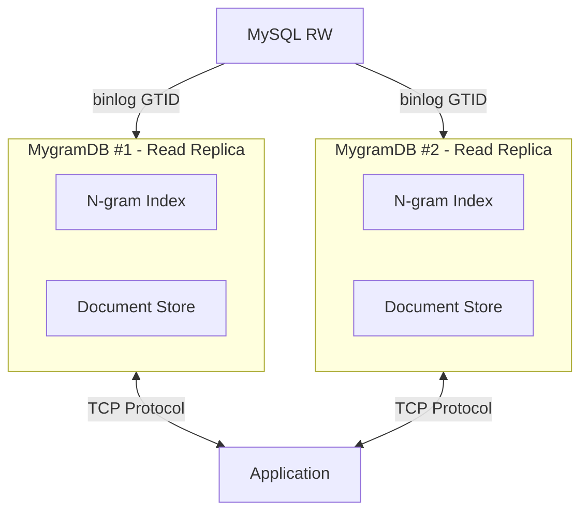

# MygramDB

High-performance in-memory full-text search engine with MySQL replication support.

## Features

- **Fast Full-Text Search**: N-gram based indexing with hybrid posting lists (Delta encoding + Roaring bitmaps)
- **MySQL Replication**: Real-time synchronization via binlog streaming (GTID-based)
- **Unicode Support**: ICU-based Unicode normalization and processing
- **Parallel Processing**: 10,000 concurrent read operations support
- **TCP Protocol**: memcached-style text protocol
- **Column Type Validation**: Supports VARCHAR and TEXT types with type checking
- **Efficient Queries**: Optimized ORDER BY with primary key indexing

## Architecture



## Quick Start

### Prerequisites

- C++17 compatible compiler (GCC 7+, Clang 5+)
- CMake 3.15+
- MySQL client library (libmysqlclient)
- ICU library (libicu)

### Build

```bash
# Clone repository
git clone https://github.com/libraz/mygram-db.git
cd mygram-db

# Create build directory
mkdir build && cd build

# Configure and build
cmake ..
cmake --build .

# Run tests
ctest
```

### Configuration

Create a YAML configuration file (`config.yaml`):

```yaml
server:
  host: "0.0.0.0"
  port: 11211
  max_connections: 1000

mysql:
  host: "localhost"
  port: 3306
  user: "repl_user"
  password: "repl_password"
  database: "mydb"

tables:
  - name: "articles"
    primary_key: "id"
    text_source:
      column: "content"  # Single column
      # OR concatenate multiple columns:
      # concat: ["title", "body"]
      # delimiter: " "
    filters:
      - name: "status"
        type: "int"
      - name: "category"
        type: "string"

index:
  ngram_size: 1

replication:
  start_gtid: "3E11FA47-71CA-11E1-9E33-C80AA9429562:1"
  queue_size: 10000
```

### Run Server

```bash
./mygramdb -c config.yaml
```

### Using the CLI Client

```bash
# Interactive mode
./mygram-cli

# Single command mode
./mygram-cli SEARCH articles "hello world"

# Specify host and port
./mygram-cli -h localhost -p 11211
```

## Protocol

MygramDB uses a simple text-based protocol over TCP (similar to memcached).

### SEARCH Command

```
SEARCH <table> <text> [NOT <term>...] [FILTER <col=val>...] [LIMIT <n>] [OFFSET <n>]
```

**Examples:**
```
SEARCH articles hello
SEARCH articles "live streaming" LIMIT 100
SEARCH articles news NOT old FILTER status=1
SEARCH articles tech FILTER category=AI LIMIT 50 OFFSET 100
```

**Response:**
```
OK RESULTS <total_count> <id1> <id2> <id3> ...
```

### COUNT Command

```
COUNT <table> <text> [NOT <term>...] [FILTER <col=val>...]
```

**Examples:**
```
COUNT articles hello
COUNT articles news NOT old FILTER status=1
```

**Response:**
```
OK COUNT <number>
```

### GET Command

```
GET <table> <primary_key>
```

**Examples:**
```
GET articles 12345
```

**Response:**
```
OK DOC <primary_key> <filter1=value1> <filter2=value2> ...
```

### Error Response

```
ERROR <error_message>
```

## Performance

- **Index Type**: Hybrid posting lists (Delta encoding for small lists, Roaring bitmaps for large lists)
- **Read Performance**: 10,000 parallel reads supported
- **Memory Efficiency**: Optimized memory usage with compressed posting lists
- **Search Limits**: Max 1,000 results per SEARCH query (configurable via LIMIT)

## Supported Column Types

MygramDB supports the following MySQL column types for text indexing:

- `VARCHAR`
- `TEXT` (including TINYTEXT, MEDIUMTEXT, LONGTEXT)
- `BLOB` (treated as text, including TINYBLOB, MEDIUMBLOB, LONGBLOB)

Attempting to use other column types (e.g., INT, DATETIME) will result in an error.

## Development

### Project Structure

```
mygram-db/
├── src/
│   ├── config/          # YAML configuration
│   ├── index/           # N-gram index
│   ├── storage/         # Document store & snapshot builder
│   ├── mysql/           # MySQL connection & binlog reader
│   ├── query/           # Query parser
│   ├── server/          # TCP server
│   ├── utils/           # String utilities (ICU)
│   └── cli/             # CLI client
├── tests/               # Unit tests
├── docs/                # Documentation
└── CMakeLists.txt
```

### Running Tests

```bash
cd build
ctest --output-on-failure
```

Current test coverage: **138 tests, 100% passing**

### Code Style

- Google C++ Style Guide
- C++17 standard
- clang-format for formatting
- cpplint for linting

## License

[MIT License](LICENSE)

## Contributing

Contributions are welcome! Please:

1. Fork the repository
2. Create a feature branch
3. Make your changes with tests
4. Run all tests and linting
5. Submit a pull request

## Authors

- libraz <libraz@libraz.net> - Initial work

## Acknowledgments

- Roaring Bitmaps library
- ICU (International Components for Unicode)
- spdlog for logging
- yaml-cpp for configuration parsing
