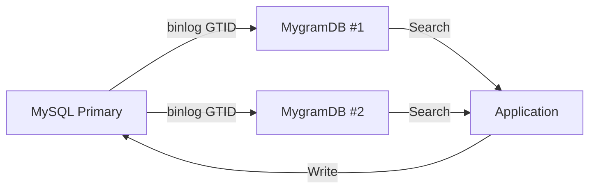

# MygramDB

[](https://github.com/libraz/mygram-db/actions)
[](https://github.com/libraz/mygram-db/releases)
[](https://github.com/libraz/mygram-db/pkgs/container/mygram-db)
[](https://codecov.io/gh/libraz/mygram-db)
[](https://github.com/libraz/mygram-db/blob/main/LICENSE)
[](https://en.cppreference.com/w/cpp/17)
[](https://github.com/libraz/mygram-db)

**25-200x faster** than MySQL FULLTEXT. In-memory full-text search engine with MySQL replication.

## Why MygramDB?

MySQL FULLTEXT is painfully slow — it scans B-tree pages on disk, doesn't compress postings, and struggles with common terms.

**MygramDB** solves this with an in-memory search replica that syncs via GTID binlog, delivering **sub-60ms queries** even for datasets matching 75% of your data.

## Performance

Tested on 1.7M rows (real production data):

| Query Type | MySQL (Cold/Warm) | MygramDB | Speedup |
|------------|-------------------|----------|---------|
| **SORT id LIMIT 100** (typical use) | 900-3,700ms | 24-56ms | **25-68x** |
| Medium-freq term (4.6% match) | 906ms / 592ms | 24ms | **38x / 25x** |
| High-freq term (47.5% match) | 2,495ms / 2,017ms | 42ms | **59x / 48x** |
| Ultra high-freq (74.9% match) | 3,753ms / 3,228ms | 56ms | **68x / 58x** |
| Two terms AND | 1,189ms | 10ms | **115x** |
| **COUNT queries** | 680-1,070ms | 5-9ms | **70-200x** |

**Key advantages:**
- **No cache warmup needed** - Always fast, even on cold starts
- **SORT optimization** - Uses primary key index (no external sort)
- **Scales with result size** - Larger result sets show bigger speedups
- **Consistent performance** - MySQL varies 600ms-3.7s, MygramDB stays under 60ms
- **High concurrency** - Handles heavy load effortlessly; MySQL FULLTEXT often stalls under concurrent traffic

**Real-world impact:**
Under **heavy concurrent load**, MySQL FULLTEXT starts queuing requests due to disk I/O bottlenecks, causing cascading delays and timeouts. MygramDB's in-memory architecture handles the same load trivially with consistent sub-60ms latencies.

See [Performance Guide](docs/en/performance.md) for detailed benchmarks.

## Quick Start

### Docker (Production Ready)

**Prerequisites:** Ensure MySQL has GTID mode enabled:
```sql
-- Check GTID mode (should be ON)
SHOW VARIABLES LIKE 'gtid_mode';

-- If OFF, enable GTID mode (MySQL 8.0+)
SET GLOBAL enforce_gtid_consistency = ON;
SET GLOBAL gtid_mode = OFF_PERMISSIVE;
SET GLOBAL gtid_mode = ON_PERMISSIVE;
SET GLOBAL gtid_mode = ON;
```

**Start MygramDB:**
```bash
docker run -d --name mygramdb \
  -p 11016:11016 \
  -e MYSQL_HOST=your-mysql-host \
  -e MYSQL_USER=repl_user \
  -e MYSQL_PASSWORD=your_password \
  -e MYSQL_DATABASE=mydb \
  -e TABLE_NAME=articles \
  -e TABLE_PRIMARY_KEY=id \
  -e TABLE_TEXT_COLUMN=content \
  -e TABLE_NGRAM_SIZE=2 \
  -e REPLICATION_SERVER_ID=12345 \
  -e NETWORK_ALLOW_CIDRS=0.0.0.0/0 \
  ghcr.io/libraz/mygram-db:latest

# Check logs
docker logs -f mygramdb

# Trigger initial data sync (required on first start)
docker exec mygramdb mygram-cli -p 11016 SYNC articles

# Try a search
docker exec mygramdb mygram-cli -p 11016 SEARCH articles "hello world"
```

**Security Note:** `NETWORK_ALLOW_CIDRS=0.0.0.0/0` allows connections from any IP address. For production, restrict to specific IP ranges:
```bash
# Production example: Allow only from application servers
-e NETWORK_ALLOW_CIDRS=10.0.0.0/8,172.16.0.0/12
```

### Docker Compose (with Test MySQL)

```bash
git clone https://github.com/libraz/mygram-db.git
cd mygram-db
docker-compose up -d

# Wait for MySQL to be ready (check with docker-compose logs -f)

# Trigger initial data sync
docker-compose exec mygramdb mygram-cli -p 11016 SYNC articles

# Try searching
docker-compose exec mygramdb mygram-cli -p 11016 SEARCH articles "hello"
```

Includes MySQL 8.4 with sample data for instant testing.

## Basic Usage

```bash
# Search with pagination
SEARCH articles "hello world" SORT id LIMIT 100

# Sort by custom column
SEARCH articles "hello" SORT created_at DESC LIMIT 50

# LIMIT with offset (MySQL-style)
SEARCH articles "tech" LIMIT 10,100  # offset=10, count=100

# Count matches
COUNT articles "hello world"

# Multi-term AND search
SEARCH articles hello AND world

# With filters
SEARCH articles tech FILTER status=1 LIMIT 100

# Get by primary key
GET articles 12345
```

See [Protocol Reference](docs/en/protocol.md) for all commands.

## Features

- **Fast**: 25-200x faster than MySQL FULLTEXT
- **MySQL Replication**: Real-time GTID-based binlog streaming
- **Configuration Hot Reload**: SIGHUP signal for zero-downtime config changes
- **Failover Detection**: Automatic MySQL master failover detection and validation
- **Multiple Tables**: Index multiple tables in one instance
- **Dual Protocol**: TCP (memcached-style) and HTTP/REST API
- **High Concurrency**: Thread pool supporting 10,000+ connections
- **Unicode**: ICU-based normalization for CJK/multilingual text
- **Compression**: Hybrid Delta encoding + Roaring bitmaps
- **Easy Deploy**: Single binary or Docker container

## Architecture



MygramDB acts as a specialized read replica for full-text search, while MySQL handles writes and normal queries.

## When to Use MygramDB

✅ **Good fit:**
- Search-heavy workloads (read >> write)
- Millions of documents with full-text search
- Need sub-100ms search latency
- Simple deployment requirements
- Japanese/CJK text with ngrams

❌ **Not recommended:**
- Write-heavy workloads
- Dataset doesn't fit in RAM (~1-2GB per million docs)
- Need distributed search across nodes
- Complex aggregations/analytics

## Documentation

- **[CHANGELOG](CHANGELOG.md)** - Version history and release notes
- [Docker Deployment Guide](docs/en/docker-deployment.md) - Production Docker setup
- [Configuration Guide](docs/en/configuration.md) - All configuration options
- [Protocol Reference](docs/en/protocol.md) - Complete command reference
- [HTTP API Reference](docs/en/http-api.md) - REST API documentation
- [Performance Guide](docs/en/performance.md) - Benchmarks and optimization
- [Replication Guide](docs/en/replication.md) - MySQL replication setup
- [Operations Guide](docs/en/operations.md) - Configuration hot reload and failover detection
- [Installation Guide](docs/en/installation.md) - Build from source
- [Development Guide](docs/en/development.md) - Contributing guidelines
- [Client Library](docs/en/libmygramclient.md) - C/C++ client library

### Release Notes

- [Latest Release](https://github.com/libraz/mygram-db/releases/latest) - Download binaries
- [Detailed Release Notes](docs/releases/) - Version-specific migration guides

## Requirements

**System:**
- RAM: ~1-2GB per million documents
- OS: Linux or macOS

**MySQL:**
- Version: 5.7.6+ or 8.0+
- GTID mode enabled (`gtid_mode=ON`)
- Binary log format: ROW (`binlog_format=ROW`)
- Replication privileges: `REPLICATION SLAVE`, `REPLICATION CLIENT`

See [Installation Guide](docs/en/installation.md) for details.

## License

[MIT License](LICENSE)

## Contributing

We welcome contributions! Please see [CONTRIBUTING.md](CONTRIBUTING.md) for guidelines.

For development environment setup, see [Development Guide](docs/en/development.md).

## Authors

- libraz <libraz@libraz.net>

## Acknowledgments

- [Roaring Bitmaps](https://roaringbitmap.org/) for compressed bitmaps
- [ICU](https://icu.unicode.org/) for Unicode support
- [spdlog](https://github.com/gabime/spdlog) for logging
- [yaml-cpp](https://github.com/jbeder/yaml-cpp) for configuration
