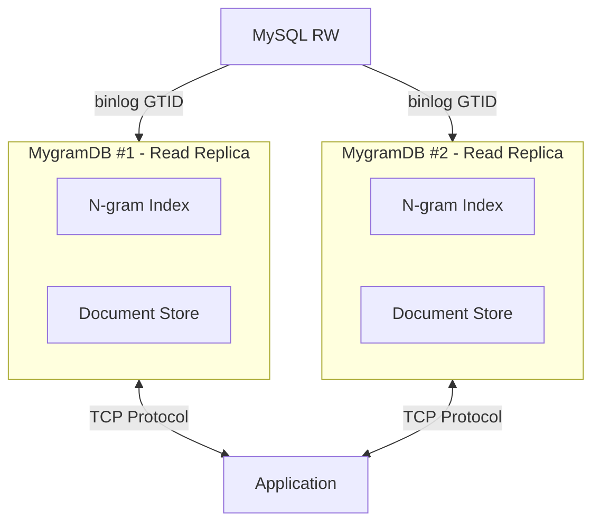

Ｙ# MygramDB

High-performance in-memory full-text search engine with MySQL replication support.

## Why MygramDB?

Because MySQL FULLTEXT (ngram) is slow.
Painfully slow. It scans millions of rows through B-tree pages on disk,
doesn't compress postings, and struggles with short terms like "の" or "a".

It's not your fault — it was never designed for true full-text search.

So I built **MygramDB** — an in-memory search replica for MySQL.
It builds its index from a consistent snapshot, syncs via GTID binlog,
and gives you millisecond-class search without Elasticsearch or pain.

## Features

- **Fast Full-Text Search**: N-gram based indexing with hybrid posting lists (Delta encoding + Roaring bitmaps)
- **MySQL Replication**: Real-time synchronization via binlog streaming (GTID-based)
- **Unicode Support**: ICU-based Unicode normalization and processing
- **Parallel Processing**: 10,000 concurrent read operations support
- **TCP Protocol**: memcached-style text protocol
- **Column Type Validation**: Supports VARCHAR and TEXT types with type checking
- **Efficient Queries**: Optimized ORDER BY with primary key indexing

## Requirements and Limitations

### System Requirements

- **Memory**: In-memory storage requires sufficient RAM to hold the entire index and document store
  - Estimate: ~1-2GB per million documents (varies by text size and ngram_size)
  - For 10M documents with average 1KB text: expect 10-20GB memory usage
- **CPU**: Multi-core processor recommended for parallel query processing
- **OS**: Linux or macOS (Windows not tested)

### MySQL Requirements

- **MySQL Version**: 5.7.6+ or 8.0+ (tested with MySQL 8.0 and 8.4)
- **GTID Mode**: Must be enabled (`gtid_mode=ON`, `enforce_gtid_consistency=ON`)
- **Binary Log Format**: ROW format required (`binlog_format=ROW`)
- **Privileges**: Replication user needs `REPLICATION SLAVE` and `REPLICATION CLIENT` privileges

### Limitations

- **Single Table**: Currently supports one table per MygramDB instance
- **Text Columns Only**: Only VARCHAR and TEXT columns can be indexed for full-text search
- **Primary Key**: Table must have a single-column primary key (composite keys not supported)
- **No Transactions**: MygramDB is eventually consistent (binlog lag typically <100ms)
- **Memory Bound**: Dataset size limited by available RAM
- **Read-Only**: MygramDB is a read replica; writes go to MySQL master

### When to Use MygramDB

✅ **Good fit:**
- High read volume, low write volume
- Full-text search on millions of rows
- Need millisecond search latency
- Simple deployment (no Elasticsearch cluster)
- Japanese/CJK text search with ngrams

❌ **Not recommended:**
- Write-heavy workloads
- Dataset doesn't fit in memory
- Need distributed search across multiple nodes
- Complex aggregations or analytics queries

## Architecture



## Quick Start

### Prerequisites

- C++17 compatible compiler (GCC 7+, Clang 5+)
- CMake 3.15+
- MySQL client library (libmysqlclient)
- ICU library (libicu)

### Build

#### Using Makefile (Recommended)

```bash
# Clone repository
git clone https://github.com/libraz/mygram-db.git
cd mygram-db

# Install dependencies (Ubuntu/Debian)
sudo apt-get update
sudo apt-get install -y pkg-config libmysqlclient-dev libicu-dev

# Build
make

# Run tests
make test

# Clean build
make clean

# Other useful commands
make help      # Show all available commands
make rebuild   # Clean and rebuild
make format    # Format code with clang-format
```

#### Using CMake directly

```bash
# Create build directory
mkdir build && cd build

# Configure and build
cmake ..
cmake --build .

# Run tests
ctest
```

### Installation

```bash
# Install to /usr/local (requires sudo)
sudo make install

# Install to custom location
make PREFIX=/opt/mygramdb install

# Uninstall
sudo make uninstall
```

After installation, the following files will be available:
- Binaries: `/usr/local/bin/mygramdb`, `/usr/local/bin/mygram-cli`
- Config sample: `/usr/local/etc/mygramdb/config.yaml.example`
- Documentation: `/usr/local/share/doc/mygramdb/`

### Configuration

Create a YAML configuration file (`config.yaml`):

```yaml
# MySQL connection settings
mysql:
  host: "127.0.0.1"
  port: 3306
  user: "repl_user"
  password: "your_password_here"
  database: "mydb"                  # Database name (optional if specified in table config)
  use_gtid: true                    # Enable GTID-based replication
  binlog_format: "ROW"              # Required: ROW format
  binlog_row_image: "FULL"          # Required: FULL row image
  connect_timeout_ms: 3000          # Connection timeout

# Table configuration (supports one table per instance)
tables:
  - name: "articles"
    primary_key: "id"
    text_source:
      column: "content"               # Single column for full-text search
      # OR concatenate multiple columns:
      # concat: ["title", "body"]
      # delimiter: " "
    filters:                          # Optional filter columns
      - name: "status"
        type: "int"                   # Integer types: tinyint, tinyint_unsigned, smallint,
                                      #   smallint_unsigned, int, int_unsigned, mediumint,
                                      #   mediumint_unsigned, bigint
                                      # Float types: float, double
                                      # String types: string, varchar, text
                                      # Date types: datetime, date, timestamp
        dict_compress: true           # Enable dictionary compression (for low-cardinality columns)
        bitmap_index: true            # Enable bitmap indexing (for filter acceleration)
      - name: "category"
        type: "string"
      - name: "created_at"
        type: "datetime"
        bucket: "minute"              # Datetime bucketing: minute|hour|day (reduces cardinality)
    ngram_size: 1                     # N-gram size (1=unigram, 2=bigram, etc.)
    posting:                          # Posting list configuration
      block_size: 128
      freq_bits: 0                    # 0=boolean, 4 or 8 for term frequency
      use_roaring: "auto"             # auto|always|never
    where_clause: ""                  # Optional WHERE clause for snapshot (e.g., "status = 1")

# Index build configuration
build:
  mode: "select_snapshot"             # Build mode (currently only select_snapshot)
  batch_size: 5000                    # Rows per batch during snapshot
  parallelism: 2                      # Number of parallel build threads
  throttle_ms: 0                      # Throttle delay between batches (ms)

# Replication configuration
replication:
  enable: true
  server_id: 0                        # MySQL server ID (0 = auto-generate)
  start_from: "snapshot"              # Options: snapshot|latest|gtid=<UUID:txn>|state_file
  state_file: "./mygramdb_replication.state"  # GTID state persistence file
  queue_size: 10000                   # Binlog event queue size
  reconnect_backoff_min_ms: 500       # Min reconnect backoff delay
  reconnect_backoff_max_ms: 10000     # Max reconnect backoff delay

# Memory management
memory:
  hard_limit_mb: 8192                 # Hard memory limit
  soft_target_mb: 4096                # Soft memory target
  arena_chunk_mb: 64                  # Arena chunk size
  roaring_threshold: 0.18             # Roaring bitmap threshold
  minute_epoch: true                  # Use minute-precision epoch
  normalize:                          # Text normalization
    nfkc: true                        # NFKC normalization
    width: "narrow"                   # Width: keep|narrow|wide
    lower: false                      # Lowercase conversion

# Snapshot persistence
snapshot:
  dir: "/var/lib/mygramdb/snapshots"  # Snapshot directory

# API server configuration
api:
  tcp:
    bind: "0.0.0.0"                   # TCP bind address
    port: 11311                       # TCP port

# Logging configuration
logging:
  level: "info"                       # Log level: debug|info|warn|error
```

See `examples/config.yaml` for a complete example with all available options.

### Test Configuration

Before starting the server, validate your configuration file:

```bash
# Test configuration syntax
./build/bin/mygramdb -t config.yaml

# Or use long option
./build/bin/mygramdb --config-test config.yaml
```

This will validate the configuration file and display:
- **YAML syntax errors**: Invalid YAML format
- **Unknown configuration keys**: Typos or unsupported options
- **Type mismatches**: Wrong data types (e.g., string instead of map)
- **Missing required fields**: Essential configuration missing
- **Invalid values**: Out-of-range or invalid setting values

If the configuration is valid, it displays:
- MySQL connection settings
- Table configurations (name, primary_key, ngram_size)
- API server settings (bind address and port)
- Replication status (enabled/disabled)
- Logging level

### Run Server

```bash
# Using Makefile
make run

# Or run directly from build directory
./build/bin/mygramdb config.yaml

# The server requires a config file path as the only argument
# Usage: mygramdb [OPTIONS] <config.yaml>
# Options:
#   -t, --config-test    Test configuration file and exit
```

### Using the CLI Client

```bash
# Interactive mode
./build/bin/mygram-cli

# Single command mode
./build/bin/mygram-cli SEARCH articles "hello world"

# Specify host and port
./build/bin/mygram-cli -h localhost -p 11211
```

#### CLI Features

The CLI client (`mygram-cli`) provides an interactive shell for MygramDB with the following features:

- **Tab Completion**: Press TAB to autocomplete command names (requires GNU Readline)
- **Command History**: Use ↑/↓ arrow keys to navigate command history (requires GNU Readline)
- **Line Editing**: Full line editing support with Ctrl+A, Ctrl+E, etc. (requires GNU Readline)
- **Error Handling**: Graceful error messages for invalid commands (does not crash)

**Note**: Tab completion and command history require GNU Readline library. The CLI will automatically use Readline if available at build time, otherwise falls back to basic input mode.

**Available commands** (type `help` in interactive mode):
- `SEARCH`, `COUNT`, `GET` - Search and retrieval
- `INFO`, `CONFIG` - Server information and configuration
- `SAVE`, `LOAD` - Snapshot management
- `REPLICATION STATUS/STOP/START` - Replication control
- `quit`, `exit` - Exit the client
- `help` - Show help message

## Protocol

MygramDB uses a simple text-based protocol over TCP (similar to memcached).

### SEARCH Command

```
SEARCH <table> <text> [NOT <term>...] [FILTER <col=val>...] [LIMIT <n>] [OFFSET <n>]
```

**Examples:**
```
SEARCH articles hello
SEARCH articles "live streaming" LIMIT 100
SEARCH articles news NOT old FILTER status=1
SEARCH articles tech FILTER category=AI LIMIT 50 OFFSET 100
```

**Response:**
```
OK RESULTS <total_count> <id1> <id2> <id3> ...
```

### COUNT Command

```
COUNT <table> <text> [NOT <term>...] [FILTER <col=val>...]
```

**Examples:**
```
COUNT articles hello
COUNT articles news NOT old FILTER status=1
```

**Response:**
```
OK COUNT <number>
```

### GET Command

```
GET <table> <primary_key>
```

**Examples:**
```
GET articles 12345
```

**Response:**
```
OK DOC <primary_key> <filter1=value1> <filter2=value2> ...
```

### INFO Command

Get server information and statistics.

```
INFO
```

**Response:**
```
OK INFO version=<version> uptime=<seconds> total_requests=<count> connections=<count> index_size=<bytes> doc_count=<count>
```

### SAVE Command

Save current index snapshot to disk.

```
SAVE [<filepath>]
```

**Examples:**
```
SAVE
SAVE /path/to/snapshot.bin
```

**Response:**
```
OK SAVED <filepath>
```

### LOAD Command

Load index snapshot from disk.

```
LOAD <filepath>
```

**Examples:**
```
LOAD /path/to/snapshot.bin
```

**Response:**
```
OK LOADED <filepath> docs=<count>
```

### REPLICATION STATUS Command

Get current replication status.

```
REPLICATION STATUS
```

**Response:**
```
OK REPLICATION status=<running|stopped> gtid=<current_gtid>
```

### REPLICATION STOP Command

Stop binlog replication (index becomes read-only).

```
REPLICATION STOP
```

**Response:**
```
OK REPLICATION STOPPED
```

### REPLICATION START Command

Resume binlog replication.

```
REPLICATION START
```

**Response:**
```
OK REPLICATION STARTED
```

### CONFIG Command

Get current server configuration (all settings).

```
CONFIG
```

**Response:**
Returns a YAML-style formatted configuration showing:
- MySQL connection settings
- Table configurations (name, primary_key, ngram_size, filters count)
- API server settings (bind address and port)
- Replication settings (enable, server_id, start_from, state_file)
- Memory configuration (limits, thresholds)
- Snapshot directory
- Logging level
- Runtime status (connections, uptime, read_only mode)

**Example:**
```
CONFIG
OK CONFIG
  mysql:
    host: 127.0.0.1
    port: 3306
    user: repl_user
    database: mydb
    use_gtid: true
  tables: 1
    - name: articles
      primary_key: id
      ngram_size: 1
      filters: 3
  api:
    tcp.bind: 0.0.0.0
    tcp.port: 11311
  replication:
    enable: true
    server_id: 12345
    start_from: snapshot
    state_file: ./mygramdb_replication.state
  memory:
    hard_limit_mb: 8192
    soft_target_mb: 4096
    roaring_threshold: 0.18
  snapshot:
    dir: /var/lib/mygramdb/snapshots
  logging:
    level: info
  runtime:
    connections: 5
    max_connections: 1000
    read_only: false
    uptime: 3600s
```

### Error Response

```
ERROR <error_message>
```

## Performance

- **Index Type**: Hybrid posting lists (Delta encoding for small lists, Roaring bitmaps for large lists)
- **Read Performance**: 10,000 parallel reads supported
- **Memory Efficiency**: Optimized memory usage with compressed posting lists
- **Search Limits**: Max 1,000 results per SEARCH query (configurable via LIMIT)

## MySQL Replication

MygramDB supports real-time replication from MySQL using GTID-based binlog streaming with guaranteed data consistency.

### Prerequisites

**MySQL server must have GTID mode enabled:**
```sql
-- Check current GTID mode
SHOW VARIABLES LIKE 'gtid_mode';

-- If GTID mode is OFF, enable it (requires server restart in MySQL 5.7)
SET GLOBAL gtid_mode = ON;
SET GLOBAL enforce_gtid_consistency = ON;
```

MygramDB will automatically validate GTID mode on startup and provide clear error messages if not configured.

### Replication Start Options

Configure `replication.start_from` in config.yaml:

- **`snapshot`** (Recommended): Starts from GTID captured during initial snapshot build
  - Uses `START TRANSACTION WITH CONSISTENT SNAPSHOT` for data consistency
  - Captures `@@global.gtid_executed` at exact snapshot moment
  - Guarantees no data loss between snapshot and binlog replication

- **`latest`**: Starts from current GTID position (ignores historical data)
  - Uses `SHOW BINARY LOG STATUS` to get latest GTID
  - Suitable when only real-time changes are needed

- **`gtid=<UUID:txn>`**: Starts from specific GTID position
  - Example: `gtid=3E11FA47-71CA-11E1-9E33-C80AA9429562:100`

- **`state_file`**: Resumes from saved GTID state file
  - Reads from `./gtid_state.txt` (created automatically)
  - Enables crash recovery and resume

### Supported Operations

- INSERT (WRITE_ROWS events)
- UPDATE (UPDATE_ROWS events)
- DELETE (DELETE_ROWS events)

### Supported Column Types

- Integers: TINYINT, SMALLINT, INT, MEDIUMINT, BIGINT (signed/unsigned)
- Strings: VARCHAR, CHAR, TEXT, BLOB, ENUM, SET
- Date/Time: DATE, TIME, DATETIME, TIMESTAMP (with fractional seconds)
- Numeric: DECIMAL, FLOAT, DOUBLE
- Special: JSON, BIT, NULL

### Features

- **GTID Consistency**: Snapshot and binlog replication are coordinated via consistent snapshot transaction
- **GTID Position Tracking**: Atomic persistence with state file
- **Automatic Validation**: Checks GTID mode on startup with clear error messages
- **Automatic Reconnection**: Handles connection loss gracefully
- **Multi-threaded Processing**: Separate reader and worker threads
- **Configurable Queue**: Adjustable event queue size for performance tuning

## Development

### Project Structure

```
mygram-db/
├── src/
│   ├── config/          # YAML configuration
│   ├── index/           # N-gram index
│   ├── storage/         # Document store & snapshot builder
│   ├── mysql/           # MySQL connection & binlog reader
│   ├── query/           # Query parser
│   ├── server/          # TCP server
│   ├── utils/           # String utilities (ICU)
│   └── cli/             # CLI client
├── tests/               # Unit tests
├── docs/                # Documentation
└── CMakeLists.txt
```

### Running Tests

Using Makefile:
```bash
make test
```

Or using CTest directly:
```bash
cd build
ctest --output-on-failure
```

Current test coverage: **169 tests, 100% passing**

**Note**: All unit tests run without requiring a MySQL server connection. Integration tests that require a MySQL server are separated and disabled by default. To run integration tests:

```bash
# Set environment variables for MySQL connection
export MYSQL_HOST=127.0.0.1
export MYSQL_USER=root
export MYSQL_PASSWORD=your_password
export MYSQL_DATABASE=test
export ENABLE_MYSQL_INTEGRATION_TESTS=1

# Run integration tests
./build/bin/mysql_connection_integration_test
```

### Build Options

You can configure CMake options when using Makefile:

```bash
# Enable AddressSanitizer
make CMAKE_OPTIONS="-DENABLE_ASAN=ON" configure

# Enable ThreadSanitizer
make CMAKE_OPTIONS="-DENABLE_TSAN=ON" configure

# Disable tests
make CMAKE_OPTIONS="-DBUILD_TESTS=OFF" configure
```

### Code Style

- Google C++ Style Guide
- C++17 standard
- clang-format for formatting
- cpplint for linting

## License

[MIT License](LICENSE)

## Contributing

Contributions are welcome! Please:

1. Fork the repository
2. Create a feature branch
3. Make your changes with tests
4. Run all tests and linting
5. Submit a pull request

## Authors

- libraz <libraz@libraz.net> - Initial work

## Acknowledgments

- Roaring Bitmaps library
- ICU (International Components for Unicode)
- spdlog for logging
- yaml-cpp for configuration parsing
