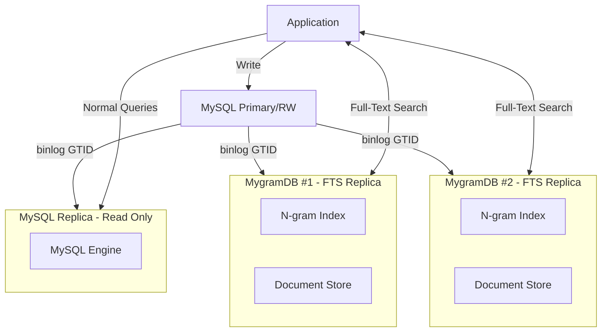

# MygramDB

[](https://github.com/libraz/mygram-db/actions)
[](https://github.com/libraz/mygram-db/releases)
[](https://github.com/libraz/mygram-db/pkgs/container/mygram-db)
[](https://codecov.io/gh/libraz/mygram-db)
[](https://github.com/libraz/mygram-db/blob/main/LICENSE)
[](https://en.cppreference.com/w/cpp/17)
[](https://github.com/libraz/mygram-db)

High-performance in-memory full-text search engine with MySQL replication support.

## Why MygramDB?

Because MySQL FULLTEXT (ngram) is slow.
Painfully slow. It scans millions of rows through B-tree pages on disk,
doesn't compress postings, and struggles with short, common terms like "a" or "the".

It's not your fault — it was never designed for true full-text search.

So I built **MygramDB** — an in-memory search replica for MySQL.
It builds its index from a consistent snapshot, syncs via GTID binlog,
and gives you millisecond-class search without Elasticsearch or pain.

## Features

- **Fast Full-Text Search**: N-gram based indexing with hybrid posting lists (Delta encoding + Roaring bitmaps)
- **MySQL Replication**: Real-time synchronization via binlog streaming (GTID-based)
- **Unicode Support**: ICU-based Unicode normalization and processing
- **Parallel Processing**: Thread pool architecture supporting 10,000 concurrent connections
- **TCP Protocol**: memcached-style text protocol
- **Column Type Validation**: Supports VARCHAR and TEXT types with type checking
- **Efficient Queries**: Optimized ORDER BY with primary key indexing
- **Configuration Validation**: Automatic JSON Schema validation for both YAML and JSON config files

## Architecture



## Quick Start

### Prerequisites

- C++17 compatible compiler (GCC 7+, Clang 5+)
- CMake 3.15+
- MySQL client library (libmysqlclient)
- ICU library (libicu)

### Installation

```bash
# Clone repository
git clone https://github.com/libraz/mygram-db.git
cd mygram-db

# Install dependencies (Ubuntu/Debian)
sudo apt-get update
sudo apt-get install -y pkg-config libmysqlclient-dev libicu-dev

# Build
make

# Run tests
make test

# Install (optional)
sudo make install
```

### Configuration

MygramDB supports both **YAML** and **JSON** configuration formats with automatic **JSON Schema validation**.

```bash
# Copy minimal YAML configuration
cp examples/config-minimal.yaml config.yaml

# Or copy minimal JSON configuration
cp examples/config-minimal.json config.json

# Or copy full configuration with all options
cp examples/config.yaml config.yaml

# Edit configuration
vim config.yaml  # or config.json
```

Minimal configuration example (YAML):

```yaml
mysql:
  host: "127.0.0.1"
  port: 3306
  user: "repl_user"
  password: "your_password"
  database: "mydb"
  use_gtid: true

tables:
  - name: "articles"
    primary_key: "id"
    text_source:
      column: "content"
    ngram_size: 2          # ASCII/alphanumeric: bigram
    kanji_ngram_size: 1    # CJK characters: unigram

api:
  tcp:
    bind: "0.0.0.0"
    port: 11016

replication:
  enable: true
  server_id: 12345  # Must be unique
  start_from: "snapshot"
```

Or in JSON format:

```json
{
  "mysql": {
    "user": "repl_user",
    "password": "your_password",
    "database": "mydb"
  },
  "tables": [
    {
      "name": "articles",
      "text_source": {
        "column": "content"
      }
    }
  ],
  "replication": {
    "server_id": 12345
  }
}
```

**Automatic Validation**: All configurations are automatically validated against a built-in JSON Schema. Invalid settings (typos, wrong types, unknown keys) are detected immediately at startup.

### Start Server

```bash
# Show help
./build/bin/mygramdb --help

# Show version
./build/bin/mygramdb --version

# Test configuration
./build/bin/mygramdb -t config.yaml

# Start server (both formats supported)
./build/bin/mygramdb -c config.yaml
# or
./build/bin/mygramdb config.yaml
```

### Using CLI Client

```bash
# Interactive mode
./build/bin/mygram-cli

# Single command
./build/bin/mygram-cli SEARCH articles "hello world"
```

### Basic Commands

```bash
# Search
SEARCH articles hello LIMIT 100

# Search with AND operator
SEARCH articles tech AND AI

# Search with filters
SEARCH articles news FILTER status=1

# Count results
COUNT articles hello

# Get document
GET articles 12345
```

## Documentation

For detailed documentation, see:

- [Installation Guide](docs/en/installation.md) - Building and installing MygramDB
- [Configuration Guide](docs/en/configuration.md) - Configuration options and examples
- [Protocol Reference](docs/en/protocol.md) - Complete command reference
- [Replication Guide](docs/en/replication.md) - MySQL replication setup
- [Development Guide](docs/en/development.md) - Development environment setup
- [Client Library (libmygramclient)](docs/en/libmygramclient.md) - C/C++ client library for building language bindings

## Requirements and Limitations

### System Requirements

- **Memory**: In-memory storage requires sufficient RAM (~1-2GB per million documents)
- **CPU**: Multi-core processor recommended
- **OS**: Linux or macOS

### MySQL Requirements

- **MySQL Version**: 5.7.6+ or 8.0+ (tested with MySQL 8.0 and 8.4)
- **GTID Mode**: Must be enabled (`gtid_mode=ON`)
- **Binary Log Format**: ROW format required (`binlog_format=ROW`)
- **Privileges**: Replication user needs `REPLICATION SLAVE` and `REPLICATION CLIENT`

### Limitations

- **Single Table**: One table per MygramDB instance
- **Text Columns Only**: VARCHAR and TEXT columns only
- **Primary Key**: Single-column primary key required
- **Read-Only**: MygramDB is a read replica; writes go to MySQL master
- **Memory Bound**: Dataset size limited by available RAM

### When to Use MygramDB

✅ **Good fit:**
- High read volume, low write volume
- Full-text search on millions of rows
- Need millisecond search latency
- Simple deployment (no Elasticsearch cluster)
- Japanese/CJK text search with ngrams

❌ **Not recommended:**
- Write-heavy workloads
- Dataset doesn't fit in memory
- Need distributed search across multiple nodes
- Complex aggregations or analytics queries

## Performance

- **Index Type**: Hybrid posting lists (Delta encoding for small lists, Roaring bitmaps for large lists)
- **Concurrency**: Thread pool architecture handling up to 10,000 concurrent connections
- **Memory Efficiency**: Optimized memory usage with compressed posting lists
- **Search Limits**: Max 1,000 results per SEARCH query (configurable via LIMIT)

## License

[MIT License](LICENSE)

## Contributing

Contributions are welcome! Please:

1. Fork the repository
2. Create a feature branch
3. Make your changes with tests
4. Run all tests and linting
5. Submit a pull request

## Authors

- libraz <libraz@libraz.net> - Initial work

## Acknowledgments

- Roaring Bitmaps library
- ICU (International Components for Unicode)
- spdlog for logging
- yaml-cpp for configuration parsing
