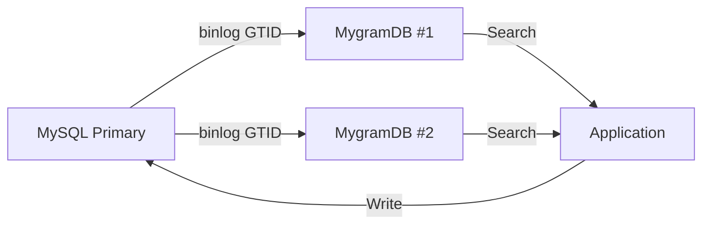

# MygramDB

[](https://mygramdb.libraz.net)
[](https://github.com/libraz/mygram-db/actions)
[](https://github.com/libraz/mygram-db/releases)
[](https://github.com/libraz/mygram-db/pkgs/container/mygram-db)
[](https://codecov.io/gh/libraz/mygram-db)
[](https://github.com/libraz/mygram-db/blob/main/LICENSE)
[](https://en.cppreference.com/w/cpp/17)
[](https://dev.mysql.com/)
[](https://github.com/libraz/mygram-db)

In-memory full-text search engine synchronized through MySQL/MariaDB binlog replication. Keep MySQL as the source of truth, route search traffic to MygramDB, and target sub-millisecond responses on million-row datasets.

## Why MygramDB?

MySQL FULLTEXT is convenient, but latency can grow with common terms, CJK n-gram searches, and concurrent load. MygramDB keeps a compressed n-gram index entirely in memory and applies MySQL/MariaDB updates through GTID binlog replication.

Applications continue writing to MySQL/MariaDB and send search queries to MygramDB. It acts as a specialized read replica for full-text search, so existing RDBMS deployments can add faster search without a large architectural change.

## Performance

Benchmarked on 1.1M Wikipedia articles (EN + JA), comparing MygramDB v1.5.0 with MySQL 8.4 FULLTEXT using the ngram parser.

| Query Type | MySQL | MygramDB | Speedup |
|------------|-------|----------|---------|
| **Search** (SORT id LIMIT 100) | 507–2,566ms | 0.08–0.42ms | 1,200–6,700x |
| **CJK search** (Japanese bi-gram) | 4–1,204ms | 1–4ms | 2–1,100x |
| **COUNT** | 416–1,797ms | 0.08ms | 5,500–21,600x |
| **Concurrent** (4 connections) | 8 QPS | 11,766 QPS | 1,400x |

- Sub-millisecond latency for most queries with no cache warmup required
- v1.5.0 `verify_text` removes n-gram false positives and returns results consistent with MySQL
- Reproducible: `make bench-up && make bench-run` ([details](https://mygramdb.libraz.net/docs/performance))

## Quick Start

### Docker (Minimal Production Setup)

MygramDB reads binlogs to keep indexes up to date, so the source MySQL/MariaDB server must use GTID and ROW-format binary logs. For MySQL, first confirm that GTID mode is enabled.

```sql
-- Check GTID mode (must be ON)
SHOW VARIABLES LIKE 'gtid_mode';

-- If OFF, enable GTID mode (MySQL 8.0+ / 9.x)
SET GLOBAL enforce_gtid_consistency = ON;
SET GLOBAL gtid_mode = OFF_PERMISSIVE;
SET GLOBAL gtid_mode = ON_PERMISSIVE;
SET GLOBAL gtid_mode = ON;
```

Start MygramDB with environment variables for the MySQL connection, indexed table, text column, and replication server_id.

```bash
docker run -d --name mygramdb \
  -p 11016:11016 \
  -e MYSQL_HOST=your-mysql-host \
  -e MYSQL_USER=repl_user \
  -e MYSQL_PASSWORD=your_password \
  -e MYSQL_DATABASE=mydb \
  -e TABLE_NAME=articles \
  -e TABLE_PRIMARY_KEY=id \
  -e TABLE_TEXT_COLUMN=content \
  -e TABLE_NGRAM_SIZE=2 \
  -e REPLICATION_SERVER_ID=12345 \
  -e NETWORK_ALLOW_CIDRS=0.0.0.0/0 \
  ghcr.io/libraz/mygram-db:latest

# Check logs
docker logs -f mygramdb

# Trigger initial data sync (required on first start)
docker exec mygramdb mygram-cli -p 11016 SYNC articles

# Try a search
docker exec mygramdb mygram-cli -p 11016 SEARCH articles "hello world"
```

**Security note:** `NETWORK_ALLOW_CIDRS=0.0.0.0/0` allows connections from any IP address. In production, restrict this to only the application servers or management networks that need access. An empty, omitted, or invalid `network.allow_cidrs` denies all TCP and non-probe HTTP access; only `/health/live` and `/health/ready` bypass this ACL.

```bash
# Production example: Allow only from application servers
-e NETWORK_ALLOW_CIDRS=10.0.0.0/8,172.16.0.0/12
```

### Docker Compose (with Test MySQL)

```bash
git clone https://github.com/libraz/mygram-db.git
cd mygram-db
docker-compose up -d

# Wait for MySQL to be ready (check with docker-compose logs -f)

# Trigger initial data sync
docker-compose exec mygramdb mygram-cli -p 11016 SYNC articles

# Try searching
docker-compose exec mygramdb mygram-cli -p 11016 SEARCH articles "hello"
```

This setup includes MySQL 8.4 with sample data, so you can validate behavior locally. MygramDB is also tested with MySQL 9.4 and MariaDB 10.11/11.4.

## Basic Usage

```bash
# Search with pagination
SEARCH articles "hello world" SORT id LIMIT 100

# Sort by relevance (BM25)
SEARCH articles "hello world" SORT _score DESC LIMIT 10

# Highlighted results
SEARCH articles "hello" HIGHLIGHT TAG <b> </b> LIMIT 10

# Fuzzy search (edit distance 1)
SEARCH articles "machne" FUZZY LIMIT 10

# Faceted aggregation
FACET articles category "tech"

# Count matches
COUNT articles "hello world"

# Multi-term AND search
SEARCH articles hello AND world

# With filters
SEARCH articles tech FILTER status=1 LIMIT 100

# Get by primary key
GET articles 12345
```

See [Protocol Reference](https://mygramdb.libraz.net/docs/protocol) for all commands.

## Features

- **Fast Search**: In-memory index designed for sub-millisecond search on million-row datasets
- **BM25 Relevance**: `SORT _score` for TF-IDF based relevance ranking
- **Highlighting**: `HIGHLIGHT` returns snippets with matched terms tagged
- **Fuzzy Search**: `FUZZY` clause for Levenshtein edit distance matching
- **Synonyms**: Automatic query expansion from TSV synonym dictionaries
- **Faceted Search**: `FACET` command aggregates filter column values with counts
- **MySQL/MariaDB Replication**: Real-time GTID-based binlog streaming (MySQL 8.4+, MariaDB 10.6+)
- **Runtime Variables**: MySQL-style `SET` / `SHOW VARIABLES` commands for changing selected settings without downtime
- **MySQL Failover**: Switch MySQL servers at runtime while preserving GTID position
- **Multiple Tables**: Index multiple tables in one instance
- **Dual Protocol**: TCP (memcached-style) for search and operational commands, HTTP/REST API for search and status checks
- **High Concurrency**: Thread pool built to handle 10,000+ concurrent connections
- **Unicode**: ICU-based normalization for CJK/multilingual text
- **Compression**: Hybrid Delta encoding + Roaring bitmaps
- **Easy Deploy**: Run as a single binary or Docker container

## Architecture


```mermaid
graph LR
    MySQL[MySQL Primary] -->|binlog GTID| MygramDB1[MygramDB #1]
    MySQL -->|binlog GTID| MygramDB2[MygramDB #2]

    MygramDB1 -->|Search| App[Application]
    MygramDB2 -->|Search| App
    App -->|Write| MySQL
```

MygramDB acts as a specialized read replica for full-text search. MySQL/MariaDB remains the source of truth and continues handling writes and normal SQL queries.

## When to Use MygramDB

✅ **Good fit:**
- Search-heavy workloads where reads greatly outnumber writes
- Millions of documents that need full-text search
- Need sub-100ms search latency
- Simple deployment requirements
- Japanese/CJK text searched with n-grams

❌ **Not recommended:**
- Write-heavy workloads
- Dataset does not fit in RAM (roughly 1-2GB per million docs)
- Need distributed search across nodes
- Complex aggregations/analytics

## Documentation

📖 **Full documentation:** https://mygramdb.libraz.net

- **[CHANGELOG](CHANGELOG.md)** - Version history and release notes
- [Docker Deployment Guide](https://mygramdb.libraz.net/docs/docker-deployment) - Production Docker setup
- [Configuration Guide](https://mygramdb.libraz.net/docs/configuration) - Configuration options and explanations
- [Protocol Reference](https://mygramdb.libraz.net/docs/protocol) - Complete command reference
- [HTTP API Reference](https://mygramdb.libraz.net/docs/http-api) - REST API documentation
- [Performance Guide](https://mygramdb.libraz.net/docs/performance) - Benchmarks and optimization
- [Replication Guide](https://mygramdb.libraz.net/docs/replication) - MySQL replication setup
- [Operations Guide](https://mygramdb.libraz.net/docs/operations) - Runtime variables and MySQL failover
- [Installation Guide](https://mygramdb.libraz.net/docs/installation) - Build from source
- [Development Guide](https://mygramdb.libraz.net/docs/development) - Contributing guidelines
- [Client Library](https://mygramdb.libraz.net/docs/client-library) - C/C++ client library

HTTP exposes search, document lookup, health checks, metrics, and read-only status endpoints. Operational commands such as `SYNC`, `DUMP`, `CACHE`, `SET`, and replication control are served through the TCP protocol and `mygram-cli`. Even when only the HTTP API is exposed externally, keep an internal TCP/CLI path for initial sync and maintenance tasks.

### Release Notes

- [Latest Release](https://github.com/libraz/mygram-db/releases/latest) - Download binaries
- [Detailed Release Notes](docs/releases/) - Version-specific migration guides

## Requirements

**System:**
- RAM: ~1-2GB per million documents
- OS: Linux or macOS

**MySQL:**
- MySQL 8.4+ / 9.x (tested with 8.4 and 9.4)
- MariaDB 10.6+ / 11.x (tested with 10.11 and 11.4)
- GTID mode enabled (`gtid_mode=ON` for MySQL, GTID enabled for MariaDB)
- Binary log format: ROW (`binlog_format=ROW`)
- Replication privileges: `REPLICATION SLAVE`, `REPLICATION CLIENT`

See [Installation Guide](https://mygramdb.libraz.net/docs/installation) for details.

## License

[MIT License](LICENSE)

## Contributing

We welcome contributions! Please see [CONTRIBUTING.md](CONTRIBUTING.md) for guidelines.

For development environment setup, see [Development Guide](https://mygramdb.libraz.net/docs/development).

## Authors

- libraz <libraz@libraz.net>

## Related Projects

- [mysql-event-stream](https://github.com/libraz/mysql-event-stream) - Standalone MySQL CDC library extracted from MygramDB's replication layer
- [go-mygram-client](https://github.com/libraz/go-mygram-client) - Go client library
- [node-mygramdb-client](https://github.com/libraz/node-mygramdb-client) - Node.js client library ([npm](https://www.npmjs.com/package/mygramdb-client))
- [python-mygramdb-client](https://github.com/libraz/python-mygramdb-client) - Python client library

## Acknowledgments

- [Roaring Bitmaps](https://roaringbitmap.org/) for compressed bitmaps
- [ICU](https://icu.unicode.org/) for Unicode support
- [spdlog](https://github.com/gabime/spdlog) for logging
- [yaml-cpp](https://github.com/jbeder/yaml-cpp) for configuration
