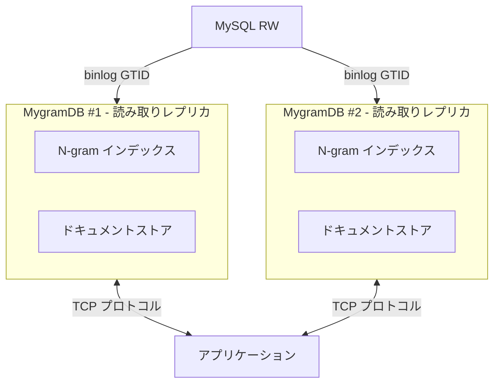

# MygramDB

MySQL レプリケーションに対応した高性能インメモリ全文検索エンジン

## 特徴

- **高速全文検索**: N-gram ベースのインデックスとハイブリッド転置インデックス（Delta エンコーディング + Roaring ビットマップ）
- **MySQL レプリケーション**: binlog ストリーミングによるリアルタイム同期（GTID ベース）
- **Unicode 対応**: ICU ベースの Unicode 正規化と処理
- **並列処理**: 10,000 並列読み取り操作をサポート
- **TCP プロトコル**: memcached スタイルのテキストプロトコル
- **カラム型検証**: VARCHAR および TEXT 型をサポート、型チェック機能付き
- **効率的なクエリ**: プライマリキーインデックスを使用した最適化された ORDER BY

## アーキテクチャ



## クイックスタート

### 前提条件

- C++17 対応コンパイラ（GCC 7+、Clang 5+）
- CMake 3.15+
- MySQL クライアントライブラリ（libmysqlclient）
- ICU ライブラリ（libicu）

### ビルド

#### Makefile を使用（推奨）

```bash
# リポジトリのクローン
git clone https://github.com/libraz/mygram-db.git
cd mygram-db

# 依存関係のインストール（Ubuntu/Debian）
sudo apt-get update
sudo apt-get install -y pkg-config libmysqlclient-dev libicu-dev

# ビルド
make

# テスト実行
make test

# ビルドをクリーン
make clean

# その他の便利なコマンド
make help      # 利用可能なコマンド一覧を表示
make rebuild   # クリーン後に再ビルド
make format    # clang-format でコード整形
```

#### CMake を直接使用

```bash
# ビルドディレクトリの作成
mkdir build && cd build

# 設定とビルド
cmake ..
cmake --build .

# テスト実行
ctest
```

### インストール

```bash
# /usr/local にインストール（sudo が必要）
sudo make install

# カスタムディレクトリにインストール
make PREFIX=/opt/mygramdb install

# アンインストール
sudo make uninstall
```

インストール後、以下のファイルが利用可能になります：
- バイナリ: `/usr/local/bin/mygramdb`, `/usr/local/bin/mygram-cli`
- 設定サンプル: `/usr/local/etc/mygramdb/config.yaml.example`
- ドキュメント: `/usr/local/share/doc/mygramdb/`

### 設定

YAML 設定ファイル（`config.yaml`）を作成:

```yaml
server:
  host: "0.0.0.0"
  port: 11211
  max_connections: 1000

mysql:
  host: "localhost"
  port: 3306
  user: "repl_user"
  password: "repl_password"
  database: "mydb"

tables:
  - name: "articles"
    primary_key: "id"
    text_source:
      column: "content"  # 単一カラム
      # または複数カラムを連結:
      # concat: ["title", "body"]
      # delimiter: " "
    filters:
      - name: "status"
        type: "int"
      - name: "category"
        type: "string"

index:
  ngram_size: 1

replication:
  start_gtid: "3E11FA47-71CA-11E1-9E33-C80AA9429562:1"
  queue_size: 10000
```

### サーバー起動

```bash
# Makefile を使用
make run

# またはビルドディレクトリから直接実行
./build/bin/mygramdb -c config.yaml
```

### CLI クライアントの使用

```bash
# 対話モード
./build/bin/mygram-cli

# 単一コマンドモード
./build/bin/mygram-cli SEARCH articles "こんにちは"

# ホストとポートを指定
./build/bin/mygram-cli -h localhost -p 11211
```

## プロトコル

MygramDB は TCP 上でシンプルなテキストベースのプロトコルを使用します（memcached と類似）。

### SEARCH コマンド

```
SEARCH <table> <text> [NOT <term>...] [FILTER <col=val>...] [LIMIT <n>] [OFFSET <n>]
```

**例:**
```
SEARCH articles こんにちは
SEARCH articles "ライブ配信" LIMIT 100
SEARCH articles ニュース NOT 古い FILTER status=1
SEARCH articles 技術 FILTER category=AI LIMIT 50 OFFSET 100
```

**レスポンス:**
```
OK RESULTS <total_count> <id1> <id2> <id3> ...
```

### COUNT コマンド

```
COUNT <table> <text> [NOT <term>...] [FILTER <col=val>...]
```

**例:**
```
COUNT articles こんにちは
COUNT articles ニュース NOT 古い FILTER status=1
```

**レスポンス:**
```
OK COUNT <number>
```

### GET コマンド

```
GET <table> <primary_key>
```

**例:**
```
GET articles 12345
```

**レスポンス:**
```
OK DOC <primary_key> <filter1=value1> <filter2=value2> ...
```

### エラーレスポンス

```
ERROR <error_message>
```

## パフォーマンス

- **インデックスタイプ**: ハイブリッド転置インデックス（小さいリストには Delta エンコーディング、大きいリストには Roaring ビットマップ）
- **読み取りパフォーマンス**: 10,000 並列読み取りをサポート
- **メモリ効率**: 圧縮転置インデックスによる最適化されたメモリ使用量
- **検索制限**: SEARCH クエリあたり最大 1,000 件の結果（LIMIT で設定可能）

## サポートされるカラム型

MygramDB は以下の MySQL カラム型をテキストインデックス化でサポートします:

- `VARCHAR`
- `TEXT`（TINYTEXT、MEDIUMTEXT、LONGTEXT を含む）
- `BLOB`（テキストとして扱われ、TINYBLOB、MEDIUMBLOB、LONGBLOB を含む）

他のカラム型（例: INT、DATETIME）を使用しようとするとエラーが発生します。

## MySQL レプリケーション

MygramDB は GTID ベースの binlog ストリーミングを使用した MySQL からのリアルタイムレプリケーションをサポートしています。

**サポートされている操作:**
- INSERT（WRITE_ROWS イベント）
- UPDATE（UPDATE_ROWS イベント）
- DELETE（DELETE_ROWS イベント）

**サポートされているカラム型:**
- 整数型: TINYINT、SMALLINT、INT、MEDIUMINT、BIGINT（signed/unsigned）
- 文字列型: VARCHAR、CHAR、TEXT、BLOB、ENUM、SET
- 日時型: DATE、TIME、DATETIME、TIMESTAMP（小数秒対応）
- 数値型: DECIMAL、FLOAT、DOUBLE
- 特殊型: JSON、BIT、NULL

**機能:**
- アトミックな永続化を伴う GTID ポジション追跡
- 接続断時の自動再接続
- マルチスレッドイベント処理
- 設定可能なイベントキューサイズ

**注意:** MySQL で GTID モードを有効にしたレプリケーションを設定する必要があります。詳細は MySQL のドキュメントを参照してください。

## 開発

### プロジェクト構造

```
mygram-db/
├── src/
│   ├── config/          # YAML 設定
│   ├── index/           # N-gram インデックス
│   ├── storage/         # ドキュメントストア & スナップショットビルダー
│   ├── mysql/           # MySQL 接続 & binlog リーダー
│   ├── query/           # クエリパーサー
│   ├── server/          # TCP サーバー
│   ├── utils/           # 文字列ユーティリティ（ICU）
│   └── cli/             # CLI クライアント
├── tests/               # ユニットテスト
├── docs/                # ドキュメント
└── CMakeLists.txt
```

### テストの実行

Makefile を使用:
```bash
make test
```

または CTest を直接使用:
```bash
cd build
ctest --output-on-failure
```

現在のテストカバレッジ: **163 テスト、100% 成功**

**注意**: すべてのユニットテストは MySQL サーバー接続なしで実行できます。MySQL サーバーが必要な統合テストは分離されており、デフォルトでは無効化されています。統合テストを実行するには：

```bash
# MySQL 接続用の環境変数を設定
export MYSQL_HOST=127.0.0.1
export MYSQL_USER=root
export MYSQL_PASSWORD=your_password
export MYSQL_DATABASE=test
export ENABLE_MYSQL_INTEGRATION_TESTS=1

# 統合テストを実行
./build/bin/mysql_connection_integration_test
```

### ビルドオプション

Makefile を使用する際に CMake オプションを設定できます:

```bash
# AddressSanitizer を有効化
make CMAKE_OPTIONS="-DENABLE_ASAN=ON" configure

# ThreadSanitizer を有効化
make CMAKE_OPTIONS="-DENABLE_TSAN=ON" configure

# テストを無効化
make CMAKE_OPTIONS="-DBUILD_TESTS=OFF" configure
```

### コードスタイル

- Google C++ スタイルガイド
- C++17 標準
- clang-format によるフォーマット
- cpplint による静的解析

## ライセンス

[MIT License](LICENSE)

## コントリビューション

コントリビューションを歓迎します！以下の手順に従ってください:

1. リポジトリをフォーク
2. フィーチャーブランチを作成
3. テストを含む変更を作成
4. すべてのテストと静的解析を実行
5. プルリクエストを送信

## 作者

- libraz <libraz@libraz.net> - 初期作成

## 謝辞

- Roaring Bitmaps ライブラリ
- ICU（International Components for Unicode）
- spdlog ロギングライブラリ
- yaml-cpp 設定パーサー
