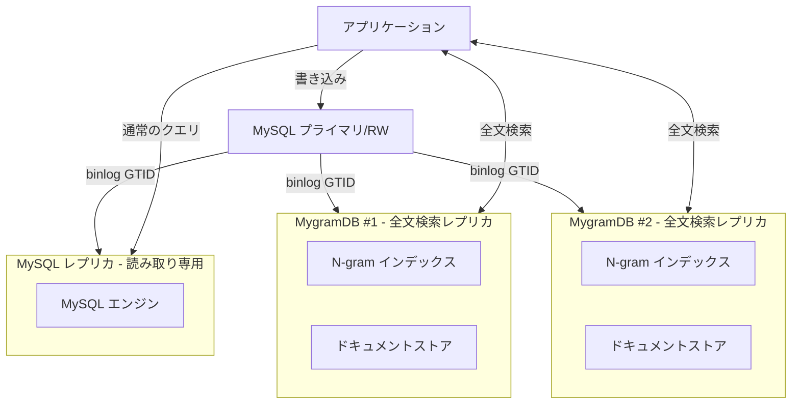

# MygramDB

[](https://github.com/libraz/mygram-db/actions)
[](https://github.com/libraz/mygram-db/releases)
[](https://github.com/libraz/mygram-db/pkgs/container/mygram-db)
[](https://codecov.io/gh/libraz/mygram-db)
[](https://github.com/libraz/mygram-db/blob/main/LICENSE)
[](https://en.cppreference.com/w/cpp/17)
[](https://github.com/libraz/mygram-db)

MySQL レプリケーションに対応した高性能インメモリ全文検索エンジン

## なぜ MygramDB なのか？

MySQL の FULLTEXT (ngram) は遅いのです。
数百万行のデータをディスク上の B-tree ページから読み込み、転置インデックスも圧縮されず、
「の」や「a」といった頻出する短い語句の検索でパフォーマンスが低下します。

これは MySQL の設計上の問題で、そもそも本格的な全文検索エンジンとして作られていません。

**MygramDB** は、この課題を解決するために開発した MySQL 用のインメモリ検索レプリカです。
一貫性のあるスナップショットからインデックスを構築し、GTID binlog でリアルタイム同期を実現。
Elasticsearch のような複雑なセットアップは不要で、ミリ秒単位の高速検索を提供します。

## 特徴

- **高速全文検索**: N-gram ベースのインデックスとハイブリッド転置インデックス（Delta エンコーディング + Roaring ビットマップ）
- **MySQL レプリケーション**: binlog ストリーミングによるリアルタイム同期（GTID ベース）
- **Unicode 対応**: ICU ベースの Unicode 正規化と処理
- **並列処理**: 最大10,000同時接続を処理するスレッドプールアーキテクチャ
- **TCP プロトコル**: memcached スタイルのテキストプロトコル
- **カラム型検証**: VARCHAR および TEXT 型をサポート、型チェック機能付き
- **効率的なクエリ**: プライマリキーインデックスを使用した最適化された ORDER BY
- **設定検証**: YAML と JSON 設定ファイルの自動 JSON Schema 検証

## アーキテクチャ



## クイックスタート

### 前提条件

- C++17 対応コンパイラ（GCC 7+、Clang 5+）
- CMake 3.15+
- MySQL クライアントライブラリ（libmysqlclient）
- ICU ライブラリ（libicu）

### インストール

```bash
# リポジトリのクローン
git clone https://github.com/libraz/mygram-db.git
cd mygram-db

# 依存関係のインストール（Ubuntu/Debian）
sudo apt-get update
sudo apt-get install -y pkg-config libmysqlclient-dev libicu-dev

# ビルド
make

# テスト実行
make test

# インストール（オプション）
sudo make install
```

### 設定

MygramDB は **YAML** と **JSON** の両方の設定フォーマットに対応しており、自動的に **JSON Schema 検証**を行います。

```bash
# 最小限の YAML 設定をコピー
cp examples/config-minimal.yaml config.yaml

# または最小限の JSON 設定をコピー
cp examples/config-minimal.json config.json

# またはすべてのオプションを含む完全な設定をコピー
cp examples/config.yaml config.yaml

# 設定を編集
vim config.yaml  # または config.json
```

最小限の設定例（YAML）:

```yaml
mysql:
  host: "127.0.0.1"
  port: 3306
  user: "repl_user"
  password: "your_password"
  database: "mydb"
  use_gtid: true

tables:
  - name: "articles"
    primary_key: "id"
    text_source:
      column: "content"
    ngram_size: 1

api:
  tcp:
    bind: "0.0.0.0"
    port: 11016

replication:
  enable: true
  server_id: 12345  # 一意である必要があります
  start_from: "snapshot"
```

または JSON フォーマット:

```json
{
  "mysql": {
    "user": "repl_user",
    "password": "your_password",
    "database": "mydb"
  },
  "tables": [
    {
      "name": "articles",
      "text_source": {
        "column": "content"
      }
    }
  ],
  "replication": {
    "server_id": 12345
  }
}
```

**自動検証**: すべての設定は、組み込みの JSON Schema に対して自動的に検証されます。不正な設定（タイポ、間違った型、未知のキー）は起動時に即座に検出されます。

### サーバー起動

```bash
# ヘルプを表示
./build/bin/mygramdb --help

# バージョンを表示
./build/bin/mygramdb --version

# 設定をテスト
./build/bin/mygramdb -t config.yaml

# サーバーを起動（両方の形式をサポート）
./build/bin/mygramdb -c config.yaml
# または
./build/bin/mygramdb config.yaml
```

### CLI クライアントの使用

```bash
# 対話モード
./build/bin/mygram-cli

# 単一コマンド
./build/bin/mygram-cli SEARCH articles "こんにちは"
```

### 基本コマンド

```bash
# 検索
SEARCH articles こんにちは LIMIT 100

# AND 演算子で検索
SEARCH articles 技術 AND AI

# フィルター付き検索
SEARCH articles ニュース FILTER status=1

# 結果数をカウント
COUNT articles こんにちは

# ドキュメントを取得
GET articles 12345
```

## ドキュメント

詳細なドキュメントについては、以下を参照してください：

- [インストールガイド](docs/ja/installation.md) - MygramDB のビルドとインストール
- [設定ガイド](docs/ja/configuration.md) - 設定オプションと例
- [プロトコルリファレンス](docs/ja/protocol.md) - 完全なコマンドリファレンス
- [レプリケーションガイド](docs/ja/replication.md) - MySQL レプリケーションのセットアップ
- [開発ガイド](docs/ja/development.md) - 開発環境のセットアップ
- [クライアントライブラリ (libmygramclient)](docs/ja/libmygramclient.md) - 言語バインディング構築用のC/C++クライアントライブラリ

## 要件と制限事項

### システム要件

- **メモリ**: インメモリストレージのため、十分な RAM が必要（100万ドキュメントあたり約1-2GB）
- **CPU**: マルチコアプロセッサを推奨
- **OS**: Linux または macOS

### MySQL 要件

- **MySQL バージョン**: 5.7.6+ または 8.0+（MySQL 8.0 および 8.4 でテスト済み）
- **GTID モード**: 有効化必須（`gtid_mode=ON`）
- **バイナリログ形式**: ROW 形式が必要（`binlog_format=ROW`）
- **権限**: レプリケーションユーザーに `REPLICATION SLAVE` および `REPLICATION CLIENT` 権限が必要

### 制限事項

- **単一テーブル**: MygramDB インスタンスごとに1つのテーブル
- **テキストカラムのみ**: VARCHAR および TEXT カラムのみ
- **プライマリキー**: 単一カラムのプライマリキーが必要
- **読み取り専用**: MygramDB は読み取りレプリカ。書き込みは MySQL マスターへ
- **メモリ制約**: データセットサイズは利用可能な RAM に制限される

### MygramDB の適用シーン

✅ **適している場合:**
- 読み取り負荷が高く、書き込み負荷が低い
- 数百万行の全文検索が必要
- ミリ秒の検索レイテンシが必要
- シンプルなデプロイ（Elasticsearch クラスタ不要）
- 日本語/CJK テキストの ngram 検索

❌ **推奨されない場合:**
- 書き込み負荷が高いワークロード
- データセットがメモリに収まらない
- 複数ノードにまたがる分散検索が必要
- 複雑な集計や分析クエリが必要

## パフォーマンス

- **インデックスタイプ**: ハイブリッド転置インデックス（小さいリストには Delta エンコーディング、大きいリストには Roaring ビットマップ）
- **並行性**: 最大10,000同時接続を処理するスレッドプールアーキテクチャ
- **メモリ効率**: 圧縮転置インデックスによる最適化されたメモリ使用量
- **検索制限**: SEARCH クエリあたり最大 1,000 件の結果（LIMIT で設定可能）

## ライセンス

[MIT License](LICENSE)

## コントリビューション

コントリビューションを歓迎します！以下の手順に従ってください:

1. リポジトリをフォーク
2. フィーチャーブランチを作成
3. テストを含む変更を作成
4. すべてのテストと静的解析を実行
5. プルリクエストを送信

## 作者

- libraz <libraz@libraz.net> - 初期作成

## 謝辞

- Roaring Bitmaps ライブラリ
- ICU（International Components for Unicode）
- spdlog ロギングライブラリ
- yaml-cpp 設定パーサー
