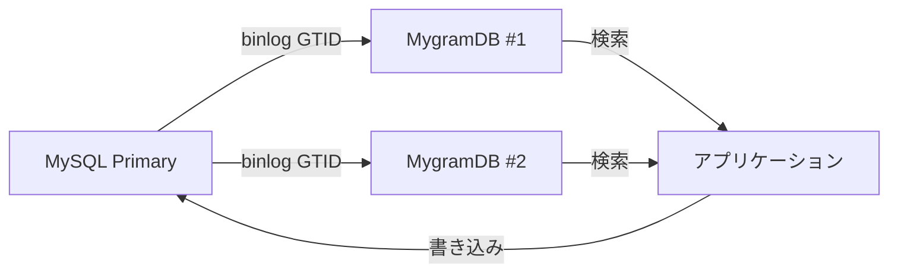

# MygramDB

[](https://github.com/libraz/mygram-db/actions)
[](https://github.com/libraz/mygram-db/releases)
[](https://github.com/libraz/mygram-db/pkgs/container/mygram-db)
[](https://codecov.io/gh/libraz/mygram-db)
[](https://github.com/libraz/mygram-db/blob/main/LICENSE)
[](https://en.cppreference.com/w/cpp/17)
[](https://github.com/libraz/mygram-db)

MySQL FULLTEXT より **25〜200倍高速**。MySQL レプリケーション対応のインメモリ全文検索エンジン。

## なぜ MygramDB なのか？

MySQL の FULLTEXT は非常に遅く、ディスク上の B-tree ページをスキャンし、転置インデックスも圧縮されず、一般的な語句の検索で性能が低下します。

**MygramDB** は、GTID binlog で同期するインメモリ検索レプリカとしてこの問題を解決し、データの75%にマッチするクエリでも **60ms以下** で応答します。

## パフォーマンス

170万行の実データでのテスト結果：

| クエリタイプ | MySQL (コールド/ウォーム) | MygramDB | 高速化 |
|------------|-------------------|----------|---------|
| **SORT id LIMIT 100** (典型例) | 900-3,700ms | 24-56ms | **25-68倍** |
| 中頻度語句 (4.6%マッチ) | 906ms / 592ms | 24ms | **38倍 / 25倍** |
| 高頻度語句 (47.5%マッチ) | 2,495ms / 2,017ms | 42ms | **59倍 / 48倍** |
| 超高頻度語句 (74.9%マッチ) | 3,753ms / 3,228ms | 56ms | **68倍 / 58倍** |
| 2語句 AND | 1,189ms | 10ms | **115倍** |
| **COUNT クエリ** | 680-1,070ms | 5-9ms | **70-200倍** |

**主な利点:**
- **キャッシュウォームアップ不要** - コールドスタートでも常に高速
- **SORT 最適化** - プライマリキーインデックスを使用（外部ソート不要）
- **結果セットに応じてスケール** - 大きな結果セットほど高速化率が高い
- **一貫したパフォーマンス** - MySQLは600ms〜3.7秒と変動、MygramDBは60ms以内
- **高並行性** - 高負荷を余裕で処理；MySQL FULLTEXTは並行トラフィックで停滞

**実際の影響:**
**高負荷な並行環境**では、MySQL FULLTEXTはディスクI/Oのボトルネックによりリクエストがキューイングされ、連鎖的な遅延とタイムアウトが発生します。MygramDBのインメモリアーキテクチャは、同じ負荷を一貫した60ms以内のレイテンシで難なく処理します。

詳細なベンチマークは [パフォーマンスガイド](docs/ja/performance.md) を参照してください。

## クイックスタート

### Docker（本番環境対応）

**前提条件:** MySQLのGTIDモードが有効になっていることを確認してください：
```sql
-- GTIDモードを確認（ONであるべき）
SHOW VARIABLES LIKE 'gtid_mode';

-- OFFの場合、GTIDモードを有効化（MySQL 8.0以降）
SET GLOBAL enforce_gtid_consistency = ON;
SET GLOBAL gtid_mode = OFF_PERMISSIVE;
SET GLOBAL gtid_mode = ON_PERMISSIVE;
SET GLOBAL gtid_mode = ON;
```

**MygramDBを起動:**
```bash
docker run -d --name mygramdb \
  -p 11016:11016 \
  -e MYSQL_HOST=your-mysql-host \
  -e MYSQL_USER=repl_user \
  -e MYSQL_PASSWORD=your_password \
  -e MYSQL_DATABASE=mydb \
  -e TABLE_NAME=articles \
  -e TABLE_PRIMARY_KEY=id \
  -e TABLE_TEXT_COLUMN=content \
  -e TABLE_NGRAM_SIZE=2 \
  -e REPLICATION_SERVER_ID=12345 \
  ghcr.io/libraz/mygram-db:latest

# ログを確認
docker logs -f mygramdb

# 初回データ同期を実行（初回起動時に必須）
docker exec mygramdb mygram-cli -p 11016 SYNC articles

# 検索を試す
docker exec mygramdb mygram-cli -p 11016 SEARCH articles "こんにちは"
```

### Docker Compose（テスト用MySQL付き）

```bash
git clone https://github.com/libraz/mygram-db.git
cd mygram-db
docker-compose up -d

# MySQLの準備完了を待つ（docker-compose logs -f で確認）

# 初回データ同期を実行
docker-compose exec mygramdb mygram-cli -p 11016 SYNC articles

# 検索を試す
docker-compose exec mygramdb mygram-cli -p 11016 SEARCH articles "こんにちは"
```

サンプルデータ付きの MySQL 8.4 が含まれ、すぐにテストできます。

## 基本的な使い方

```bash
# ページネーション付き検索
SEARCH articles "こんにちは" SORT id LIMIT 100

# カスタムカラムでソート
SEARCH articles "こんにちは" SORT created_at DESC LIMIT 50

# LIMIT でオフセット指定（MySQL形式）
SEARCH articles "技術" LIMIT 10,100  # offset=10, count=100

# マッチ数をカウント
COUNT articles "こんにちは"

# 複数語句のAND検索
SEARCH articles こんにちは AND 世界

# フィルター付き検索
SEARCH articles 技術 FILTER status=1 LIMIT 100

# プライマリキーで取得
GET articles 12345
```

全コマンドは [プロトコルリファレンス](docs/ja/protocol.md) を参照してください。

## 特徴

- **高速**: MySQL FULLTEXT より25〜200倍高速
- **MySQL レプリケーション**: GTID ベースのリアルタイム binlog ストリーミング
- **ランタイム変数**: MySQL互換のSET/SHOW VARIABLESコマンドでゼロダウンタイム設定変更
- **MySQL フェイルオーバー**: GTID位置を保持しながらランタイムでMySQLサーバーを切り替え
- **複数テーブル対応**: 単一インスタンスで複数テーブルのインデックス化
- **デュアルプロトコル**: TCP（memcachedスタイル）と HTTP/REST API
- **高並行性**: 10,000以上の同時接続をサポートするスレッドプール
- **Unicode対応**: CJK/多言語テキスト用のICUベース正規化
- **圧縮**: ハイブリッド Delta エンコーディング + Roaring ビットマップ
- **簡単デプロイ**: 単一バイナリまたはDockerコンテナ

## アーキテクチャ



MygramDB は全文検索専用の読み取りレプリカとして機能し、MySQL は書き込みと通常のクエリを処理します。

## MygramDB の適用シーン

✅ **適している場合:**
- 検索中心のワークロード（読み取り >> 書き込み）
- 数百万ドキュメントの全文検索
- 100ms以下の検索レイテンシが必要
- シンプルなデプロイ要件
- 日本語/CJK テキストの ngram 検索

❌ **推奨されない場合:**
- 書き込み負荷が高いワークロード
- データセットがメモリに収まらない（100万ドキュメントあたり約1-2GB）
- ノード間の分散検索が必要
- 複雑な集計や分析クエリ

## ドキュメント

- **[CHANGELOG](CHANGELOG.md)** - バージョン履歴とリリースノート
- [Docker デプロイメントガイド](docs/ja/docker-deployment.md) - 本番環境Dockerセットアップ
- [設定ガイド](docs/ja/configuration.md) - すべての設定オプション
- [プロトコルリファレンス](docs/ja/protocol.md) - 完全なコマンドリファレンス
- [HTTP API リファレンス](docs/ja/http-api.md) - REST API ドキュメント
- [パフォーマンスガイド](docs/ja/performance.md) - ベンチマークと最適化
- [レプリケーションガイド](docs/ja/replication.md) - MySQL レプリケーション設定
- [運用ガイド](docs/ja/operations.md) - ランタイム変数とMySQLフェイルオーバー
- [インストールガイド](docs/ja/installation.md) - ソースからビルド
- [開発ガイド](docs/ja/development.md) - コントリビューションガイドライン
- [クライアントライブラリ](docs/ja/libmygramclient.md) - C/C++ クライアントライブラリ

### リリースノート

- [最新リリース](https://github.com/libraz/mygram-db/releases/latest) - バイナリダウンロード
- [詳細リリースノート](docs/releases/) - バージョン別マイグレーションガイド

## 要件

**システム:**
- RAM: 100万ドキュメントあたり約1-2GB
- OS: Linux または macOS

**MySQL:**
- バージョン: 5.7.6+ または 8.0+
- GTID モード有効化 (`gtid_mode=ON`)
- バイナリログ形式: ROW (`binlog_format=ROW`)
- レプリケーション権限: `REPLICATION SLAVE`, `REPLICATION CLIENT`

詳細は [インストールガイド](docs/ja/installation.md) を参照してください。

## ライセンス

[MIT License](LICENSE)

## コントリビューション

コントリビューションを歓迎します！ガイドラインは [CONTRIBUTING.md](CONTRIBUTING.md) を参照してください。

開発環境のセットアップは [開発ガイド](docs/ja/development.md) を参照してください。

## 作者

- libraz <libraz@libraz.net>

## 謝辞

- [Roaring Bitmaps](https://roaringbitmap.org/) - 圧縮ビットマップ
- [ICU](https://icu.unicode.org/) - Unicode サポート
- [spdlog](https://github.com/gabime/spdlog) - ロギング
- [yaml-cpp](https://github.com/jbeder/yaml-cpp) - 設定パース
