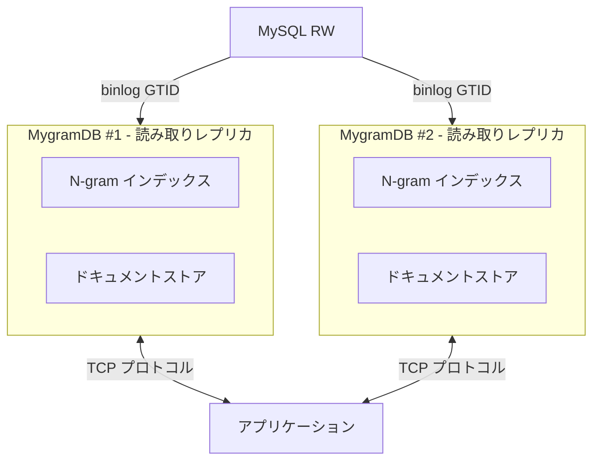

# MygramDB

MySQL レプリケーションに対応した高性能インメモリ全文検索エンジン

## なぜ MygramDB なのか？

MySQL FULLTEXT (ngram) が遅いからです。
恐ろしく遅い。ディスク上の B-tree ページを通して数百万行をスキャンし、
転置インデックスを圧縮せず、「の」や「a」のような短い語で苦戦します。

あなたのせいではありません — MySQL は本格的な全文検索用に設計されていないのです。

そこで私は **MygramDB** を作りました — MySQL のためのインメモリ検索レプリカです。
一貫性のあるスナップショットからインデックスを構築し、GTID binlog で同期し、
Elasticsearch の複雑さも痛みもなく、ミリ秒クラスの検索を提供します。

## 特徴

- **高速全文検索**: N-gram ベースのインデックスとハイブリッド転置インデックス（Delta エンコーディング + Roaring ビットマップ）
- **MySQL レプリケーション**: binlog ストリーミングによるリアルタイム同期（GTID ベース）
- **Unicode 対応**: ICU ベースの Unicode 正規化と処理
- **並列処理**: 10,000 並列読み取り操作をサポート
- **TCP プロトコル**: memcached スタイルのテキストプロトコル
- **カラム型検証**: VARCHAR および TEXT 型をサポート、型チェック機能付き
- **効率的なクエリ**: プライマリキーインデックスを使用した最適化された ORDER BY

## 要件と制限事項

### システム要件

- **メモリ**: インメモリストレージのため、インデックスとドキュメントストア全体を保持するのに十分な RAM が必要
  - 目安: 100万ドキュメントあたり約1-2GB（テキストサイズと ngram_size により変動）
  - 1000万ドキュメント（平均1KBテキスト）の場合: 10-20GB のメモリ使用量を想定
- **CPU**: 並列クエリ処理のためマルチコアプロセッサを推奨
- **OS**: Linux または macOS（Windows は未テスト）

### MySQL 要件

- **MySQL バージョン**: 5.7.6+ または 8.0+（MySQL 8.0 および 8.4 でテスト済み）
- **GTID モード**: 有効化必須（`gtid_mode=ON`, `enforce_gtid_consistency=ON`）
- **バイナリログ形式**: ROW 形式が必要（`binlog_format=ROW`）
- **権限**: レプリケーションユーザーに `REPLICATION SLAVE` および `REPLICATION CLIENT` 権限が必要

### 制限事項

- **単一テーブル**: 現在、MygramDB インスタンスごとに1つのテーブルのみサポート
- **テキストカラムのみ**: VARCHAR および TEXT カラムのみ全文検索インデックス化可能
- **プライマリキー**: テーブルは単一カラムのプライマリキーが必要（複合キー非対応）
- **トランザクションなし**: MygramDB は結果整合性（binlog ラグは通常 100ms 未満）
- **メモリ制約**: データセットサイズは利用可能な RAM に制限される
- **読み取り専用**: MygramDB は読み取りレプリカ。書き込みは MySQL マスターへ

### MygramDB の適用シーン

✅ **適している場合:**
- 読み取り負荷が高く、書き込み負荷が低い
- 数百万行の全文検索が必要
- ミリ秒の検索レイテンシが必要
- シンプルなデプロイ（Elasticsearch クラスタ不要）
- 日本語/CJK テキストの ngram 検索

❌ **推奨されない場合:**
- 書き込み負荷が高いワークロード
- データセットがメモリに収まらない
- 複数ノードにまたがる分散検索が必要
- 複雑な集計や分析クエリが必要

## アーキテクチャ



## クイックスタート

### 前提条件

- C++17 対応コンパイラ（GCC 7+、Clang 5+）
- CMake 3.15+
- MySQL クライアントライブラリ（libmysqlclient）
- ICU ライブラリ（libicu）

### ビルド

#### Makefile を使用（推奨）

```bash
# リポジトリのクローン
git clone https://github.com/libraz/mygram-db.git
cd mygram-db

# 依存関係のインストール（Ubuntu/Debian）
sudo apt-get update
sudo apt-get install -y pkg-config libmysqlclient-dev libicu-dev

# ビルド
make

# テスト実行
make test

# ビルドをクリーン
make clean

# その他の便利なコマンド
make help      # 利用可能なコマンド一覧を表示
make rebuild   # クリーン後に再ビルド
make format    # clang-format でコード整形
```

#### CMake を直接使用

```bash
# ビルドディレクトリの作成
mkdir build && cd build

# 設定とビルド
cmake ..
cmake --build .

# テスト実行
ctest
```

### インストール

```bash
# /usr/local にインストール（sudo が必要）
sudo make install

# カスタムディレクトリにインストール
make PREFIX=/opt/mygramdb install

# アンインストール
sudo make uninstall
```

インストール後、以下のファイルが利用可能になります：
- バイナリ: `/usr/local/bin/mygramdb`, `/usr/local/bin/mygram-cli`
- 設定サンプル: `/usr/local/etc/mygramdb/config.yaml.example`
- ドキュメント: `/usr/local/share/doc/mygramdb/`

### 設定

YAML 設定ファイル（`config.yaml`）を作成:

```yaml
# MySQL 接続設定
mysql:
  host: "127.0.0.1"
  port: 3306
  user: "repl_user"
  password: "your_password_here"
  database: "mydb"                  # データベース名（テーブル設定で指定する場合はオプション）
  use_gtid: true                    # GTID ベースレプリケーションを有効化
  binlog_format: "ROW"              # 必須: ROW 形式
  binlog_row_image: "FULL"          # 必須: FULL 行イメージ
  connect_timeout_ms: 3000          # 接続タイムアウト

# テーブル設定（インスタンスごとに1テーブルをサポート）
tables:
  - name: "articles"
    primary_key: "id"
    text_source:
      column: "content"               # 全文検索用の単一カラム
      # または複数カラムを連結:
      # concat: ["title", "body"]
      # delimiter: " "
    filters:                          # オプションのフィルターカラム
      - name: "status"
        type: "int"                   # 整数型: tinyint, tinyint_unsigned, smallint,
                                      #   smallint_unsigned, int, int_unsigned, mediumint,
                                      #   mediumint_unsigned, bigint
                                      # 浮動小数点型: float, double
                                      # 文字列型: string, varchar, text
                                      # 日付型: datetime, date, timestamp
        dict_compress: true           # 辞書圧縮を有効化（低カーディナリティカラム向け）
        bitmap_index: true            # ビットマップインデックスを有効化（フィルター高速化）
      - name: "category"
        type: "string"
      - name: "created_at"
        type: "datetime"
        bucket: "minute"              # 日時のバケット化: minute|hour|day（カーディナリティ削減）
    ngram_size: 1                     # N-gram サイズ（1=ユニグラム、2=バイグラム等）
    posting:                          # 転置インデックス設定
      block_size: 128
      freq_bits: 0                    # 0=ブール値、4 または 8 で語頻度
      use_roaring: "auto"             # auto|always|never
    where_clause: ""                  # スナップショット用のオプション WHERE 句（例: "status = 1"）

# インデックス構築設定
build:
  mode: "select_snapshot"             # ビルドモード（現在は select_snapshot のみ）
  batch_size: 5000                    # スナップショット時の1バッチあたりの行数
  parallelism: 2                      # 並列ビルドスレッド数
  throttle_ms: 0                      # バッチ間のスロットル遅延（ミリ秒）

# レプリケーション設定
replication:
  enable: true
  server_id: 0                        # MySQL サーバー ID（0 = 自動生成）
  start_from: "snapshot"              # オプション: snapshot|latest|gtid=<UUID:txn>|state_file
  state_file: "./mygramdb_replication.state"  # GTID 状態永続化ファイル
  queue_size: 10000                   # Binlog イベントキューサイズ
  reconnect_backoff_min_ms: 500       # 最小再接続バックオフ遅延
  reconnect_backoff_max_ms: 10000     # 最大再接続バックオフ遅延

# メモリ管理
memory:
  hard_limit_mb: 8192                 # ハードメモリ制限
  soft_target_mb: 4096                # ソフトメモリ目標
  arena_chunk_mb: 64                  # アリーナチャンクサイズ
  roaring_threshold: 0.18             # Roaring ビットマップ閾値
  minute_epoch: true                  # 分精度のエポックを使用
  normalize:                          # テキスト正規化
    nfkc: true                        # NFKC 正規化
    width: "narrow"                   # 幅: keep|narrow|wide
    lower: false                      # 小文字変換

# スナップショット永続化
snapshot:
  dir: "/var/lib/mygramdb/snapshots"  # スナップショットディレクトリ

# API サーバー設定
api:
  tcp:
    bind: "0.0.0.0"                   # TCP バインドアドレス
    port: 11311                       # TCP ポート

# ロギング設定
logging:
  level: "info"                       # ログレベル: debug|info|warn|error
```

すべての利用可能なオプションの完全な例については `examples/config.yaml` を参照してください。

### 設定のテスト

サーバーを起動する前に、設定ファイルを検証します:

```bash
# 設定構文をテスト
./build/bin/mygramdb -t config.yaml

# またはロングオプションを使用
./build/bin/mygramdb --config-test config.yaml
```

以下の検証を実行します:
- **YAML 構文エラー**: 無効な YAML フォーマット
- **未知の設定キー**: タイプミスやサポートされていないオプション
- **型の不一致**: 誤ったデータ型（例: map の代わりに string）
- **必須フィールドの欠如**: 必須設定の欠落
- **無効な値**: 範囲外または無効な設定値

設定が有効な場合、以下を表示します:
- MySQL 接続設定
- テーブル設定（名前、primary_key、ngram_size）
- API サーバー設定（バインドアドレスとポート）
- レプリケーション状態（有効/無効）
- ロギングレベル

### サーバー起動

```bash
# Makefile を使用
make run

# またはビルドディレクトリから直接実行
./build/bin/mygramdb config.yaml

# サーバーは設定ファイルパスを引数として必要とします
# 使用方法: mygramdb [OPTIONS] <config.yaml>
# オプション:
#   -t, --config-test    設定ファイルをテストして終了
```

### CLI クライアントの使用

```bash
# 対話モード
./build/bin/mygram-cli

# 単一コマンドモード
./build/bin/mygram-cli SEARCH articles "こんにちは"

# ホストとポートを指定
./build/bin/mygram-cli -h localhost -p 11211
```

#### CLI の機能

CLI クライアント（`mygram-cli`）は、MygramDB 用のインタラクティブシェルを提供し、以下の機能を備えています：

- **タブ補完**: TAB キーを押すとコマンド名を自動補完（GNU Readline が必要）
- **コマンド履歴**: ↑/↓ 矢印キーでコマンド履歴をナビゲート（GNU Readline が必要）
- **行編集**: Ctrl+A、Ctrl+E などの完全な行編集サポート（GNU Readline が必要）
- **エラーハンドリング**: 無効なコマンドに対しても適切なエラーメッセージを表示（クラッシュしません）

**注意**: タブ補完とコマンド履歴は GNU Readline ライブラリが必要です。ビルド時に Readline が利用可能な場合は自動的に使用され、そうでない場合は基本入力モードにフォールバックします。

**利用可能なコマンド**（対話モードで `help` と入力）：
- `SEARCH`、`COUNT`、`GET` - 検索と取得
- `INFO`、`CONFIG` - サーバー情報と設定
- `SAVE`、`LOAD` - スナップショット管理
- `REPLICATION STATUS/STOP/START` - レプリケーション制御
- `quit`、`exit` - クライアントの終了
- `help` - ヘルプメッセージの表示

## プロトコル

MygramDB は TCP 上でシンプルなテキストベースのプロトコルを使用します（memcached と類似）。

### SEARCH コマンド

```
SEARCH <table> <text> [NOT <term>...] [FILTER <col=val>...] [LIMIT <n>] [OFFSET <n>]
```

**例:**
```
SEARCH articles こんにちは
SEARCH articles "ライブ配信" LIMIT 100
SEARCH articles ニュース NOT 古い FILTER status=1
SEARCH articles 技術 FILTER category=AI LIMIT 50 OFFSET 100
```

**レスポンス:**
```
OK RESULTS <total_count> <id1> <id2> <id3> ...
```

### COUNT コマンド

```
COUNT <table> <text> [NOT <term>...] [FILTER <col=val>...]
```

**例:**
```
COUNT articles こんにちは
COUNT articles ニュース NOT 古い FILTER status=1
```

**レスポンス:**
```
OK COUNT <number>
```

### GET コマンド

```
GET <table> <primary_key>
```

**例:**
```
GET articles 12345
```

**レスポンス:**
```
OK DOC <primary_key> <filter1=value1> <filter2=value2> ...
```

### INFO コマンド

サーバー情報と統計を取得します。

```
INFO
```

**レスポンス:**
```
OK INFO version=<version> uptime=<seconds> total_requests=<count> connections=<count> index_size=<bytes> doc_count=<count>
```

### SAVE コマンド

現在のインデックススナップショットをディスクに保存します。

```
SAVE [<filepath>]
```

**例:**
```
SAVE
SAVE /path/to/snapshot.bin
```

**レスポンス:**
```
OK SAVED <filepath>
```

### LOAD コマンド

インデックススナップショットをディスクから読み込みます。

```
LOAD <filepath>
```

**例:**
```
LOAD /path/to/snapshot.bin
```

**レスポンス:**
```
OK LOADED <filepath> docs=<count>
```

### REPLICATION STATUS コマンド

現在のレプリケーション状態を取得します。

```
REPLICATION STATUS
```

**レスポンス:**
```
OK REPLICATION status=<running|stopped> gtid=<current_gtid>
```

### REPLICATION STOP コマンド

Binlog レプリケーションを停止します（インデックスは読み取り専用になります）。

```
REPLICATION STOP
```

**レスポンス:**
```
OK REPLICATION STOPPED
```

### REPLICATION START コマンド

Binlog レプリケーションを再開します。

```
REPLICATION START
```

**レスポンス:**
```
OK REPLICATION STARTED
```

### CONFIG コマンド

現在のサーバー設定（すべての設定項目）を取得します。

```
CONFIG
```

**レスポンス:**
YAML形式で以下の情報を返します:
- MySQL 接続設定
- テーブル設定（名前、primary_key、ngram_size、フィルター数）
- API サーバー設定（バインドアドレスとポート）
- レプリケーション設定（enable、server_id、start_from、state_file）
- メモリ設定（制限、閾値）
- スナップショットディレクトリ
- ロギングレベル
- 実行時状態（接続数、稼働時間、読み取り専用モード）

**例:**
```
CONFIG
OK CONFIG
  mysql:
    host: 127.0.0.1
    port: 3306
    user: repl_user
    database: mydb
    use_gtid: true
  tables: 1
    - name: articles
      primary_key: id
      ngram_size: 1
      filters: 3
  api:
    tcp.bind: 0.0.0.0
    tcp.port: 11311
  replication:
    enable: true
    server_id: 12345
    start_from: snapshot
    state_file: ./mygramdb_replication.state
  memory:
    hard_limit_mb: 8192
    soft_target_mb: 4096
    roaring_threshold: 0.18
  snapshot:
    dir: /var/lib/mygramdb/snapshots
  logging:
    level: info
  runtime:
    connections: 5
    max_connections: 1000
    read_only: false
    uptime: 3600s
```

### エラーレスポンス

```
ERROR <error_message>
```

## パフォーマンス

- **インデックスタイプ**: ハイブリッド転置インデックス（小さいリストには Delta エンコーディング、大きいリストには Roaring ビットマップ）
- **読み取りパフォーマンス**: 10,000 並列読み取りをサポート
- **メモリ効率**: 圧縮転置インデックスによる最適化されたメモリ使用量
- **検索制限**: SEARCH クエリあたり最大 1,000 件の結果（LIMIT で設定可能）

## サポートされるカラム型

MygramDB は以下の MySQL カラム型をテキストインデックス化でサポートします:

- `VARCHAR`
- `TEXT`（TINYTEXT、MEDIUMTEXT、LONGTEXT を含む）
- `BLOB`（テキストとして扱われ、TINYBLOB、MEDIUMBLOB、LONGBLOB を含む）

他のカラム型（例: INT、DATETIME）を使用しようとするとエラーが発生します。

## MySQL レプリケーション

MygramDB はデータ一貫性を保証した GTID ベースの binlog ストリーミングによる MySQL からのリアルタイムレプリケーションをサポートしています。

### 前提条件

**MySQL サーバーで GTID モードを有効化する必要があります:**
```sql
-- 現在の GTID モードを確認
SHOW VARIABLES LIKE 'gtid_mode';

-- GTID モードが OFF の場合は有効化（MySQL 5.7 ではサーバー再起動が必要）
SET GLOBAL gtid_mode = ON;
SET GLOBAL enforce_gtid_consistency = ON;
```

MygramDB は起動時に GTID モードを自動的に検証し、設定されていない場合は明確なエラーメッセージを表示します。

### レプリケーション開始オプション

config.yaml の `replication.start_from` で設定:

- **`snapshot`**（推奨）: 初期スナップショットビルド時にキャプチャされた GTID から開始
  - データ一貫性のため `START TRANSACTION WITH CONSISTENT SNAPSHOT` を使用
  - スナップショット時点の `@@global.gtid_executed` を正確にキャプチャ
  - スナップショットと binlog レプリケーション間のデータ損失を保証

- **`latest`**: 現在の GTID ポジションから開始（履歴データは無視）
  - `SHOW BINARY LOG STATUS` を使用して最新の GTID を取得
  - リアルタイム変更のみが必要な場合に適しています

- **`gtid=<UUID:txn>`**: 特定の GTID ポジションから開始
  - 例: `gtid=3E11FA47-71CA-11E1-9E33-C80AA9429562:100`

- **`state_file`**: 保存された GTID 状態ファイルから再開
  - `./gtid_state.txt` から読み込み（自動作成）
  - クラッシュリカバリと再開を可能にします

### サポートされている操作

- INSERT（WRITE_ROWS イベント）
- UPDATE（UPDATE_ROWS イベント）
- DELETE（DELETE_ROWS イベント）

### サポートされているカラム型

- 整数型: TINYINT、SMALLINT、INT、MEDIUMINT、BIGINT（signed/unsigned）
- 文字列型: VARCHAR、CHAR、TEXT、BLOB、ENUM、SET
- 日時型: DATE、TIME、DATETIME、TIMESTAMP（小数秒対応）
- 数値型: DECIMAL、FLOAT、DOUBLE
- 特殊型: JSON、BIT、NULL

### 機能

- **GTID 一貫性**: スナップショットと binlog レプリケーションは一貫性のあるスナップショットトランザクションにより調整されます
- **GTID ポジション追跡**: 状態ファイルによるアトミックな永続化
- **自動検証**: 起動時に GTID モードをチェックし、明確なエラーメッセージを表示
- **自動再接続**: 接続断を適切に処理
- **マルチスレッド処理**: リーダーとワーカーを分離したスレッド
- **設定可能なキュー**: パフォーマンスチューニング用に調整可能なイベントキューサイズ

## 開発

### プロジェクト構造

```
mygram-db/
├── src/
│   ├── config/          # YAML 設定
│   ├── index/           # N-gram インデックス
│   ├── storage/         # ドキュメントストア & スナップショットビルダー
│   ├── mysql/           # MySQL 接続 & binlog リーダー
│   ├── query/           # クエリパーサー
│   ├── server/          # TCP サーバー
│   ├── utils/           # 文字列ユーティリティ（ICU）
│   └── cli/             # CLI クライアント
├── tests/               # ユニットテスト
├── docs/                # ドキュメント
└── CMakeLists.txt
```

### テストの実行

Makefile を使用:
```bash
make test
```

または CTest を直接使用:
```bash
cd build
ctest --output-on-failure
```

現在のテストカバレッジ: **169 テスト、100% 成功**

**注意**: すべてのユニットテストは MySQL サーバー接続なしで実行できます。MySQL サーバーが必要な統合テストは分離されており、デフォルトでは無効化されています。統合テストを実行するには：

```bash
# MySQL 接続用の環境変数を設定
export MYSQL_HOST=127.0.0.1
export MYSQL_USER=root
export MYSQL_PASSWORD=your_password
export MYSQL_DATABASE=test
export ENABLE_MYSQL_INTEGRATION_TESTS=1

# 統合テストを実行
./build/bin/mysql_connection_integration_test
```

### ビルドオプション

Makefile を使用する際に CMake オプションを設定できます:

```bash
# AddressSanitizer を有効化
make CMAKE_OPTIONS="-DENABLE_ASAN=ON" configure

# ThreadSanitizer を有効化
make CMAKE_OPTIONS="-DENABLE_TSAN=ON" configure

# テストを無効化
make CMAKE_OPTIONS="-DBUILD_TESTS=OFF" configure
```

### コードスタイル

- Google C++ スタイルガイド
- C++17 標準
- clang-format によるフォーマット
- cpplint による静的解析

## ライセンス

[MIT License](LICENSE)

## コントリビューション

コントリビューションを歓迎します！以下の手順に従ってください:

1. リポジトリをフォーク
2. フィーチャーブランチを作成
3. テストを含む変更を作成
4. すべてのテストと静的解析を実行
5. プルリクエストを送信

## 作者

- libraz <libraz@libraz.net> - 初期作成

## 謝辞

- Roaring Bitmaps ライブラリ
- ICU（International Components for Unicode）
- spdlog ロギングライブラリ
- yaml-cpp 設定パーサー
