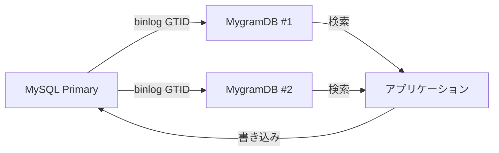

# MygramDB

[](https://github.com/libraz/mygram-db/actions)
[](https://github.com/libraz/mygram-db/releases)
[](https://github.com/libraz/mygram-db/pkgs/container/mygram-db)
[](https://codecov.io/gh/libraz/mygram-db)
[](https://github.com/libraz/mygram-db/blob/main/LICENSE)
[](https://en.cppreference.com/w/cpp/17)
[](https://dev.mysql.com/)
[](https://github.com/libraz/mygram-db)

MySQL binlog レプリケーション対応のインメモリ全文検索エンジン。100万行規模でサブミリ秒のクエリ応答。

## なぜ MygramDB なのか？

MySQL FULLTEXT はディスク上の B-tree をスキャンするため、一般的な語句や並列負荷で性能が低下します。MygramDB は圧縮 n-gram インデックスをメモリ上に保持し、GTID binlog レプリケーションで同期します。

## パフォーマンス

110万件の Wikipedia 記事（英語+日本語）で MygramDB v1.5.0 と MySQL 8.4 FULLTEXT（ngram パーサー）を比較：

| クエリタイプ | MySQL | MygramDB | 高速化 |
|------------|-------|----------|---------|
| **検索**（SORT id LIMIT 100） | 507–2,566ms | 0.08–0.42ms | 1,200–6,700倍 |
| **CJK検索**（日本語バイグラム） | 4–1,204ms | 1–4ms | 2–1,100倍 |
| **COUNT** | 416–1,797ms | 0.08ms | 5,500–21,600倍 |
| **並列**（4接続） | 8 QPS | 11,766 QPS | 1,400倍 |

- ほとんどのクエリでサブミリ秒のレイテンシ、キャッシュウォームアップ不要
- v1.5.0 の `verify_text` で n-gram 偽陽性を除去（MySQL と完全一致の検索結果）
- 再現可能: `make bench-up && make bench-run`（[詳細](docs/ja/performance.md)）

## クイックスタート

### Docker（本番環境対応）

**前提条件:** MySQLのGTIDモードが有効になっていることを確認してください：
```sql
-- GTIDモードを確認（ONであるべき）
SHOW VARIABLES LIKE 'gtid_mode';

-- OFFの場合、GTIDモードを有効化（MySQL 8.0以降 / 9.x）
SET GLOBAL enforce_gtid_consistency = ON;
SET GLOBAL gtid_mode = OFF_PERMISSIVE;
SET GLOBAL gtid_mode = ON_PERMISSIVE;
SET GLOBAL gtid_mode = ON;
```

**MygramDBを起動:**
```bash
docker run -d --name mygramdb \
  -p 11016:11016 \
  -e MYSQL_HOST=your-mysql-host \
  -e MYSQL_USER=repl_user \
  -e MYSQL_PASSWORD=your_password \
  -e MYSQL_DATABASE=mydb \
  -e TABLE_NAME=articles \
  -e TABLE_PRIMARY_KEY=id \
  -e TABLE_TEXT_COLUMN=content \
  -e TABLE_NGRAM_SIZE=2 \
  -e REPLICATION_SERVER_ID=12345 \
  ghcr.io/libraz/mygram-db:latest

# ログを確認
docker logs -f mygramdb

# 初回データ同期を実行（初回起動時に必須）
docker exec mygramdb mygram-cli -p 11016 SYNC articles

# 検索を試す
docker exec mygramdb mygram-cli -p 11016 SEARCH articles "こんにちは"
```

### Docker Compose（テスト用MySQL付き）

```bash
git clone https://github.com/libraz/mygram-db.git
cd mygram-db
docker-compose up -d

# MySQLの準備完了を待つ（docker-compose logs -f で確認）

# 初回データ同期を実行
docker-compose exec mygramdb mygram-cli -p 11016 SYNC articles

# 検索を試す
docker-compose exec mygramdb mygram-cli -p 11016 SEARCH articles "こんにちは"
```

サンプルデータ付きの MySQL 8.4 が含まれ、すぐにテストできます。MySQL 9.4 および MariaDB 10.11/11.4 でもテスト済み。

## 基本的な使い方

```bash
# ページネーション付き検索
SEARCH articles "こんにちは" SORT id LIMIT 100

# 関連度順でソート（BM25）
SEARCH articles "こんにちは" SORT _score DESC LIMIT 10

# ハイライト付き検索結果
SEARCH articles "こんにちは" HIGHLIGHT TAG <b> </b> LIMIT 10

# あいまい検索（編集距離1）
SEARCH articles "まちがい" FUZZY LIMIT 10

# ファセット集計
FACET articles category "技術"

# マッチ数をカウント
COUNT articles "こんにちは"

# 複数語句のAND検索
SEARCH articles こんにちは AND 世界

# フィルター付き検索
SEARCH articles 技術 FILTER status=1 LIMIT 100

# プライマリキーで取得
GET articles 12345
```

全コマンドは [プロトコルリファレンス](docs/ja/protocol.md) を参照してください。

## 特徴

- **高速**: 100万行規模でサブミリ秒の検索
- **BM25 関連度スコアリング**: `SORT _score` でTF-IDFベースの関連度ランキング
- **ハイライト**: `HIGHLIGHT` 句でマッチした語句をタグ付きスニペットで返却
- **あいまい検索**: `FUZZY` 句でレーベンシュタイン編集距離によるマッチング
- **類義語辞書**: TSVファイルからの自動クエリ展開
- **ファセット検索**: `FACET` コマンドでフィルターカラム値の集計とカウント
- **MySQL/MariaDB レプリケーション**: GTIDベースのリアルタイム binlog ストリーミング（MySQL 8.4+、MariaDB 10.6+）
- **ランタイム変数**: MySQL互換のSET/SHOW VARIABLESコマンドでゼロダウンタイム設定変更
- **MySQL フェイルオーバー**: GTID位置を保持しながらランタイムでMySQLサーバーを切り替え
- **複数テーブル対応**: 単一インスタンスで複数テーブルのインデックス化
- **デュアルプロトコル**: TCP（memcachedスタイル）と HTTP/REST API
- **高並行性**: 10,000以上の同時接続をサポートするスレッドプール
- **Unicode対応**: CJK/多言語テキスト用のICUベース正規化
- **圧縮**: ハイブリッド Delta エンコーディング + Roaring ビットマップ
- **簡単デプロイ**: 単一バイナリまたはDockerコンテナ

## アーキテクチャ


```mermaid
graph LR
    MySQL[MySQL Primary] -->|binlog GTID| MygramDB1[MygramDB #1]
    MySQL -->|binlog GTID| MygramDB2[MygramDB #2]

    MygramDB1 -->|検索| App[アプリケーション]
    MygramDB2 -->|検索| App
    App -->|書き込み| MySQL
```

MygramDB は全文検索専用の読み取りレプリカとして機能し、MySQL は書き込みと通常のクエリを処理します。

## MygramDB の適用シーン

✅ **適している場合:**
- 検索中心のワークロード（読み取り >> 書き込み）
- 数百万ドキュメントの全文検索
- 100ms以下の検索レイテンシが必要
- シンプルなデプロイ要件
- 日本語/CJK テキストの ngram 検索

❌ **推奨されない場合:**
- 書き込み負荷が高いワークロード
- データセットがメモリに収まらない（100万ドキュメントあたり約1-2GB）
- ノード間の分散検索が必要
- 複雑な集計や分析クエリ

## ドキュメント

- **[CHANGELOG](CHANGELOG.md)** - バージョン履歴とリリースノート
- [Docker デプロイメントガイド](docs/ja/docker-deployment.md) - 本番環境Dockerセットアップ
- [設定ガイド](docs/ja/configuration.md) - すべての設定オプション
- [プロトコルリファレンス](docs/ja/protocol.md) - 完全なコマンドリファレンス
- [HTTP API リファレンス](docs/ja/http-api.md) - REST API ドキュメント
- [パフォーマンスガイド](docs/ja/performance.md) - ベンチマークと最適化
- [レプリケーションガイド](docs/ja/replication.md) - MySQL レプリケーション設定
- [運用ガイド](docs/ja/operations.md) - ランタイム変数とMySQLフェイルオーバー
- [インストールガイド](docs/ja/installation.md) - ソースからビルド
- [開発ガイド](docs/ja/development.md) - コントリビューションガイドライン
- [クライアントライブラリ](docs/ja/libmygramclient.md) - C/C++ クライアントライブラリ

### リリースノート

- [最新リリース](https://github.com/libraz/mygram-db/releases/latest) - バイナリダウンロード
- [詳細リリースノート](docs/releases/) - バージョン別マイグレーションガイド

## 要件

**システム:**
- RAM: 100万ドキュメントあたり約1-2GB
- OS: Linux または macOS

**MySQL:**
- MySQL 8.4+ / 9.x（8.4 および 9.4 でテスト済み）
- MariaDB 10.6+ / 11.x（10.11 および 11.4 でテスト済み）
- GTIDモード有効化（MySQL: `gtid_mode=ON`、MariaDB: GTID有効）
- バイナリログ形式: ROW (`binlog_format=ROW`)
- レプリケーション権限: `REPLICATION SLAVE`, `REPLICATION CLIENT`

詳細は [インストールガイド](docs/ja/installation.md) を参照してください。

## ライセンス

[MIT License](LICENSE)

## コントリビューション

コントリビューションを歓迎します！ガイドラインは [CONTRIBUTING.md](CONTRIBUTING.md) を参照してください。

開発環境のセットアップは [開発ガイド](docs/ja/development.md) を参照してください。

## 作者

- libraz <libraz@libraz.net>

## 関連プロジェクト

- [mysql-event-stream](https://github.com/libraz/mysql-event-stream) - MygramDB のレプリケーション層から抽出したスタンドアロン MySQL CDC ライブラリ
- [go-mygram-client](https://github.com/libraz/go-mygram-client) - Go クライアントライブラリ
- [node-mygramdb-client](https://github.com/libraz/node-mygramdb-client) - Node.js クライアントライブラリ（[npm](https://www.npmjs.com/package/mygramdb-client)）
- [python-mygramdb-client](https://github.com/libraz/python-mygramdb-client) - Python クライアントライブラリ

## 謝辞

- [Roaring Bitmaps](https://roaringbitmap.org/) - 圧縮ビットマップ
- [ICU](https://icu.unicode.org/) - Unicode サポート
- [spdlog](https://github.com/gabime/spdlog) - ロギング
- [yaml-cpp](https://github.com/jbeder/yaml-cpp) - 設定パース
