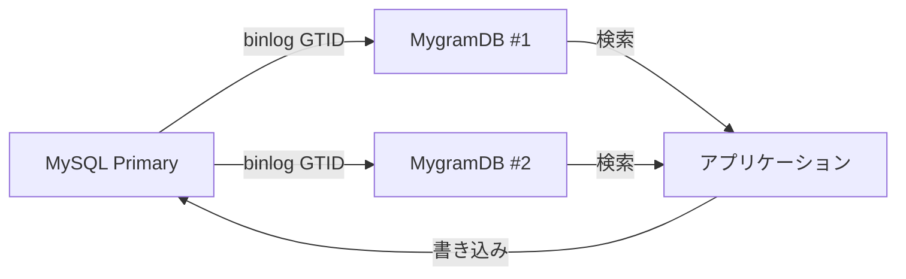

# MygramDB

[](https://mygramdb.libraz.net/ja/)
[](https://github.com/libraz/mygram-db/actions)
[](https://github.com/libraz/mygram-db/releases)
[](https://github.com/libraz/mygram-db/pkgs/container/mygram-db)
[](https://codecov.io/gh/libraz/mygram-db)
[](https://github.com/libraz/mygram-db/blob/main/LICENSE)
[](https://en.cppreference.com/w/cpp/17)
[](https://dev.mysql.com/)
[](https://github.com/libraz/mygram-db)

MySQL/MariaDB の binlog レプリケーションで同期する、インメモリ全文検索エンジンです。MySQL を正本データとして使いながら、検索だけを MygramDB に逃がすことで、100万行規模でもサブミリ秒級の応答を狙えます。

## なぜ MygramDB なのか？

MySQL FULLTEXT は手軽ですが、ヒット数の多い語句、CJK の n-gram 検索、並列アクセスではレイテンシが伸びやすくなります。MygramDB は圧縮 n-gram インデックスをメモリ上に保持し、GTID binlog レプリケーションで MySQL/MariaDB の更新を取り込みます。

アプリケーションは書き込みを従来どおり MySQL/MariaDB に行い、検索だけを MygramDB に問い合わせます。検索専用の読み取りレプリカとして分離できるため、既存の RDBMS 構成を大きく変えずに全文検索を高速化できます。

## パフォーマンス

110万件の Wikipedia 記事（英語 + 日本語）で、MygramDB v1.5.0 と MySQL 8.4 FULLTEXT（ngram パーサー）を比較しました。

| クエリタイプ | MySQL | MygramDB | 高速化 |
|------------|-------|----------|---------|
| **検索**（SORT id LIMIT 100） | 507–2,566ms | 0.08–0.42ms | 1,200–6,700倍 |
| **CJK 検索**（日本語バイグラム） | 4–1,204ms | 1–4ms | 2–1,100倍 |
| **COUNT** | 416–1,797ms | 0.08ms | 5,500–21,600倍 |
| **並列**（4接続） | 8 QPS | 11,766 QPS | 1,400倍 |

- ほとんどのクエリでサブミリ秒のレイテンシを維持し、キャッシュの事前ウォームアップも不要
- v1.5.0 の `verify_text` により n-gram の偽陽性を除去し、MySQL と一致する検索結果を返却
- 再現可能: `make bench-up && make bench-run`（[詳細](https://mygramdb.libraz.net/ja/docs/performance)）

## クイックスタート

### Docker（本番環境向けの最小構成）

MygramDB は binlog を読んでインデックスを更新するため、接続先の MySQL/MariaDB 側で GTID と ROW 形式の binlog が必要です。MySQL では、まず GTID モードが有効になっていることを確認してください。

MariaDBでは `log_bin_compress=OFF` も必須です。圧縮row eventを無音でskipすると行変更を反映せずGTIDだけが進むため、MygramDBは起動時および実行時に圧縮eventを明示的に拒否します。

```sql
-- GTID モードを確認（ON である必要があります）
SHOW VARIABLES LIKE 'gtid_mode';

-- OFF の場合は GTID モードを有効化（MySQL 8.0 以降 / 9.x）
SET GLOBAL enforce_gtid_consistency = ON;
SET GLOBAL gtid_mode = OFF_PERMISSIVE;
SET GLOBAL gtid_mode = ON_PERMISSIVE;
SET GLOBAL gtid_mode = ON;
```

続いて MygramDB を起動します。環境変数で MySQL の接続先、同期対象テーブル、テキスト列、レプリケーション用の server_id を指定します。

```bash
docker run -d --name mygramdb \
  -p 11016:11016 \
  -e MYSQL_HOST=your-mysql-host \
  -e MYSQL_USER=repl_user \
  -e MYSQL_PASSWORD=your_password \
  -e MYSQL_DATABASE=mydb \
  -e TABLE_NAME=articles \
  -e TABLE_PRIMARY_KEY=id \
  -e TABLE_TEXT_COLUMN=content \
  -e TABLE_NGRAM_SIZE=2 \
  -e REPLICATION_SERVER_ID=12345 \
  -e NETWORK_ALLOW_CIDRS=0.0.0.0/0 \
  ghcr.io/libraz/mygram-db:latest

# ログを確認
docker logs -f mygramdb

# 初回データ同期を実行（初回起動時に必須）
docker exec mygramdb mygram-cli -p 11016 SYNC articles

# 検索を試す
docker exec mygramdb mygram-cli -p 11016 SEARCH articles "こんにちは"
```

**セキュリティ上の注意:** `NETWORK_ALLOW_CIDRS=0.0.0.0/0` は任意の IP アドレスからの接続を許可します。本番環境では、アプリケーションサーバーや管理用ネットワークなど、必要な送信元だけに制限してください。`network.allow_cidrs` が空・未指定・不正な場合は TCP と probe 以外の HTTP をすべて拒否し、`/health/live` と `/health/ready` だけが ACL を迂回します。

```bash
# 本番環境の例: アプリケーションサーバーからのみ許可
-e NETWORK_ALLOW_CIDRS=10.0.0.0/8,172.16.0.0/12
```

### Docker Compose（テスト用MySQL付き）

```bash
git clone https://github.com/libraz/mygram-db.git
cd mygram-db
docker-compose up -d

# MySQL の準備完了を待つ（docker-compose logs -f で確認）

# 初回データ同期を実行
docker-compose exec mygramdb mygram-cli -p 11016 SYNC articles

# 検索を試す
docker-compose exec mygramdb mygram-cli -p 11016 SEARCH articles "こんにちは"
```

この構成にはサンプルデータ入りの MySQL 8.4 が含まれるため、ローカルで動作確認できます。MySQL 9.4 および MariaDB 10.11/11.4 でもテスト済みです。

## 基本的な使い方

```bash
# ページネーション付き検索
SEARCH articles "こんにちは" SORT id LIMIT 100

# 関連度順でソート（BM25）
SEARCH articles "こんにちは" SORT _score DESC LIMIT 10

# ハイライト付き検索結果
SEARCH articles "こんにちは" HIGHLIGHT TAG <b> </b> LIMIT 10

# あいまい検索（編集距離1）
SEARCH articles "まちがい" FUZZY LIMIT 10

# ファセット集計
FACET articles category "技術"

# マッチ数をカウント
COUNT articles "こんにちは"

# 複数語句のAND検索
SEARCH articles こんにちは AND 世界

# フィルター付き検索
SEARCH articles 技術 FILTER status=1 LIMIT 100

# プライマリキーで取得
GET articles 12345
```

全コマンドは [プロトコルリファレンス](https://mygramdb.libraz.net/ja/docs/protocol) を参照してください。

## 特徴

- **高速検索**: 100万行規模でもサブミリ秒級の検索を目指せるインメモリインデックス
- **BM25 関連度スコアリング**: `SORT _score` で TF-IDF ベースの関連度ランキング
- **ハイライト**: `HIGHLIGHT` 句で、マッチした語句をタグ付きスニペットとして返却
- **あいまい検索**: `FUZZY` 句で、レーベンシュタイン編集距離にもとづくマッチング
- **類義語辞書**: TSV ファイルを使った自動クエリ展開
- **ファセット検索**: `FACET` コマンドでフィルター列の値を集計し、件数を返却
- **MySQL/MariaDB レプリケーション**: GTID ベースのリアルタイム binlog ストリーミング（MySQL 8.4+、MariaDB 10.6+）
- **ランタイム変数**: MySQL 互換の `SET` / `SHOW VARIABLES` コマンドで、停止せずに一部設定を変更
- **MySQL フェイルオーバー**: GTID 位置を保持しながら、実行中に接続先 MySQL サーバーを切り替え
- **複数テーブル対応**: 単一インスタンスで複数テーブルのインデックス化
- **デュアルプロトコル**: TCP（memcached 風プロトコル）は検索と運用操作向け、HTTP/REST API は検索とステータス確認向け
- **高並行性**: 10,000 以上の同時接続を扱うスレッドプール
- **Unicode 対応**: CJK/多言語テキスト向けの ICU ベース正規化
- **圧縮**: Hybrid Delta エンコーディングと Roaring ビットマップによる省メモリ化
- **簡単デプロイ**: 単一バイナリまたは Docker コンテナで起動

## アーキテクチャ


```mermaid
graph LR
    MySQL[MySQL Primary] -->|binlog GTID| MygramDB1[MygramDB #1]
    MySQL -->|binlog GTID| MygramDB2[MygramDB #2]

    MygramDB1 -->|検索| App[アプリケーション]
    MygramDB2 -->|検索| App
    App -->|書き込み| MySQL
```

MygramDB は全文検索専用の読み取りレプリカとして機能します。MySQL/MariaDB は引き続き正本データ、書き込み、通常の SQL クエリを担当します。

## MygramDB の適用シーン

✅ **適している場合:**
- 検索中心のワークロード（読み取りが書き込みよりかなり多い）
- 数百万件規模のドキュメントを全文検索したい
- 100ms 以下の検索レイテンシが必要
- シンプルなデプロイ要件
- 日本語/CJK テキストを n-gram で検索したい

❌ **推奨されない場合:**
- 書き込み負荷が高いワークロード
- データセットがメモリに収まらない（目安: 100万ドキュメントあたり約 1-2GB）
- ノード間の分散検索が必要
- 複雑な集計や分析クエリ

## ドキュメント

📖 **ドキュメント全体:** https://mygramdb.libraz.net/ja/

- **[CHANGELOG](CHANGELOG.md)** - バージョン履歴とリリースノート
- [Docker デプロイメントガイド](https://mygramdb.libraz.net/ja/docs/docker-deployment) - 本番環境向け Docker セットアップ
- [設定ガイド](https://mygramdb.libraz.net/ja/docs/configuration) - 設定オプションの一覧と説明
- [プロトコルリファレンス](https://mygramdb.libraz.net/ja/docs/protocol) - 完全なコマンドリファレンス
- [HTTP API リファレンス](https://mygramdb.libraz.net/ja/docs/http-api) - REST API ドキュメント
- [パフォーマンスガイド](https://mygramdb.libraz.net/ja/docs/performance) - ベンチマークと最適化
- [レプリケーションガイド](https://mygramdb.libraz.net/ja/docs/replication) - MySQL レプリケーション設定
- [運用ガイド](https://mygramdb.libraz.net/ja/docs/operations) - ランタイム変数と MySQL フェイルオーバー
- [インストールガイド](https://mygramdb.libraz.net/ja/docs/installation) - ソースからビルド
- [開発ガイド](https://mygramdb.libraz.net/ja/docs/development) - コントリビューションガイドライン
- [クライアントライブラリ](https://mygramdb.libraz.net/ja/docs/client-library) - C/C++ クライアントライブラリ
- [C/C++ API機能対応](docs/client-api_ja.md) - SearchRaw、Unix socket、timeout、C ABI versioning

HTTP API は、検索、ドキュメント取得、ヘルスチェック、メトリクス、読み取り専用のステータス確認を提供します。一方で、`SYNC`、`DUMP`、`CACHE`、`SET`、レプリケーション制御などの運用コマンドは TCP プロトコルと `mygram-cli` で提供します。HTTP API だけを外部公開する構成でも、初期同期やメンテナンスのために、内部ネットワークから TCP/CLI を実行できる経路を残してください。

### リリースノート

- [最新リリース](https://github.com/libraz/mygram-db/releases/latest) - バイナリダウンロード
- [詳細リリースノート](docs/releases/) - バージョン別マイグレーションガイド

## 要件

**システム:**
- RAM: 100万ドキュメントあたり約 1-2GB
- OS: Linux または macOS

**MySQL:**
- MySQL 8.4+ / 9.x（8.4 および 9.4 でテスト済み）
- MariaDB 10.6+ / 11.x（10.11 および 11.4 でテスト済み）
- GTID モード有効化（MySQL: `gtid_mode=ON`、MariaDB: GTID 有効）
- バイナリログ形式: ROW (`binlog_format=ROW`)
- 完全row image（`binlog_row_image=FULL`）、MariaDBのbinlog圧縮無効（`log_bin_compress=OFF`）
- レプリケーション権限: `REPLICATION SLAVE`, `REPLICATION CLIENT`

詳細は [インストールガイド](https://mygramdb.libraz.net/ja/docs/installation) を参照してください。

## ライセンス

[MIT License](LICENSE)

## コントリビューション

コントリビューションを歓迎します。ガイドラインは [CONTRIBUTING.md](CONTRIBUTING.md) を参照してください。

開発環境のセットアップは [開発ガイド](https://mygramdb.libraz.net/ja/docs/development) を参照してください。

## 作者

- libraz <libraz@libraz.net>

## 関連プロジェクト

- [mysql-event-stream](https://github.com/libraz/mysql-event-stream) - MygramDB のレプリケーション層から抽出したスタンドアロン MySQL CDC ライブラリ
- [go-mygram-client](https://github.com/libraz/go-mygram-client) - Go クライアントライブラリ
- [node-mygramdb-client](https://github.com/libraz/node-mygramdb-client) - Node.js クライアントライブラリ（[npm](https://www.npmjs.com/package/mygramdb-client)）
- [python-mygramdb-client](https://github.com/libraz/python-mygramdb-client) - Python クライアントライブラリ

## 謝辞

- [Roaring Bitmaps](https://roaringbitmap.org/) - 圧縮ビットマップ
- [ICU](https://icu.unicode.org/) - Unicode サポート
- [spdlog](https://github.com/gabime/spdlog) - ロギング
- [yaml-cpp](https://github.com/jbeder/yaml-cpp) - 設定パース
