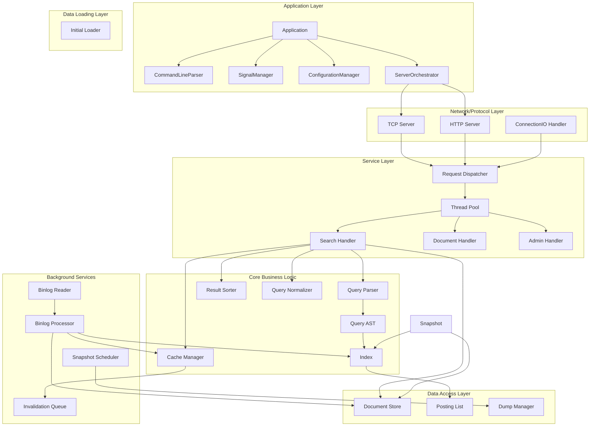
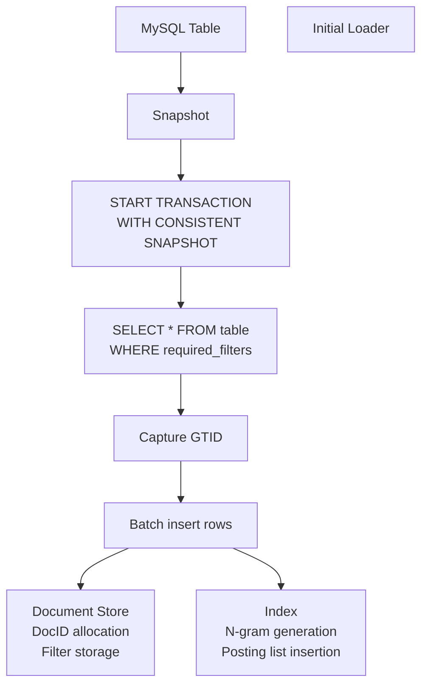
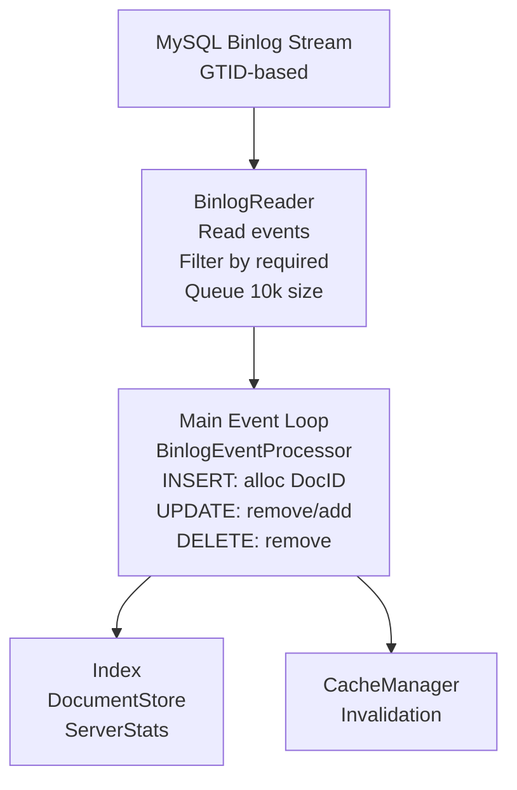
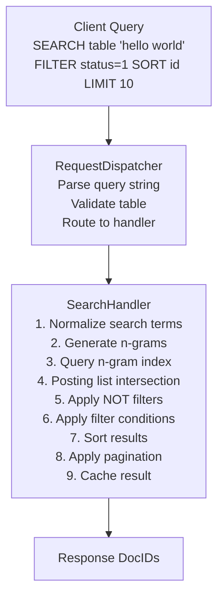
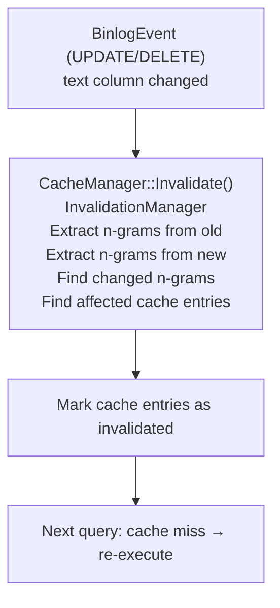
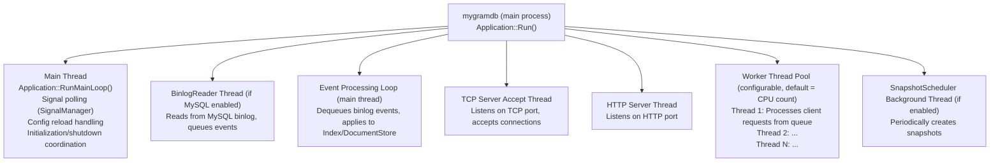
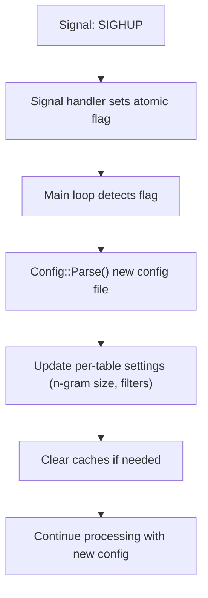

# MygramDB Architecture

**Version**: 1.0
**Last Updated**: 2025-11-18
**Project**: MygramDB - In-memory full-text search engine for MySQL replication

---

## Table of Contents

1. [Overview](#overview)
2. [System Architecture](#system-architecture)
3. [Component Responsibilities](#component-responsibilities)
4. [Data Flow](#data-flow)
5. [Thread Model](#thread-model)
6. [Component Ownership](#component-ownership)
7. [Key Design Patterns](#key-design-patterns)
8. [Integration Points](#integration-points)
9. [Performance Characteristics](#performance-characteristics)

---

## Overview

MygramDB is a **C++17 in-memory full-text search engine** designed to replicate data from MySQL using GTID-based binlog streaming. It provides **25-200x faster** full-text search than MySQL FULLTEXT through:

- **In-memory indexing** with no disk I/O during queries
- **Compressed posting lists** (delta encoding + Roaring bitmaps)
- **Precise cache invalidation** (n-gram-based, not table-level)
- **High concurrency** (multi-reader, single-writer pattern)
- **Real-time replication** (GTID-based binlog streaming)

### Key Features

- **N-gram inverted index** with configurable n-gram sizes
- **Multi-table support** from single MySQL connection
- **GTID-based binlog replication** with automatic reconnect
- **Precise cache invalidation** using n-gram tracking
- **Type-safe error handling** with `Expected<T, Error>`
- **TCP and HTTP APIs** with JSON support
- **Snapshot persistence** for fast restarts
- **Rate limiting** and connection pooling

---

## System Architecture

### Layered Architecture



---

## Component Responsibilities

### Core Business Logic Layer

#### Index Module (`src/index/`)

**Index** (`index.h`)
- **Responsibility**: N-gram inverted index implementation
- **Features**:
  - Maintains posting lists for each n-gram term
  - Batch additions for bulk operations during snapshot builds
  - Thread-safe with `shared_mutex` for concurrent reads/writes
  - Adaptive compression: delta-encoded varint arrays for sparse data, Roaring bitmaps for dense data
  - Configurable n-gram sizes (ASCII: default 2, CJK: default 1)
- **Thread Safety**: Multi-reader, single-writer via `shared_mutex`
- **Key Methods**:
  - `Add(DocId, text)`: Add document to index
  - `Search(term)`: Find documents containing term
  - `Remove(DocId)`: Remove document from index

**PostingList** (`posting_list.h`)
- **Responsibility**: Storage of document IDs for individual n-gram terms
- **Strategies**:
  - `PostingStrategy::kDeltaCompressed`: Sparse postings (< 18% density)
  - `PostingStrategy::kRoaringBitmap`: Dense postings (≥ 18% density)
- **Key Methods**:
  - `Add(DocId)`: Add document ID
  - `Contains(DocId)`: Check if document exists
  - `GetAll()`: Retrieve all document IDs

#### Query Module (`src/query/`)

**QueryParser** (`query_parser.h`)
- **Responsibility**: Parse text protocol commands
- **Supported Commands**: SEARCH, COUNT, GET, INFO, DUMP, REPLICATION, SYNC, CONFIG, CACHE
- **Returns**: `QueryType` and `Query` AST structure

**QueryAST** (`query_ast.h`)
- **Responsibility**: Boolean query expression tree
- **Operators**: AND, OR, NOT (precedence: NOT > AND > OR)
- **Execution**: `QueryNode::Evaluate()` executes query against index

**QueryNormalizer** (`query_normalizer.h`)
- **Responsibility**: Normalize queries for consistent cache keys
- **Normalization**:
  - Whitespace normalization
  - Keyword uppercasing
  - Clause order normalization
  - Filter alphabetical sorting

**ResultSorter** (`result_sorter.h`)
- **Responsibility**: Sort and paginate search results
- **Features**:
  - Sort by primary key or custom columns
  - LIMIT with offset support

#### Storage Module (`src/storage/`)

**DocumentStore** (`document_store.h`)
- **Responsibility**: DocID ↔ Primary Key mapping and filter column storage
- **Capacity**: Up to 4 billion documents (uint32_t DocID)
- **Thread Safety**: `shared_mutex` for concurrent access
- **Filter Types**: bool, int8/16/32/64, uint8/16/32/64, string, double
- **Key Methods**:
  - `AddDocument(primary_key, filters)`: Allocate DocID and store metadata
  - `GetPrimaryKey(DocId)`: Retrieve primary key
  - `GetFilterValue(DocId, column)`: Get filter value

**InitialLoader** (`loader/initial_loader.h`)
- **Responsibility**: Initial data loading from MySQL to build index
- **Module**: Data Loading Layer (separate from storage)
- **Features**:
  - `START TRANSACTION WITH CONSISTENT SNAPSHOT` for consistency
  - Captures GTID at load time for binlog replication continuity
  - Progress callbacks for monitoring
  - Cancelable operations

**DumpManager** (`dump_manager.h`)
- **Responsibility**: Snapshot persistence to disk
- **Format**: V1 format with compression and metadata

---

### Service Layer (Background Workers)

#### MySQL Replication Service (`src/mysql/`)

**BinlogReader** (`binlog_reader.h`)
- **Responsibility**: Stream MySQL binlog events
- **Features**:
  - GTID-based positioning (no filename/offset)
  - Multi-table support from single connection
  - Event queue (configurable size, default 10,000)
  - Automatic reconnect with exponential backoff
  - Thread-safe with condition variables

**BinlogEventProcessor** (`binlog_event_processor.h`)
- **Responsibility**: Apply binlog events to index
- **Event Types**: INSERT, UPDATE, DELETE, DDL
- **Updates**: Index, DocumentStore, ServerStats

**ConnectionValidator** (`connection_validator.h`)
- **Responsibility**: Validate MySQL connection requirements
- **Checks**:
  - GTID mode enabled
  - Binary log format = ROW
  - Replication privileges

**TableMetadata** (`table_metadata.h`)
- **Responsibility**: MySQL schema introspection
- **Features**:
  - Identifies text columns vs filter columns
  - Type mapping: MySQL → FilterValue types

#### Cache Service (`src/cache/`)

**CacheManager** (`cache_manager.h`)
- **Responsibility**: Unified cache orchestration
- **Components**: QueryCache, InvalidationManager, InvalidationQueue
- **Returns**: Cached results with metadata (creation time, execution cost)

**QueryCache** (`query_cache.h`)
- **Responsibility**: LRU cache with memory limits
- **Eviction**: By entry count and memory size
- **Callbacks**: Eviction callbacks for cleanup
- **Statistics**: Hit/miss counters

**InvalidationManager** (`invalidation_manager.h`)
- **Responsibility**: N-gram-based cache invalidation tracking
- **Tracking**:
  - Which n-grams each cached query uses
  - Reverse index: n-gram → cache entries
- **Precision**: Only invalidates queries using changed n-grams

**InvalidationQueue** (`invalidation_queue.h`)
- **Responsibility**: Asynchronous invalidation batching
- **Benefits**: Reduces lock contention during high-concurrency updates

#### Snapshot Scheduler (`src/server/snapshot_scheduler.h`)

- **Responsibility**: Periodic snapshot creation
- **Configuration**: Interval in seconds (0 = disabled by default)
- **Cleanup**: Removes old snapshot files
- **Isolation**: Independent of server lifecycle

---

### Network/Protocol Layer (`src/server/`)

#### TCP Server (`tcp_server.h`)

- **Protocol**: Text-based with `\r\n` delimiters
- **Multi-table**: Single server instance, multiple tables
- **Ports**: TCP (default 11016), HTTP (default 8080)
- **Features**: Rate limiting, connection pooling

#### HTTP Server (`http_server.h`)

- **API**: RESTful JSON
- **Endpoints**:
  - `POST /{table}/search`: Search query
  - `GET /{table}/:id`: Get document by ID
  - `GET /info`: Server information
  - `GET /health`: Health check
- **Features**: CORS support, Kubernetes-ready health checks

#### Request Dispatch Pipeline

**ConnectionAcceptor** (`connection_acceptor.h`)
- **Responsibility**: Socket accept loop
- **Features**:
  - `SO_RCVTIMEO` to prevent indefinite hangs
  - Dispatches connections to thread pool
  - Thread-safe connection tracking

**ConnectionIOHandler** (`connection_io_handler.h`)
- **Responsibility**: Per-connection I/O handling
- **Features**:
  - Reads/buffers socket data
  - Parses protocol messages (delimited by `\r\n`)
  - Enforces maximum query length (default 1MB)
  - Writes responses to socket

**RequestDispatcher** (`request_dispatcher.h`)
- **Responsibility**: Application logic routing
- **Features**:
  - No network dependencies (pure application logic)
  - Handler registry pattern
  - Table existence validation

#### Command Handlers (`src/server/handlers/`)

| Handler | Responsibility |
|---------|----------------|
| **SearchHandler** | SEARCH/COUNT queries: n-gram generation, posting list intersection, filtering, sorting |
| **DocumentHandler** | GET commands: fetch by primary key |
| **DumpHandler** | DUMP operations: SAVE/LOAD/VERIFY/INFO |
| **ReplicationHandler** | REPLICATION commands: START/STOP/STATUS |
| **SyncHandler** | SYNC operations: initial data load from MySQL |
| **AdminHandler** | Admin commands |
| **CacheHandler** | CACHE commands: CLEAR/STATS/ENABLE/DISABLE |
| **DebugHandler** | DEBUG ON/OFF |

#### Thread Pool (`thread_pool.h`)

- **Workers**: Fixed count (default = CPU count)
- **Queue**: Bounded task queue with backpressure
- **Shutdown**: Graceful with timeout
- **Thread Safety**: Lock-free task submission

---

### Application Layer (`src/app/`)

The application layer orchestrates the entire application lifecycle from command-line parsing to graceful shutdown.

#### Application (`application.h`)

- **Responsibility**: Top-level application orchestrator (main entry point)
- **Design Pattern**: Facade + Orchestrator
- **Lifecycle**:
  1. Parse command-line arguments
  2. Load configuration
  3. Handle special modes (--help, --version, --config-test)
  4. Check root privilege
  5. Apply logging configuration
  6. Daemonize (if --daemon)
  7. Verify dump directory
  8. Setup signal handlers
  9. Initialize server components
  10. Start servers
  11. Main loop (signal polling + config reload)
  12. Graceful shutdown

#### CommandLineParser (`command_line_parser.h`)

- **Responsibility**: Parse POSIX-compliant command-line arguments
- **Supported Options**:
  - `-c/--config FILE`: Configuration file path
  - `-s/--schema FILE`: Schema file path
  - `-d/--daemon`: Daemonize process
  - `-t/--config-test`: Test configuration and exit
  - `-h/--help`: Show help message
  - `-v/--version`: Show version information
- **Returns**: `CommandLineArgs` struct or error

#### SignalManager (`signal_manager.h`)

- **Responsibility**: RAII signal handler management
- **Design**: Async-signal-safe using `sig_atomic_t`
- **Signals**:
  - SIGINT/SIGTERM: Sets `shutdown_requested` flag
  - SIGHUP: Sets `reload_config_requested` flag
- **Thread Safety**: Signal handlers write to atomic flags; application thread reads via polling
- **RAII**: Destructor restores original signal handlers

#### ConfigurationManager (`configuration_manager.h`)

- **Responsibility**: Configuration loading, validation, and hot reload
- **Features**:
  - Loads YAML configuration file
  - Validates configuration structure
  - Applies logging configuration
  - Supports hot reload (triggered by SIGHUP)
  - Config test mode (--config-test)

#### ServerOrchestrator (`server_orchestrator.h`)

- **Responsibility**: Server component lifecycle orchestration
- **Design Pattern**: Facade + Lifecycle Manager
- **Initialization Order** (8 steps):
  1. Table contexts (Index, DocumentStore)
  2. MySQL connection
  3. Snapshot building (if enabled)
  4. BinlogReader initialization
  5. TCP server initialization
  6. HTTP server initialization (if enabled)
- **Shutdown Order**: Reverse of initialization
- **Hot Reload Support**: MySQL reconnection on config change

---

### Configuration & Utilities

#### Config Module (`src/config/config.h`)

- **Format**: YAML-based configuration
- **Settings**:
  - Per-table: n-gram size, text column, primary key, filter columns, required filters
  - MySQL: connection parameters (host, port, credentials, SSL/TLS)
  - Server: TCP/HTTP ports, worker threads, memory limits
  - Dump: scheduling interval
  - Rate limiting: capacity and refill rate
- **Hot Reload**: SIGHUP signal support

#### Error Handling (`src/utils/`)

**expected.h**
- **Type**: C++17-compatible `Expected<T, E>` (future C++23 std::expected)
- **Benefits**: Type-safe error propagation without exceptions

**error.h**
- **Error Code Ranges**:
  - 0-999: General errors
  - 1000-1999: Configuration errors
  - 2000-2999: MySQL/Database errors
  - 3000-3999: Query parsing errors
  - 4000-4999: Index/Search errors
  - 5000-5999: Storage/Snapshot errors
  - 6000-6999: Network/Server errors
  - 7000-7999: Client errors
  - 8000-8999: Cache errors

#### Observability

**ServerStats** (`server_stats.h`)
- **Metrics**: Redis-style statistics
  - Per-command counters (SEARCH, COUNT, GET, etc.)
  - Memory usage (current and peak)
  - Connection statistics
  - Replication event counters
  - Uptime tracking

**StructuredLog** (`structured_log.h`)
- **Format**: Event-based logging with fields
- **Benefits**: Better monitoring and analysis

**RateLimiter** (`rate_limiter.h`)
- **Algorithm**: Token bucket
- **Scope**: Per-client IP
- **Features**: Configurable capacity, refill rate, automatic cleanup

#### Synchronization Components

**SyncOperationManager** (`sync_operation_manager.h`)
- **Responsibility**: SYNC operation coordination
- **Features**:
  - Per-table sync state tracking
  - Prevents concurrent syncs on same table
  - Asynchronous snapshot building
  - Progress tracking and cancellation

**ServerLifecycleManager** (`server_lifecycle_manager.h`)
- **Responsibility**: Component initialization orchestration
- **Design Pattern**: Factory/Builder pattern
- **Features**:
  - Type-safe initialization with `Expected<T, Error>`
  - Dependency-ordered component creation
  - Returns `InitializedComponents` struct for TcpServer ownership
  - Eliminates circular dependencies (SyncHandler → SyncOperationManager)
  - Comprehensive unit test coverage (12 tests)

---

## Data Flow

### Initial Sync Phase (SYNC Command)



### Live Replication Phase



### Query Processing Phase



### Cache Invalidation Flow



---

## Thread Model

### Process Structure



### Thread Safety Patterns

| Component | Concurrency | Mechanism |
|-----------|-------------|-----------|
| **Index** | Multi-reader, single-writer | `shared_mutex` + serialized binlog processing |
| **DocumentStore** | Multi-reader, single-writer | `shared_mutex` + serialized binlog processing |
| **Cache** | Multi-reader, concurrent invalidation | `shared_mutex` on QueryCache |
| **Stats** | Wait-free | `atomic<T>` |
| **ThreadPool** | Wait-free task submission | Lock-free queue |

### Concurrency Guarantees

**Shared Mutable State Protected By:**
1. **Index**: `shared_mutex`
   - Readers: Multiple concurrent SEARCH queries
   - Writers: Single BinlogReader thread (serialized)

2. **DocumentStore**: `shared_mutex`
   - Readers: SEARCH result post-filtering
   - Writers: BinlogReader thread

3. **Cache**: `shared_mutex` in QueryCache
   - Readers: Cache lookups
   - Writers: Invalidations, evictions

4. **ServerStats**: `atomic<T>` (lock-free)

5. **TableCatalog**: `shared_mutex`

6. **SyncOperationManager**: `mutex` + `condition_variable`

---

## Component Ownership

### Ownership Hierarchy

```mermaid
graph TB
    Root["Application (root)"]
    CLIArgs["CommandLineArgs"]
    ConfigMgr["ConfigurationManager"]
    SignalMgr["SignalManager"]
    ServerOrch["ServerOrchestrator"]

    TCPServer["TcpServer"]
    HTTPServer["HttpServer"]
    Stats["ServerStats (shared reference)"]
    Config["Configuration"]
    Tables["TableContexts (map)"]
    Table1["TableContext[table1]"]
    Index1["Index (unique_ptr)"]
    DocStore1["DocumentStore (unique_ptr)"]
    TableN["TableContext[tableN]"]
    ThreadPool["ThreadPool (unique_ptr)"]
    Acceptor["ConnectionAcceptor (unique_ptr)"]
    Dispatcher["RequestDispatcher (unique_ptr)"]
    Handlers["CommandHandlers (unique_ptr)"]
    SearchH["SearchHandler"]
    DocH["DocumentHandler"]
    DumpH["DumpHandler"]
    ReplH["ReplicationHandler"]
    SyncH["SyncHandler"]
    Other["..."]
    Scheduler["SnapshotScheduler (unique_ptr)"]
    Cache["CacheManager (unique_ptr)"]
    Binlog["BinlogReader (unique_ptr, if MySQL enabled)"]
    SyncOp["SyncOperationManager (unique_ptr, if MySQL enabled)"]
    HTTP["HttpServer (unique_ptr)"]

    Root --> CLIArgs
    Root --> ConfigMgr
    Root --> SignalMgr
    Root --> ServerOrch

    ServerOrch --> TCPServer
    ServerOrch --> HTTPServer
    ServerOrch --> Tables
    ServerOrch --> Binlog

    TCPServer --> Stats
    TCPServer --> Config
    Tables --> Table1
    Table1 --> Index1
    Table1 --> DocStore1
    Tables --> TableN
    TCPServer --> ThreadPool
    TCPServer --> Acceptor
    TCPServer --> Dispatcher
    TCPServer --> Handlers
    Handlers --> SearchH
    Handlers --> DocH
    Handlers --> DumpH
    Handlers --> ReplH
    Handlers --> SyncH
    Handlers --> Other
    TCPServer --> Scheduler
    TCPServer --> Cache
    TCPServer --> SyncOp
```



### Resource Lifecycle

**Application Lifecycle** (in Application::Run()):

1. **Command-line parsing** (CommandLineParser)
2. **Configuration loading** (ConfigurationManager)
3. **Special mode handling** (--help, --version, --config-test)
4. **Privilege check** (root user verification)
5. **Logging setup** (apply config)
6. **Daemonization** (if --daemon)
7. **Dump directory verification**
8. **Signal handler setup** (SignalManager)
9. **Component initialization** (ServerOrchestrator)
10. **Server startup** (TCP/HTTP servers)
11. **Main loop** (signal polling, config reload handling)
12. **Graceful shutdown** (reverse order)

**ServerOrchestrator Initialization Order** (8 steps):

1. **Table contexts** (Index, DocumentStore for each table)
2. **MySQL connection** (if USE_MYSQL enabled)
3. **Snapshot building** (if auto_initial_snapshot enabled)
4. **BinlogReader initialization** (if GTID available)
5. **TCP server initialization** (via ServerLifecycleManager)
6. **HTTP server initialization** (if enabled in config)

**ServerLifecycleManager Initialization Order** (within TCP server):

Following the dependency graph, components are initialized in this order:

1. **ThreadPool** (no dependencies)
2. **TableCatalog** (no dependencies)
3. **CacheManager** (optional, depends on config)
4. **HandlerContext** (depends on catalog, cache)
5. **Command Handlers** (depend on HandlerContext)
   - SearchHandler, DocumentHandler, DumpHandler
   - AdminHandler, ReplicationHandler, DebugHandler
   - CacheHandler, SyncHandler (MySQL)
6. **RequestDispatcher** (depends on handlers)
7. **ConnectionAcceptor** (depends on thread pool)
8. **SnapshotScheduler** (optional, depends on catalog)

**Note**: RateLimiter and SyncOperationManager are created in `TcpServer::Start()` before ServerLifecycleManager is instantiated.

**Shutdown Order** (reverse of initialization):

1. **HTTP server shutdown** (if running)
2. **TCP server shutdown**
   - Stop accepting new connections (ConnectionAcceptor)
   - Wait for thread pool tasks to complete
   - Stop background services (SnapshotScheduler, SyncOperationManager)
   - Cleanup handlers and dispatcher
   - Cleanup cache and catalog
3. **BinlogReader shutdown** (if running)
4. **MySQL connection close** (if open)
5. **Table contexts cleanup** (Index, DocumentStore)
6. **Signal handler restoration** (SignalManager destructor)

### RAII Patterns

1. **unique_ptr for ownership**: All components owned by TcpServer
2. **shared_mutex for read/write coordination**: Index, DocumentStore, Cache
3. **atomic<T> for lock-free stats**: ServerStats counters
4. **condition_variable for synchronization**: BinlogReader queue, SyncOperationManager
5. **MySQLResult RAII wrapper**: `unique_ptr<MYSQL_RES, MySQLResultDeleter>`

---

## Key Design Patterns

### Error Handling: Expected<T, Error>

```cpp
Expected<std::vector<DocId>, Error> result = index->Search("term");
if (result) {
    // Use *result
    auto docs = *result;
} else {
    // Access error: result.error()
    auto err = result.error();
    spdlog::error("Search failed: {}", err.message);
}
```

**Advantages:**
- Type-safe: Compile-time error checking
- No exceptions: Predictable performance
- Composable: Chain operations

### Resource Management: RAII

```cpp
class TcpServer {
    std::unique_ptr<ThreadPool> thread_pool_;
    std::unique_ptr<Index> index_;
    std::unique_ptr<DocumentStore> doc_store_;
    std::unique_ptr<BinlogReader> binlog_reader_;

    ~TcpServer() {
        // Destructor automatically cleans up all unique_ptrs
        // in reverse order of declaration
    }
};
```

### Thread Safety: shared_mutex + Atomic

```cpp
class Index {
    mutable std::shared_mutex mutex_;
    std::unordered_map<std::string, PostingList> postings_;

    std::vector<DocId> Search(const std::string& term) const {
        std::shared_lock lock(mutex_);  // Multiple readers
        // ...
    }

    void Add(DocId id, std::string_view text) {
        std::unique_lock lock(mutex_);  // Exclusive writer
        // ...
    }
};

class ServerStats {
    std::atomic<uint64_t> total_requests_{0};

    void IncrementRequests() {
        total_requests_.fetch_add(1, std::memory_order_relaxed);
    }
};
```

### Handler Polymorphism: CommandHandler Interface

```cpp
class CommandHandler {
public:
    virtual std::string Handle(const query::Query& query,
                               ConnectionContext& conn_ctx) = 0;
};

class SearchHandler : public CommandHandler {
    std::string Handle(const query::Query& query,
                       ConnectionContext& conn_ctx) override;
};
```

**Benefits:**
- Easy to add new handlers (implement interface)
- RequestDispatcher agnostic to handler implementations
- Testable: Can mock handlers

### Dependency Injection: HandlerContext

```cpp
struct HandlerContext {
    TableCatalog* table_catalog;
    std::unordered_map<std::string, TableContext*>& table_contexts;
    ServerStats& stats;
    const config::Config* full_config;
    cache::CacheManager* cache_manager;
    mysql::BinlogReader* binlog_reader;
    // ...
};

class SearchHandler : public CommandHandler {
    SearchHandler(HandlerContext& ctx) : ctx_(ctx) {}

    std::string Handle(...) override {
        // Use ctx_.table_catalog, ctx_.cache_manager, etc.
    }
};
```

**Benefits:**
- Decouples handler from service creation
- Testable: Inject mock dependencies
- Centralized configuration

### Concurrency Pattern: Multi-Table Support

```cpp
// Single BinlogReader, single GTID stream
BinlogReader binlog_reader(connection, table_contexts, ...);

// Events demultiplexed to appropriate tables
struct BinlogEvent {
    std::string table_name;
    // ...
};

// BinlogEventProcessor applies to correct table's Index/DocumentStore
BinlogEventProcessor::ProcessEvent(event,
    table_contexts[event.table_name]->index,
    table_contexts[event.table_name]->doc_store,
    ...);
```

### Invalidation Pattern: Precise Cache Invalidation

```cpp
// Instead of table-level invalidation (MySQL FULLTEXT)
// MygramDB tracks n-gram usage per cached query

class InvalidationManager {
    // ngram -> {cached query keys}
    std::unordered_map<std::string, std::unordered_set<CacheKey>>
        ngram_to_cache_keys_;

    void InvalidateAffectedEntries(const std::string& old_text,
                                   const std::string& new_text) {
        // Extract changed n-grams
        auto changed_ngrams = FindChangedNgrams(old_text, new_text);

        // Find cached queries using changed n-grams
        std::unordered_set<CacheKey> affected;
        for (const auto& ngram : changed_ngrams) {
            auto it = ngram_to_cache_keys_.find(ngram);
            if (it != ngram_to_cache_keys_.end()) {
                affected.insert(it->second.begin(), it->second.end());
            }
        }

        // Mark affected entries as invalidated
        for (const auto& key : affected) {
            cache_->Invalidate(key);
        }
    }
};
```

---

## Integration Points

### Between MySQL and Index

- **BinlogReader** → reads binlog → **BinlogEventProcessor** → applies to **Index + DocumentStore**
- **InitialLoader** → SELECT from MySQL → **Index batch add** + **DocumentStore**

### Between Query and Cache

- **SearchHandler** → queries **CacheManager** → returns cached or queried results
- **BinlogReader** → on data change → **CacheManager::Invalidate** → marks cache entries invalid

### Between Handlers and Dispatcher

- **RequestDispatcher** → parses query → routes to registered **CommandHandler**
- Each handler type (Search, Document, Dump, etc.) registered with dispatcher

### Between Acceptor and Handlers

- **ConnectionAcceptor** → accepts connection → submits to **ThreadPool**
- **ThreadPool worker** → calls **ConnectionIOHandler** → calls **RequestDispatcher** → calls handler

---

## Performance Characteristics

### Query Performance

- **Full-text search**: 25-200x faster than MySQL FULLTEXT
- **In-memory operation**: No disk I/O during queries
- **Compressed postings**: Delta encoding + Roaring bitmaps
- **Multi-reader concurrency**: Shared locks for simultaneous queries

### Replication Performance

- **GTID-based**: No filename/offset coordination
- **Event queue**: Buffers up to 10,000 events (configurable)
- **Automatic reconnect**: Exponential backoff on connection loss
- **Multi-table support**: Single connection, multiple tables

### Cache Performance

- **Precise invalidation**: Only queries using changed n-grams invalidated
- **LRU eviction**: Memory-bounded cache
- **Asynchronous batching**: Reduced lock contention via InvalidationQueue

### Concurrency Performance

- **Multi-reader/single-writer**: Maximizes query throughput
- **Lock-free stats**: Atomic counters for metrics
- **Thread pool**: Fixed workers, bounded queue

---

## Configuration Hot Reload



**Reloadable Settings:**
- N-gram sizes
- Filter columns
- Cache settings
- Rate limiting

**Non-Reloadable Settings:**
- TCP/HTTP ports
- Table names
- MySQL connection (requires restart)

**See**: [Configuration Reference](configuration.md) for details

---

## Failover Detection

- **ConnectionValidator** checks MySQL connection status
- On connection loss: **BinlogReader** attempts reconnect with exponential backoff
- Detected via: Query failure, connection error, heartbeat timeout

---

## References

- [API Reference](api.md)
- [Configuration Reference](configuration.md)
- [Deployment Guide](deployment.md)
- [Development Guide](development.md)
