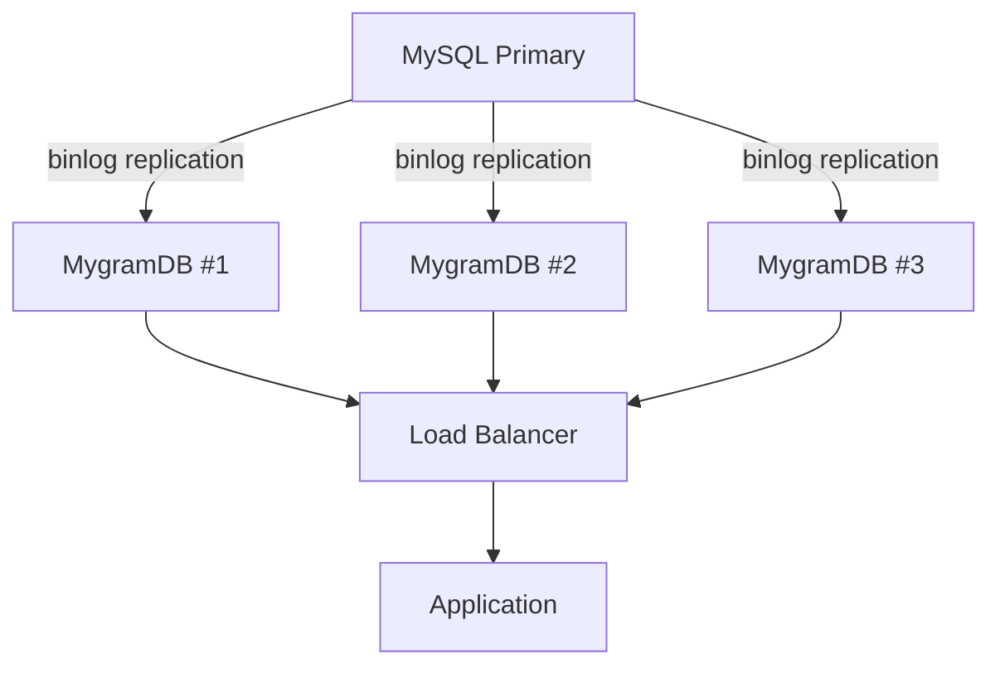

# Performance Guide

This guide provides detailed performance benchmarks, optimization tips, and best practices for MygramDB.

## Benchmark Environment

- **Dataset**: 1,699,686 rows (real production data)
- **Configuration**: Bigram indexing (ngram_size=2)
- **Hardware**: Standard server configuration
- **MySQL Version**: 8.x with FULLTEXT ngram index
- **Test Methodology**: Cold cache (after MySQL restart) vs warm cache vs MygramDB

## Performance Benchmarks

### Typical Use Case: ORDER BY id LIMIT 100

This is the most common real-world query pattern for paginated search results:

| Query Type | Result Set | MySQL (Cold) | MySQL (Warm) | MygramDB | Speedup |
|------------|------------|--------------|--------------|----------|---------|
| Medium-freq term | 78K rows (4.6%) | 906ms | 592ms | 24ms | **38x / 25x** |
| High-freq term | 807K rows (47.5%) | 2,495ms | 2,017ms | 42ms | **59x / 48x** |
| Ultra high-freq term | 1.27M rows (74.9%) | 3,753ms | 3,228ms | 56ms | **68x / 58x** |
| Two terms AND | 6.3K rows | 1,189ms | - | 10ms | **115x** |

**Key Findings:**
- ORDER BY significantly impacts MySQL performance (2-3x slower than without ORDER BY)
- MygramDB maintains sub-60ms response times even for 1.27M matches
- High-frequency terms show the largest performance gap (68x faster)

### COUNT Queries

Counting matches without retrieving IDs:

| Query Type | Result Set | MySQL (Cold) | MySQL (Warm) | MygramDB | Speedup |
|------------|------------|--------------|--------------|----------|---------|
| Medium-freq term | 78K rows (4.6%) | 682ms | 432ms | 6.3ms | **108x / 68x** |
| High-freq term | 807K rows (47.5%) | 727ms | 588ms | 8.6ms | **84x / 68x** |
| Ultra high-freq term | 1.27M rows (74.9%) | 1,072ms | 919ms | 5.3ms | **201x / 172x** |
| Two terms AND | 6.3K rows | 1,191ms | - | 6.0ms | **197x** |

**Key Findings:**
- MygramDB delivers 70-200x faster COUNT queries in production (cold cache)
- Even with warm cache, MygramDB is 68-172x faster
- Performance advantage increases with result set size

### SEARCH with LIMIT (No ORDER BY, Warm Cache)

| Query Type | Result Set | MySQL | MygramDB | Winner |
|------------|------------|-------|----------|---------|
| Medium-freq term | 78K rows (4.6%) | 19ms | 67ms | MySQL 3.6x faster* |
| High-freq term | 807K rows (47.5%) | 18ms | 7.2ms | **MygramDB 2.5x faster** |
| Ultra high-freq term | 1.27M rows (74.9%) | 18ms | 4.9ms | **MygramDB 3.6x faster** |
| Two terms AND | 6.3K rows | 18ms | 12.6ms | **MygramDB 1.4x faster** |

\* MySQL can exit early when result set is small (<5% matches) and no sorting is required.

## Performance Analysis

### Why MySQL is Slow

1. **Disk-based B-tree**: FULLTEXT index requires disk I/O for each query
2. **No compression**: Posting lists are not compressed, requiring more disk reads
3. **Cache dependency**: Performance varies 2-3x between cold and warm cache
4. **ORDER BY overhead**: Sorting requires additional processing and I/O
5. **High-frequency terms**: Short, common terms result in large posting list scans
6. **Concurrency bottleneck**: Under heavy concurrent load, disk I/O serialization causes request queuing

### High Concurrency Performance

**MySQL FULLTEXT under load:**
- Single query: 600-3,700ms
- Moderate load: Queries start queuing due to disk I/O contention
- Heavy load: Response times degrade to 10+ seconds as queue grows
- Cascading failures: Slow queries block connection pool, causing timeouts

**MygramDB under load:**
- Single query: 24-56ms
- Moderate load: Maintains sub-60ms latencies (in-memory, no I/O wait)
- Heavy load: Still responsive with thread pool architecture
- Predictable: No queue buildup, no cascading delays

**Real-world scenario:**
Production web applications often experience burst traffic during peak hours. MySQL FULLTEXT struggles with concurrent search requests, while MygramDB handles the same load effortlessly.

### Why MygramDB is Fast

1. **In-memory index**: Zero disk I/O, all data in RAM
2. **Compressed posting lists**: Hybrid Delta encoding + Roaring bitmaps
3. **Optimized intersections**: SIMD-accelerated bitmap operations
4. **Primary key index**: ORDER BY id uses native index order (no external sort)
5. **No cache warmup**: Always ready, consistent performance

## Performance Characteristics

### Query Time Complexity

| Operation | MySQL FULLTEXT | MygramDB |
|-----------|----------------|----------|
| Single term search | O(n log n) with disk I/O | O(n) in memory |
| AND intersection | O(n * m) with disk I/O | O(n + m) with SIMD |
| ORDER BY id | O(n log n) external sort | O(1) index scan |
| COUNT | Full scan | Bitmap cardinality |

### Scalability

**MygramDB scales linearly with:**
- Number of search terms (efficient bitmap intersection)
- Result set size (compressed bitmaps)
- Concurrent queries (thread pool architecture)

**MygramDB does NOT scale with:**
- Dataset size beyond available RAM (in-memory only)

## Optimization Tips

### 1. Choose Appropriate ngram_size

```yaml
tables:
  - name: "articles"
    ngram_size: 2          # ASCII/alphanumeric: bigram (recommended)
    kanji_ngram_size: 1    # CJK characters: unigram (recommended)
```

**Recommendations:**
- **Bigram (2)** for ASCII/English: Good balance of precision and index size
- **Unigram (1)** for CJK: Each character is meaningful
- **Trigram (3)**: More precise but larger index and slower queries

### 2. Memory Configuration

```yaml
memory:
  hard_limit_mb: 16384      # Maximum memory allowed
  soft_target_mb: 8192      # Target memory usage
  roaring_threshold: 0.18   # Delta→Roaring conversion threshold
```

**Recommendations:**
- Set `hard_limit_mb` to 60-70% of available RAM
- Set `soft_target_mb` to 50% of `hard_limit_mb`
- Leave `roaring_threshold` at default (0.18) unless memory is tight

### 3. Use Filters for Selective Queries

```yaml
tables:
  - name: "articles"
    filters:
      - column: "status"
        type: "int"
      - column: "category_id"
        type: "int"
```

Filter early to reduce result set:
```
SEARCH articles tech FILTER status=1 AND category_id=5 LIMIT 100
```

### 4. Optimize Query Patterns

**Fast queries:**
- `SEARCH table term ORDER BY id LIMIT 100` - Uses primary key index
- `COUNT table term` - Bitmap cardinality operation
- `SEARCH table term1 AND term2` - Efficient bitmap intersection

**Slower queries:**
- `SEARCH table term LIMIT 100` without ORDER BY - Still fast, but may scan more
- Very high LIMIT values (>1000) - More IDs to return

### 5. Use OPTIMIZE Command

Run periodically to optimize posting list storage:

```
OPTIMIZE
```

This converts Delta-encoded lists to Roaring bitmaps based on density, reducing memory usage by 10-30%.

## Production Deployment Recommendations

### 1. Memory Sizing

**Rule of thumb:** Plan for 1-2GB RAM per million documents

**Example sizing:**
- 1M documents: 2GB RAM minimum, 4GB recommended
- 10M documents: 16GB RAM minimum, 32GB recommended
- 100M documents: Consider sharding across multiple instances

### 2. High Availability Setup

Deploy multiple MygramDB instances behind a load balancer:



### 3. Monitoring

Monitor these metrics via `INFO` command:

```
INFO
```

Key metrics:
- `doc_count`: Number of indexed documents
- `index_size`: Memory used by index
- `total_requests`: Total queries processed
- `connections`: Current active connections
- `uptime`: Server uptime in seconds

### 4. Backup Strategy

Use `SAVE` command to create snapshots:

```
SAVE /path/to/snapshot.bin
```

Schedule regular snapshots:
```bash
# Daily snapshot
0 2 * * * echo "SAVE /backup/mygramdb-$(date +\%Y\%m\%d).bin" | mygram-cli
```

## Troubleshooting

### Query is Slower Than Expected

1. **Check if index is optimized:**
   ```
   OPTIMIZE
   ```

2. **Verify memory usage:**
   ```
   INFO
   ```
   Look at `index_size` - if close to `hard_limit_mb`, increase memory.

3. **Enable debug mode:**
   ```
   DEBUG ON
   SEARCH table term LIMIT 100
   ```
   Review `query_time`, `index_time`, and `optimization` fields.

### High Memory Usage

1. **Run OPTIMIZE:**
   ```
   OPTIMIZE
   ```
   Converts dense posting lists to Roaring bitmaps (10-30% reduction).

2. **Adjust roaring_threshold:**
   ```yaml
   memory:
     roaring_threshold: 0.15  # Lower = more aggressive compression
   ```

3. **Consider sharding:** Split data across multiple MygramDB instances.

## Comparison with Alternatives

### vs MySQL FULLTEXT

**MygramDB advantages:**
- 25-200x faster for typical queries
- Consistent performance (no cache warmup)
- Better ORDER BY performance
- No disk I/O

**MySQL advantages:**
- No separate infrastructure
- Works with existing MySQL data
- Lower memory requirements

### vs Elasticsearch

**MygramDB advantages:**
- Simpler deployment (single binary)
- Lower operational complexity
- Direct MySQL replication (no ETL)
- Lower latency for simple queries

**Elasticsearch advantages:**
- Distributed search across nodes
- Advanced analytics and aggregations
- Full-text features (highlighting, fuzzy search)
- Not limited by single-node RAM

## Benchmarking Your Own Data

To benchmark MygramDB with your data:

```bash
# 1. Start MygramDB with your MySQL
./mygramdb -c config.yaml

# 2. Wait for initial indexing
# Check logs for "Indexed N rows"

# 3. Enable debug mode
echo "DEBUG ON" | mygram-cli

# 4. Run test queries
echo "SEARCH table common_term LIMIT 100" | mygram-cli
echo "COUNT table common_term" | mygram-cli

# 5. Compare with MySQL
mysql -e "SELECT COUNT(*) FROM table WHERE MATCH(column) AGAINST('common_term')"
mysql -e "SELECT id FROM table WHERE MATCH(column) AGAINST('common_term') ORDER BY id LIMIT 100"
```

## Conclusion

MygramDB provides 25-200x faster full-text search compared to MySQL FULLTEXT for typical production workloads. The performance advantage is most significant for:

1. High-frequency search terms (68-201x faster)
2. Queries with ORDER BY (25-115x faster)
3. COUNT operations (70-200x faster)
4. Cold cache scenarios (common in production)

For read-heavy workloads with millions of documents, MygramDB offers dramatic performance improvements with minimal operational complexity.
