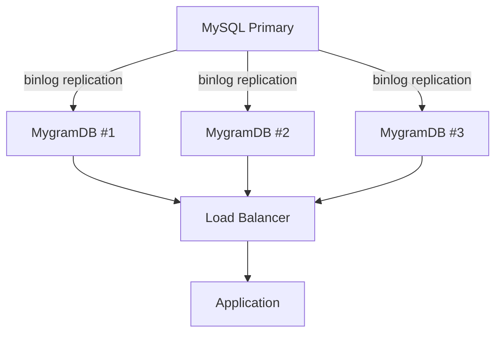

# Performance Guide

This guide provides detailed performance benchmarks, optimization tips, and best practices for MygramDB.

## Benchmark Environment

- **Dataset**: 1,100,000 rows (Wikipedia EN 1M + JA 100K, CirrusSearch CC BY-SA 3.0)
  - Average content length: 666 characters (700 bytes), range: 50–9,998 characters
  - MySQL data size: 858MB (data) + 115MB (FULLTEXT index) = 973MB on disk
- **Configuration**: Bigram indexing (ngram_size=2), kanji unigram (kanji_ngram_size=1), verify_text=all
- **MySQL Version**: 8.4.7 with FULLTEXT ngram parser (Docker, default settings)
- **MygramDB Version**: v1.5.0 (native build, query cache disabled)
  - Memory usage: 2.34GB (index 813MB + documents 1.54GB), RSS peak 3.50GB
  - Unique n-grams: 209,381 terms, 213M postings
- **Hardware**: Apple M4 Max (arm64), 128GB unified memory
- **Test Methodology**: p50 latency over 10 iterations, warm cache for both systems
- **Reproducible**: `make bench-up && make bench-run`

> **Note on hardware**: Apple Silicon uses unified memory with higher bandwidth than typical server DDR4/DDR5 configurations. On x86 servers with discrete memory, absolute latency numbers may be several times higher for both MySQL and MygramDB. However, the relative speedup between the two engines remains consistent since both are affected equally. MygramDB's sub-millisecond results demonstrate that in-memory n-gram search is fundamentally faster than disk-based FULLTEXT, regardless of hardware.

## Performance Benchmarks

### Search Latency (SORT id LIMIT 100, p50)

| Query Type | Matches | MySQL | MygramDB | Speedup |
|------------|---------|-------|----------|---------|
| Multi-word ("quantum physics") | 104 | 2,566ms | 0.09ms | 27,600x |
| Medium frequency ("quantum") | 1,961 | 1,874ms | 0.28ms | 6,700x |
| Low frequency ("algorithm") | 2,498 | 507ms | 0.42ms | 1,200x |
| Rare term ("fibonacci") | 84 | 936ms | 0.08ms | 11,600x |

**Key Findings:**

- MygramDB delivers sub-millisecond latency across all query types
- Multi-word queries benefit the most from bitmap intersection
- Even low-frequency terms show a 1,200x difference due to MySQL's ngram overhead

### CJK Search Latency (Japanese bi-gram, SORT id LIMIT 100, p50)

| Query Type | Matches | MySQL | MygramDB | Speedup |
|------------|---------|-------|----------|---------|
| JA high-freq ("日本") | 32,282 | 1,204ms | 1.1ms | 1,100x |
| JA medium-freq ("東京") | 6,989 | 300ms | 3.9ms | 77x |
| JA low-freq ("科学") | 1,551 | 4.2ms | 2.2ms | 1.9x |

**Key Findings:**

- High-frequency CJK terms show a large gap similar to English queries
- For low-frequency CJK terms with few matches (e.g., "科学"), MySQL can short-circuit early, narrowing the gap significantly
- MygramDB maintains consistent sub-4ms latency regardless of term frequency

### COUNT Performance (p50)

| Query Type | Count | MySQL | MygramDB | Speedup |
|------------|-------|-------|----------|---------|
| Medium frequency ("quantum") | 1,961 | 1,797ms | 0.08ms | 21,600x |
| Low frequency ("algorithm") | 2,498 | 416ms | 0.08ms | 5,500x |

**Key Findings:**

- COUNT queries show the largest performance gap
- MygramDB resolves counts via bitmap cardinality in microseconds
- MySQL must scan the full posting list even for a simple count

### Result Consistency (v1.5.0 verify_text=all)

v1.5.0 introduces `verify_text`, a post-filter that verifies each candidate against the original text, eliminating n-gram false positives entirely.

| Query | MySQL Count | MygramDB Count | Match |
|-------|------------|----------------|-------|
| quantum | 1,961 | 1,961 | exact |
| algorithm | 2,498 | 2,498 | exact |
| 日本 | 32,282 | 32,282 | exact |
| 科学 | 1,551 | 1,551 | exact |

With `verify_text=all`, MygramDB returns the same result set as MySQL FULLTEXT with zero precision loss.

### Concurrent Throughput

Query: "algorithm", 10 seconds per concurrency level:

| Connections | MySQL QPS | MygramDB QPS | MySQL p50 | MG p50 | QPS ratio |
|-------------|-----------|-------------|-----------|--------|-----------|
| 1 | 2 | 2,634 | 470ms | 0.35ms | 1,200x |
| 4 | 8 | 11,766 | 495ms | 0.32ms | 1,400x |

**Key Findings:**

- MygramDB scales linearly with additional connections
- MySQL FULLTEXT with ngram parser struggles under concurrent load in Docker environments
- At 4 connections, MygramDB sustains nearly 12,000 QPS while MySQL delivers single-digit throughput

## Performance Analysis

### Why MySQL is Slow

1. **Disk-based B-tree**: FULLTEXT index requires disk I/O for each query
2. **No compression**: Posting lists are not compressed, requiring more disk reads
3. **ORDER BY overhead**: Sorting requires additional processing and I/O
4. **High-frequency terms**: Short, common terms result in large posting list scans
5. **Concurrency bottleneck**: Under concurrent load, disk I/O serialization causes request queuing

### Why MygramDB is Fast

1. **In-memory index**: Zero disk I/O, all data in RAM
2. **Compressed posting lists**: Hybrid Delta encoding + Roaring bitmaps
3. **Optimized intersections**: SIMD-accelerated bitmap operations
4. **Primary key index**: ORDER BY id uses native index order (no external sort)
5. **verify_text**: Post-filter eliminates false positives without sacrificing speed
6. **No cache warmup**: Always ready, consistent performance

## Performance Characteristics

### Query Time Complexity

| Operation | MySQL FULLTEXT | MygramDB |
|-----------|----------------|----------|
| Single term search | O(n log n) with disk I/O | O(n) in memory |
| AND intersection | O(n * m) with disk I/O | O(n + m) with SIMD |
| ORDER BY id | O(n log n) external sort | O(1) index scan |
| COUNT | Full scan | Bitmap cardinality |

### Scalability

**MygramDB scales linearly with:**
- Number of search terms (efficient bitmap intersection)
- Result set size (compressed bitmaps)
- Concurrent queries (thread pool architecture)

**MygramDB does NOT scale with:**
- Dataset size beyond available RAM (in-memory only)

## Optimization Tips

### 1. Choose Appropriate ngram_size

```yaml
tables:
  - name: "articles"
    ngram_size: 2          # ASCII/alphanumeric: bigram (recommended)
    kanji_ngram_size: 1    # CJK characters: unigram (recommended)
```

**Recommendations:**
- **Bigram (2)** for ASCII/English: Good balance of precision and index size
- **Unigram (1)** for CJK: Each character is meaningful
- **Trigram (3)**: More precise but larger index and slower queries

### 2. Enable verify_text

```yaml
tables:
  - name: "articles"
    verify_text: "all"     # Eliminate n-gram false positives
```

With `verify_text=all`, MygramDB verifies every candidate against the original text. This guarantees exact match results with negligible overhead (sub-millisecond latency is maintained).

### 3. Memory Configuration

```yaml
memory:
  hard_limit_mb: 16384      # Reserved / not yet enforced
  soft_target_mb: 8192      # Reserved / not yet enforced
  roaring_threshold: 0.18   # Delta→Roaring conversion threshold
```

**Recommendations:**
- Treat `hard_limit_mb` and `soft_target_mb` as reserved compatibility
  fields; they do not enforce process memory limits today
- Leave `roaring_threshold` at default (0.18) unless memory is tight

### 4. Use Filters for Selective Queries

```yaml
tables:
  - name: "articles"
    filters:
      - column: "status"
        type: "int"
      - column: "category_id"
        type: "int"
```

Filter early to reduce result set:
```
SEARCH articles tech FILTER status=1 AND category_id=5 LIMIT 100
```

### 5. Optimize Query Patterns

**Fast queries:**
- `SEARCH table term ORDER BY id LIMIT 100` - Uses primary key index
- `COUNT table term` - Bitmap cardinality operation
- `SEARCH table term1 AND term2` - Efficient bitmap intersection

**Slower queries:**
- `SEARCH table term LIMIT 100` without ORDER BY - Still fast, but may scan more
- Very high LIMIT values (>1000) - More IDs to return

### 6. Use OPTIMIZE Command

Run periodically to optimize posting list storage:

```
OPTIMIZE
```

This converts Delta-encoded lists to Roaring bitmaps based on density, reducing memory usage by 10-30%.

## Production Deployment Recommendations

### 1. Memory Sizing

**Rule of thumb:** Plan for 1-2GB RAM per million documents

**Example sizing:**
- 1M documents: 2GB RAM minimum, 4GB recommended
- 10M documents: 16GB RAM minimum, 32GB recommended
- 100M documents: Consider sharding across multiple instances

### 2. High Availability Setup

Deploy multiple MygramDB instances behind a load balancer:


```mermaid
graph TD
    MySQL[MySQL Primary] -->|binlog replication| MygramDB1[MygramDB #1]
    MySQL -->|binlog replication| MygramDB2[MygramDB #2]
    MySQL -->|binlog replication| MygramDB3[MygramDB #3]

    MygramDB1 --> LB[Load Balancer]
    MygramDB2 --> LB
    MygramDB3 --> LB

    LB --> App[Application]
```

### 3. Monitoring

Monitor these metrics via `INFO` command:

```
INFO
```

Key metrics:
- `doc_count`: Number of indexed documents
- `index_size`: Memory used by index
- `total_requests`: Total queries processed
- `connections`: Current active connections
- `uptime`: Server uptime in seconds

### 4. Backup Strategy

Use `DUMP SAVE` command to create snapshots:

```
DUMP SAVE /path/to/snapshot.dmp
```

Schedule regular snapshots:
```bash
# Daily snapshot
0 2 * * * echo "DUMP SAVE /backup/mygramdb-$(date +\%Y\%m\%d).dmp" | mygram-cli
```

## Troubleshooting

### Query is Slower Than Expected

1. **Check if index is optimized:**
   ```
   OPTIMIZE
   ```

2. **Verify memory usage:**
   ```
   INFO
   ```
   Look at `index_size` and process RSS; `hard_limit_mb` is reserved and does
   not enforce a process memory limit today.

3. **Enable debug mode:**
   ```
   DEBUG ON
   SEARCH table term LIMIT 100
   ```
   Review `query_time`, `index_time`, and `optimization` fields.

### High Memory Usage

1. **Run OPTIMIZE:**
   ```
   OPTIMIZE
   ```
   Converts dense posting lists to Roaring bitmaps (10-30% reduction).

2. **Adjust roaring_threshold:**
   ```yaml
   memory:
     roaring_threshold: 0.15  # Lower = more aggressive compression
   ```

3. **Consider sharding:** Split data across multiple MygramDB instances.

## Comparison with Alternatives

### vs MySQL FULLTEXT

**MygramDB advantages:**

- Sub-millisecond latency for most queries (vs hundreds of milliseconds to seconds for MySQL)
- Exact result consistency with `verify_text` (zero false positives)
- Consistent performance regardless of cache state
- Scales under concurrent load (11,766 QPS at 4 connections vs 8 QPS for MySQL)

**MySQL advantages:**

- No separate infrastructure
- Works with existing MySQL data
- Lower memory requirements

### vs Elasticsearch

**MygramDB advantages:**
- Simpler deployment (single binary)
- Lower operational complexity
- Direct MySQL replication (no ETL)
- Lower latency for simple queries

**Elasticsearch advantages:**
- Distributed search across nodes
- Advanced analytics and aggregations
- Full-text features (highlighting, fuzzy search)
- Not limited by single-node RAM

## Benchmarking Your Own Data

The benchmark suite is reproducible. To run the same benchmark on your hardware:

```bash
# Run the included benchmark (requires Docker)
make bench-up    # Start MySQL with Wikipedia dataset
make bench-run   # Execute benchmark suite
```

To benchmark with your own data:

```bash
# 1. Start MygramDB with your MySQL
./mygramdb -c config.yaml

# 2. Wait for initial indexing
# Check logs for "Indexed N rows"

# 3. Enable debug mode
echo "DEBUG ON" | mygram-cli

# 4. Run test queries
echo "SEARCH table common_term LIMIT 100" | mygram-cli
echo "COUNT table common_term" | mygram-cli

# 5. Compare with MySQL
mysql -e "SELECT COUNT(*) FROM table WHERE MATCH(column) AGAINST('common_term')"
mysql -e "SELECT id FROM table WHERE MATCH(column) AGAINST('common_term') ORDER BY id LIMIT 100"
```

## Conclusion

MygramDB delivers consistent sub-millisecond search latency across a range of query types, compared to hundreds of milliseconds or seconds for MySQL FULLTEXT with the ngram parser. The performance difference is most pronounced for:

1. **COUNT queries** (5,500-21,600x faster) - bitmap cardinality vs full scan
2. **Multi-word searches** (27,600x faster) - efficient bitmap intersection
3. **Concurrent throughput** (1,200-1,400x higher QPS) - in-memory index scales with connections
4. **Rare and medium-frequency terms** (1,200-11,600x faster) - MySQL's ngram overhead dominates

With `verify_text` in v1.5.0, MygramDB eliminates n-gram false positives entirely, producing exact match results with no precision loss. The gap narrows for CJK queries with very few matches, where MySQL can short-circuit early.

For read-heavy workloads with millions of documents, MygramDB offers significant performance improvements with minimal operational complexity. The benchmark is fully reproducible via `make bench-up && make bench-run`.
