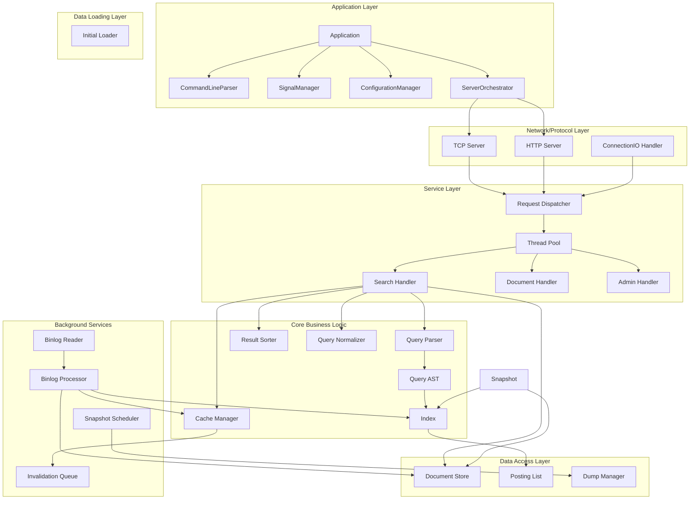
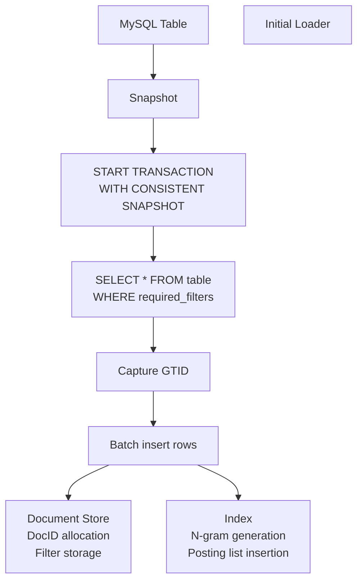
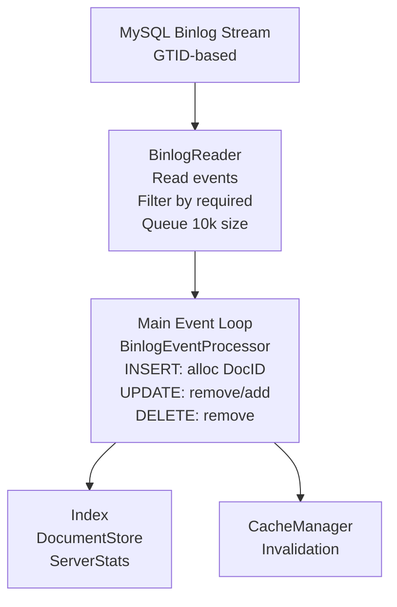
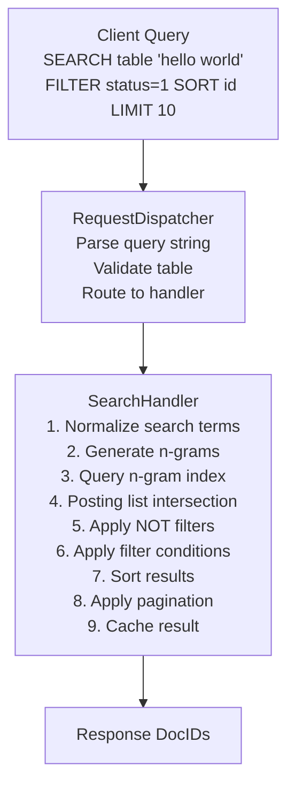
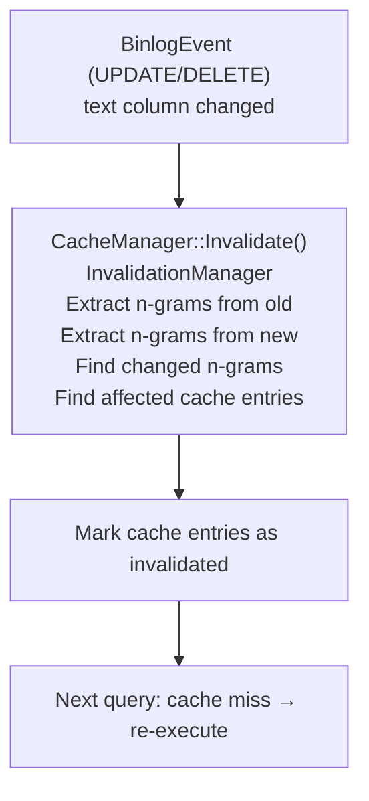
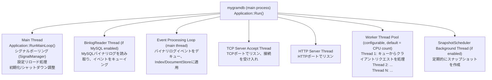
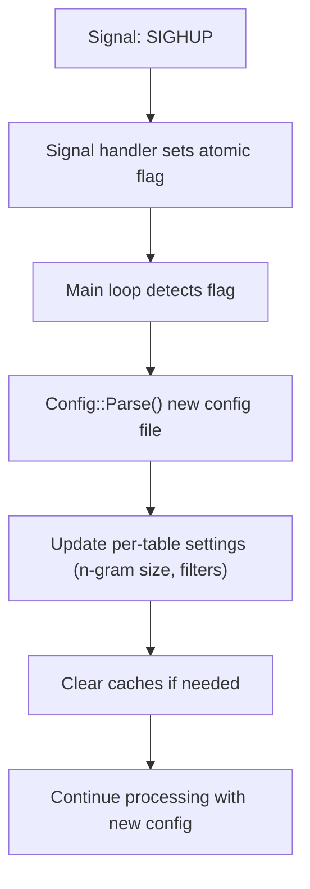

# MygramDB アーキテクチャ

**バージョン**: 1.0
**最終更新日**: 2025-11-18
**プロジェクト**: MygramDB - MySQLレプリケーション対応インメモリ全文検索エンジン

---

## 目次

1. [概要](#概要)
2. [システムアーキテクチャ](#システムアーキテクチャ)
3. [コンポーネントの責務](#コンポーネントの責務)
4. [データフロー](#データフロー)
5. [スレッドモデル](#スレッドモデル)
6. [コンポーネントの所有権](#コンポーネントの所有権)
7. [主要な設計パターン](#主要な設計パターン)
8. [統合ポイント](#統合ポイント)
9. [パフォーマンス特性](#パフォーマンス特性)

---

## 概要

MygramDBは、GTIDベースのバイナリログストリーミングを使用してMySQLからデータをレプリケートする**C++17インメモリ全文検索エンジン**です。以下の特徴により、MySQL FULLTEXTより**25〜200倍高速**な全文検索を提供します：

- **インメモリインデックス** - クエリ実行時のディスクI/Oなし
- **圧縮ポスティングリスト** - デルタエンコーディング + Roaringビットマップ
- **精密なキャッシュ無効化** - テーブルレベルではなくn-gramベース
- **高い並行性** - マルチリーダー・シングルライターパターン
- **リアルタイムレプリケーション** - GTIDベースのバイナリログストリーミング

### 主要機能

- **N-gram転置インデックス** - 設定可能なn-gramサイズ
- **マルチテーブルサポート** - 単一のMySQL接続から複数テーブル
- **GTIDベースのバイナリログレプリケーション** - 自動再接続機能付き
- **精密なキャッシュ無効化** - n-gramトラッキングを使用
- **型安全なエラーハンドリング** - `Expected<T, Error>`を使用
- **TCP/HTTP API** - JSON対応
- **スナップショット永続化** - 高速再起動
- **レート制限** - コネクションプーリング

---

## システムアーキテクチャ

### レイヤードアーキテクチャ



---

## コンポーネントの責務

### コアビジネスロジックレイヤー

#### Indexモジュール (`src/index/`)

**Index** (`index.h`)
- **責務**: N-gram転置インデックスの実装
- **機能**:
  - 各n-gram用語のポスティングリスト管理
  - スナップショット構築時のバッチ追加
  - `shared_mutex`によるスレッドセーフな並行読み書き
  - 適応的圧縮：疎データにはデルタエンコードされたvarint配列、密データにはRoaringビットマップ
  - 設定可能なn-gramサイズ（ASCII: デフォルト2、CJK: デフォルト1）
- **スレッドセーフティ**: `shared_mutex`によるマルチリーダー・シングルライター
- **主要メソッド**:
  - `Add(DocId, text)`: インデックスにドキュメントを追加
  - `Search(term)`: 用語を含むドキュメントを検索
  - `Remove(DocId)`: インデックスからドキュメントを削除

**PostingList** (`posting_list.h`)
- **責務**: 個々のn-gram用語のドキュメントIDストレージ
- **戦略**:
  - `PostingStrategy::kDeltaCompressed`: 疎なポスティング（< 18%密度）
  - `PostingStrategy::kRoaringBitmap`: 密なポスティング（≥ 18%密度）
- **主要メソッド**:
  - `Add(DocId)`: ドキュメントIDを追加
  - `Contains(DocId)`: ドキュメントの存在確認
  - `GetAll()`: すべてのドキュメントIDを取得

#### Queryモジュール (`src/query/`)

**QueryParser** (`query_parser.h`)
- **責務**: テキストプロトコルコマンドの解析
- **サポートコマンド**: SEARCH, COUNT, GET, INFO, DUMP, REPLICATION, SYNC, CONFIG, CACHE
- **戻り値**: `QueryType`と`Query` AST構造

**QueryAST** (`query_ast.h`)
- **責務**: ブール型クエリ式ツリー
- **演算子**: AND, OR, NOT（優先順位: NOT > AND > OR）
- **実行**: `QueryNode::Evaluate()`でインデックスに対してクエリを実行

**QueryNormalizer** (`query_normalizer.h`)
- **責務**: 一貫性のあるキャッシュキーのためのクエリ正規化
- **正規化**:
  - 空白の正規化
  - キーワードの大文字化
  - 句順序の正規化
  - フィルタのアルファベット順ソート

**ResultSorter** (`result_sorter.h`)
- **責務**: 検索結果のソートとページネーション
- **機能**:
  - プライマリキーまたはカスタムカラムでのソート
  - オフセット付きLIMITサポート

#### Storageモジュール (`src/storage/`)

**DocumentStore** (`document_store.h`)
- **責務**: DocID ↔ プライマリキーマッピングとフィルタカラムストレージ
- **容量**: 最大40億ドキュメント（uint32_t DocID）
- **スレッドセーフティ**: 並行アクセス用`shared_mutex`
- **フィルタ型**: bool, int8/16/32/64, uint8/16/32/64, string, double
- **主要メソッド**:
  - `AddDocument(primary_key, filters)`: DocIDを割り当ててメタデータを格納
  - `GetPrimaryKey(DocId)`: プライマリキーを取得
  - `GetFilterValue(DocId, column)`: フィルタ値を取得

**InitialLoader** (`loader/initial_loader.h`)
- **責務**: MySQLからの初期データロードによるインデックス構築
- **モジュール**: データロード層（ストレージとは分離）
- **機能**:
  - 一貫性のための`START TRANSACTION WITH CONSISTENT SNAPSHOT`
  - バイナリログレプリケーション継続のためロード時にGTIDを捕捉
  - モニタリング用の進捗コールバック
  - キャンセル可能な操作

**DumpManager** (`dump_manager.h`)
- **責務**: ディスクへのスナップショット永続化
- **フォーマット**: 圧縮とメタデータ付きV1フォーマット

---

### サービスレイヤー（バックグラウンドワーカー）

#### MySQLレプリケーションサービス (`src/mysql/`)

**BinlogReader** (`binlog_reader.h`)
- **責務**: MySQLバイナリログイベントのストリーミング
- **機能**:
  - GTIDベースの位置決め（ファイル名/オフセット不要）
  - 単一接続からの複数テーブルサポート
  - イベントキュー（設定可能サイズ、デフォルト10,000）
  - 指数バックオフによる自動再接続
  - 条件変数によるスレッドセーフ

**BinlogEventProcessor** (`binlog_event_processor.h`)
- **責務**: バイナリログイベントをインデックスに適用
- **イベントタイプ**: INSERT, UPDATE, DELETE, DDL
- **更新**: Index, DocumentStore, ServerStats

**ConnectionValidator** (`connection_validator.h`)
- **責務**: MySQL接続要件の検証
- **チェック項目**:
  - GTIDモード有効化
  - バイナリログフォーマット = ROW
  - レプリケーション権限

**TableMetadata** (`table_metadata.h`)
- **責務**: MySQLスキーマの内省
- **機能**:
  - テキストカラムとフィルタカラムの識別
  - 型マッピング: MySQL → FilterValue型

#### Cacheサービス (`src/cache/`)

**CacheManager** (`cache_manager.h`)
- **責務**: 統合キャッシュオーケストレーション
- **コンポーネント**: QueryCache, InvalidationManager, InvalidationQueue
- **戻り値**: メタデータ（作成時刻、実行コスト）付きキャッシュ結果

**QueryCache** (`query_cache.h`)
- **責務**: メモリ制限付きLRUキャッシュ
- **削除**: エントリ数とメモリサイズによる
- **コールバック**: クリーンアップ用の削除コールバック
- **統計**: ヒット/ミスカウンター

**InvalidationManager** (`invalidation_manager.h`)
- **責務**: N-gramベースのキャッシュ無効化トラッキング
- **トラッキング内容**:
  - 各キャッシュクエリが使用するn-gram
  - 逆インデックス: n-gram → キャッシュエントリ
- **精度**: 変更されたn-gramを使用するクエリのみを無効化

**InvalidationQueue** (`invalidation_queue.h`)
- **責務**: 非同期無効化バッチ処理
- **利点**: 高並行更新時のロック競合を削減

#### Snapshotスケジューラ (`src/server/snapshot_scheduler.h`)

- **責務**: 定期的なスナップショット作成
- **設定**: 秒単位の間隔（0 = デフォルトで無効）
- **クリーンアップ**: 古いスナップショットファイルの削除
- **分離**: サーバーライフサイクルから独立

---

### ネットワーク/プロトコルレイヤー (`src/server/`)

#### TCPサーバー (`tcp_server.h`)

- **プロトコル**: `\r\n`区切りのテキストベース
- **マルチテーブル**: 単一サーバーインスタンス、複数テーブル
- **ポート**: TCP（デフォルト11016）、HTTP（デフォルト8080）
- **機能**: レート制限、コネクションプーリング

#### HTTPサーバー (`http_server.h`)

- **API**: RESTful JSON
- **エンドポイント**:
  - `POST /{table}/search`: 検索クエリ
  - `GET /{table}/:id`: IDでドキュメント取得
  - `GET /info`: サーバー情報
  - `GET /health`: ヘルスチェック
- **機能**: CORSサポート、Kubernetes対応ヘルスチェック

#### リクエストディスパッチパイプライン

**ConnectionAcceptor** (`connection_acceptor.h`)
- **責務**: ソケット受け入れループ
- **機能**:
  - 無期限ハングを防ぐ`SO_RCVTIMEO`
  - スレッドプールへの接続ディスパッチ
  - スレッドセーフな接続トラッキング

**ConnectionIOHandler** (`connection_io_handler.h`)
- **責務**: 接続ごとのI/Oハンドリング
- **機能**:
  - ソケットデータの読み取り/バッファリング
  - プロトコルメッセージの解析（`\r\n`で区切り）
  - 最大クエリ長の強制（デフォルト1MB）
  - ソケットへのレスポンス書き込み

**RequestDispatcher** (`request_dispatcher.h`)
- **責務**: アプリケーションロジックルーティング
- **機能**:
  - ネットワーク依存なし（純粋なアプリケーションロジック）
  - ハンドラレジストリパターン
  - テーブル存在検証

#### コマンドハンドラ (`src/server/handlers/`)

| ハンドラ | 責務 |
|---------|------|
| **SearchHandler** | SEARCH/COUNTクエリ: n-gram生成、ポスティングリスト積集合、フィルタリング、ソート |
| **DocumentHandler** | GETコマンド: プライマリキーで取得 |
| **DumpHandler** | DUMP操作: SAVE/LOAD/VERIFY/INFO |
| **ReplicationHandler** | REPLICATIONコマンド: START/STOP/STATUS |
| **SyncHandler** | SYNC操作: MySQLからの初期データロード |
| **AdminHandler** | 管理コマンド |
| **CacheHandler** | CACHEコマンド: CLEAR/STATS/ENABLE/DISABLE |
| **DebugHandler** | DEBUG ON/OFF |

#### スレッドプール (`thread_pool.h`)

- **ワーカー**: 固定数（デフォルト = CPU数）
- **キュー**: バックプレッシャー付き有界タスクキュー
- **シャットダウン**: タイムアウト付きグレースフルシャットダウン
- **スレッドセーフティ**: ロックフリータスク投入

---

### アプリケーションレイヤー (`src/app/`)

アプリケーションレイヤーは、コマンドライン解析からグレースフルシャットダウンまで、アプリケーションのライフサイクル全体を管理します。

#### Application (`application.h`)

- **責務**: トップレベルアプリケーションオーケストレーター（メインエントリーポイント）
- **デザインパターン**: Facade + Orchestrator
- **ライフサイクル**:
  1. コマンドライン引数の解析
  2. 設定のロード
  3. 特殊モードの処理（--help, --version, --config-test）
  4. root権限チェック
  5. ロギング設定の適用
  6. デーモン化（--daemonの場合）
  7. ダンプディレクトリの検証
  8. シグナルハンドラーのセットアップ
  9. サーバーコンポーネントの初期化
  10. サーバーの起動
  11. メインループ（シグナルポーリング + 設定リロード）
  12. グレースフルシャットダウン

#### CommandLineParser (`command_line_parser.h`)

- **責務**: POSIX準拠のコマンドライン引数解析
- **サポートオプション**:
  - `-c/--config FILE`: 設定ファイルパス
  - `-s/--schema FILE`: スキーマファイルパス
  - `-d/--daemon`: プロセスのデーモン化
  - `-t/--config-test`: 設定をテストして終了
  - `-h/--help`: ヘルプメッセージを表示
  - `-v/--version`: バージョン情報を表示
- **戻り値**: `CommandLineArgs`構造体またはエラー

#### SignalManager (`signal_manager.h`)

- **責務**: RAIIシグナルハンドラー管理
- **設計**: `sig_atomic_t`を使用した非同期シグナルセーフ
- **シグナル**:
  - SIGINT/SIGTERM: `shutdown_requested`フラグを設定
  - SIGHUP: `reload_config_requested`フラグを設定
- **スレッドセーフティ**: シグナルハンドラーはアトミックフラグに書き込み；アプリケーションスレッドはポーリングで読み取り
- **RAII**: デストラクタで元のシグナルハンドラーを復元

#### ConfigurationManager (`configuration_manager.h`)

- **責務**: 設定のロード、検証、ホットリロード
- **機能**:
  - YAML設定ファイルのロード
  - 設定構造の検証
  - ロギング設定の適用
  - ホットリロードのサポート（SIGHUPによってトリガー）
  - 設定テストモード（--config-test）

#### ServerOrchestrator (`server_orchestrator.h`)

- **責務**: サーバーコンポーネントのライフサイクルオーケストレーション
- **デザインパターン**: Facade + Lifecycle Manager
- **初期化順序**（8ステップ）:
  1. テーブルコンテキスト（Index、DocumentStore）
  2. MySQL接続
  3. スナップショット構築（有効な場合）
  4. BinlogReaderの初期化
  5. TCPサーバーの初期化
  6. HTTPサーバーの初期化（有効な場合）
- **シャットダウン順序**: 初期化の逆順
- **ホットリロードサポート**: 設定変更時のMySQL再接続

---

### 設定とユーティリティ

#### Configモジュール (`src/config/config.h`)

- **フォーマット**: YAMLベースの設定
- **設定項目**:
  - テーブルごと: n-gramサイズ、テキストカラム、プライマリキー、フィルタカラム、必須フィルタ
  - MySQL: 接続パラメータ（ホスト、ポート、認証情報、SSL/TLS）
  - サーバー: TCP/HTTPポート、ワーカースレッド、メモリ制限
  - ダンプ: スケジュール間隔
  - レート制限: 容量と補充レート
- **ホットリロード**: SIGHUPシグナルサポート

#### エラーハンドリング (`src/utils/`)

**expected.h**
- **型**: C++17互換の`Expected<T, E>`（将来のC++23 std::expected）
- **利点**: 例外なしの型安全なエラー伝播

**error.h**
- **エラーコード範囲**:
  - 0-999: 一般エラー
  - 1000-1999: 設定エラー
  - 2000-2999: MySQL/データベースエラー
  - 3000-3999: クエリ解析エラー
  - 4000-4999: インデックス/検索エラー
  - 5000-5999: ストレージ/スナップショットエラー
  - 6000-6999: ネットワーク/サーバーエラー
  - 7000-7999: クライアントエラー
  - 8000-8999: キャッシュエラー

#### 可観測性

**ServerStats** (`server_stats.h`)
- **メトリクス**: Redisスタイルの統計
  - コマンドごとのカウンター（SEARCH、COUNT、GETなど）
  - メモリ使用量（現在とピーク）
  - 接続統計
  - レプリケーションイベントカウンター
  - 稼働時間トラッキング

**StructuredLog** (`structured_log.h`)
- **フォーマット**: フィールド付きイベントベースのロギング
- **利点**: より良いモニタリングと分析

**RateLimiter** (`rate_limiter.h`)
- **アルゴリズム**: トークンバケット
- **スコープ**: クライアントIPごと
- **機能**: 設定可能な容量、補充レート、自動クリーンアップ

#### 同期コンポーネント

**SyncOperationManager** (`sync_operation_manager.h`)
- **責務**: SYNC操作の調整
- **機能**:
  - テーブルごとの同期状態トラッキング
  - 同一テーブルでの同時同期を防止
  - 非同期スナップショット構築
  - 進捗トラッキングとキャンセル

**ServerLifecycleManager** (`server_lifecycle_manager.h`)
- **責務**: コンポーネント初期化のオーケストレーション
- **デザインパターン**: Factory/Builderパターン
- **機能**:
  - `Expected<T, Error>`による型安全な初期化
  - 依存関係順のコンポーネント作成
  - TcpServerの所有権のため`InitializedComponents`構造体を返却
  - 循環依存の排除（SyncHandler → SyncOperationManager）
  - 包括的なユニットテストカバレッジ（12テスト）

---

## データフロー

### 初期同期フェーズ（SYNCコマンド）



### ライブレプリケーションフェーズ



### クエリ処理フェーズ



### キャッシュ無効化フロー



---

## スレッドモデル

### プロセス構造



### スレッドセーフティパターン

| コンポーネント | 並行性 | メカニズム |
|---------------|--------|-----------|
| **Index** | マルチリーダー、シングルライター | `shared_mutex` + シリアル化されたバイナリログ処理 |
| **DocumentStore** | マルチリーダー、シングルライター | `shared_mutex` + シリアル化されたバイナリログ処理 |
| **Cache** | マルチリーダー、並行無効化 | QueryCache上の`shared_mutex` |
| **Stats** | 待機フリー | `atomic<T>` |
| **ThreadPool** | 待機フリータスク投入 | ロックフリーキュー |

### 並行性保証

**共有可変状態の保護:**

1. **Index**: `shared_mutex`
   - リーダー: 複数の並行SEARCHクエリ
   - ライター: 単一のBinlogReaderスレッド（シリアル化）

2. **DocumentStore**: `shared_mutex`
   - リーダー: SEARCH結果のポストフィルタリング
   - ライター: BinlogReaderスレッド

3. **Cache**: QueryCache内の`shared_mutex`
   - リーダー: キャッシュルックアップ
   - ライター: 無効化、削除

4. **ServerStats**: `atomic<T>`（ロックフリー）

5. **TableCatalog**: `shared_mutex`

6. **SyncOperationManager**: `mutex` + `condition_variable`

---

## コンポーネントの所有権

### 所有権階層

```mermaid
graph TB
    Root["Application (root)"]
    CLIArgs["CommandLineArgs"]
    ConfigMgr["ConfigurationManager"]
    SignalMgr["SignalManager"]
    ServerOrch["ServerOrchestrator"]

    TCPServer["TcpServer"]
    HTTPServer["HttpServer"]
    Stats["ServerStats (shared reference)"]
    Config["Configuration"]
    Tables["TableContexts (map)"]
    Table1["TableContext[table1]"]
    Index1["Index (unique_ptr)"]
    DocStore1["DocumentStore (unique_ptr)"]
    TableN["TableContext[tableN]"]
    ThreadPool["ThreadPool (unique_ptr)"]
    Acceptor["ConnectionAcceptor (unique_ptr)"]
    Dispatcher["RequestDispatcher (unique_ptr)"]
    Handlers["CommandHandlers (unique_ptr)"]
    SearchH["SearchHandler"]
    DocH["DocumentHandler"]
    DumpH["DumpHandler"]
    ReplH["ReplicationHandler"]
    SyncH["SyncHandler"]
    Other["..."]
    Scheduler["SnapshotScheduler (unique_ptr)"]
    Cache["CacheManager (unique_ptr)"]
    Binlog["BinlogReader (unique_ptr, if MySQL enabled)"]
    SyncOp["SyncOperationManager (unique_ptr, if MySQL enabled)"]
    HTTP["HttpServer (unique_ptr)"]

    Root --> CLIArgs
    Root --> ConfigMgr
    Root --> SignalMgr
    Root --> ServerOrch

    ServerOrch --> TCPServer
    ServerOrch --> HTTPServer
    ServerOrch --> Tables
    ServerOrch --> Binlog

    TCPServer --> Stats
    TCPServer --> Config
    Tables --> Table1
    Table1 --> Index1
    Table1 --> DocStore1
    Tables --> TableN
    TCPServer --> ThreadPool
    TCPServer --> Acceptor
    TCPServer --> Dispatcher
    TCPServer --> Handlers
    Handlers --> SearchH
    Handlers --> DocH
    Handlers --> DumpH
    Handlers --> ReplH
    Handlers --> SyncH
    Handlers --> Other
    TCPServer --> Scheduler
    TCPServer --> Cache
    TCPServer --> SyncOp
```



### リソースライフサイクル

**アプリケーションライフサイクル**（Application::Run()内）:

1. **コマンドライン解析**（CommandLineParser）
2. **設定ロード**（ConfigurationManager）
3. **特殊モード処理**（--help、--version、--config-test）
4. **権限チェック**（rootユーザー確認）
5. **ロギング設定**（設定を適用）
6. **デーモン化**（--daemonの場合）
7. **ダンプディレクトリ検証**
8. **シグナルハンドラーセットアップ**（SignalManager）
9. **コンポーネント初期化**（ServerOrchestrator）
10. **サーバー起動**（TCP/HTTPサーバー）
11. **メインループ**（シグナルポーリング、設定リロード処理）
12. **グレースフルシャットダウン**（逆順）

**ServerOrchestrator初期化順序**（8ステップ）:

1. **テーブルコンテキスト**（各テーブルのIndex、DocumentStore）
2. **MySQL接続**（USE_MYSQL有効時）
3. **スナップショット構築**（auto_initial_snapshot有効時）
4. **BinlogReader初期化**（GTID利用可能時）
5. **TCPサーバー初期化**（ServerLifecycleManager経由）
6. **HTTPサーバー初期化**（設定で有効な場合）

**ServerLifecycleManager初期化順序**（TCPサーバー内）:

依存関係グラフに従い、以下の順序でコンポーネントが初期化されます：

1. **ThreadPool**（依存なし）
2. **TableCatalog**（依存なし）
3. **CacheManager**（オプショナル、設定に依存）
4. **HandlerContext**（catalog、cacheに依存）
5. **コマンドハンドラー**（HandlerContextに依存）
   - SearchHandler、DocumentHandler、DumpHandler
   - AdminHandler、ReplicationHandler、DebugHandler
   - CacheHandler、SyncHandler（MySQL）
6. **RequestDispatcher**（ハンドラーに依存）
7. **ConnectionAcceptor**（ThreadPoolに依存）
8. **SnapshotScheduler**（オプショナル、catalogに依存）

**注記**: RateLimiterとSyncOperationManagerは、ServerLifecycleManagerがインスタンス化される前に`TcpServer::Start()`で作成されます。

**シャットダウン順序**（初期化の逆順）:

1. **HTTPサーバーシャットダウン**（実行中の場合）
2. **TCPサーバーシャットダウン**
   - 新しい接続の受け入れを停止（ConnectionAcceptor）
   - スレッドプールタスクの完了を待機
   - バックグラウンドサービスの停止（SnapshotScheduler、SyncOperationManager）
   - ハンドラーとディスパッチャのクリーンアップ
   - キャッシュとカタログのクリーンアップ
3. **BinlogReaderシャットダウン**（実行中の場合）
4. **MySQL接続クローズ**（オープンしている場合）
5. **テーブルコンテキストクリーンアップ**（Index、DocumentStore）
6. **シグナルハンドラー復元**（SignalManagerデストラクタ）

### RAIIパターン

1. **所有権のためのunique_ptr**: すべてのコンポーネントはTcpServerが所有
2. **読み書き調整のためのshared_mutex**: Index、DocumentStore、Cache
3. **ロックフリー統計のためのatomic<T>**: ServerStatsカウンター
4. **同期のためのcondition_variable**: BinlogReaderキュー、SyncOperationManager
5. **MySQLResult RAIIラッパー**: `unique_ptr<MYSQL_RES, MySQLResultDeleter>`

---

## 主要な設計パターン

### エラーハンドリング: Expected<T, Error>

```cpp
Expected<std::vector<DocId>, Error> result = index->Search("term");
if (result) {
    // *resultを使用
    auto docs = *result;
} else {
    // エラーにアクセス: result.error()
    auto err = result.error();
    spdlog::error("Search failed: {}", err.message);
}
```

**利点:**
- 型安全: コンパイル時エラーチェック
- 例外なし: 予測可能なパフォーマンス
- 合成可能: 操作のチェーン化

### リソース管理: RAII

```cpp
class TcpServer {
    std::unique_ptr<ThreadPool> thread_pool_;
    std::unique_ptr<Index> index_;
    std::unique_ptr<DocumentStore> doc_store_;
    std::unique_ptr<BinlogReader> binlog_reader_;

    ~TcpServer() {
        // デストラクタはすべてのunique_ptrを宣言の逆順に
        // 自動的にクリーンアップ
    }
};
```

### スレッドセーフティ: shared_mutex + Atomic

```cpp
class Index {
    mutable std::shared_mutex mutex_;
    std::unordered_map<std::string, PostingList> postings_;

    std::vector<DocId> Search(const std::string& term) const {
        std::shared_lock lock(mutex_);  // 複数のリーダー
        // ...
    }

    void Add(DocId id, std::string_view text) {
        std::unique_lock lock(mutex_);  // 排他的ライター
        // ...
    }
};

class ServerStats {
    std::atomic<uint64_t> total_requests_{0};

    void IncrementRequests() {
        total_requests_.fetch_add(1, std::memory_order_relaxed);
    }
};
```

### ハンドラポリモーフィズム: CommandHandlerインターフェース

```cpp
class CommandHandler {
public:
    virtual std::string Handle(const query::Query& query,
                               ConnectionContext& conn_ctx) = 0;
};

class SearchHandler : public CommandHandler {
    std::string Handle(const query::Query& query,
                       ConnectionContext& conn_ctx) override;
};
```

**利点:**
- 新しいハンドラの追加が容易（インターフェースを実装）
- RequestDispatcherはハンドラの実装に依存しない
- テスト可能: ハンドラをモック可能

### 依存性注入: HandlerContext

```cpp
struct HandlerContext {
    TableCatalog* table_catalog;
    std::unordered_map<std::string, TableContext*>& table_contexts;
    ServerStats& stats;
    const config::Config* full_config;
    cache::CacheManager* cache_manager;
    mysql::BinlogReader* binlog_reader;
    // ...
};

class SearchHandler : public CommandHandler {
    SearchHandler(HandlerContext& ctx) : ctx_(ctx) {}

    std::string Handle(...) override {
        // ctx_.table_catalog、ctx_.cache_managerなどを使用
    }
};
```

**利点:**
- ハンドラをサービス作成から分離
- テスト可能: モック依存性を注入
- 集中化された設定

### 並行性パターン: マルチテーブルサポート

```cpp
// 単一のBinlogReader、単一のGTIDストリーム
BinlogReader binlog_reader(connection, table_contexts, ...);

// イベントは適切なテーブルに逆多重化
struct BinlogEvent {
    std::string table_name;
    // ...
};

// BinlogEventProcessorは正しいテーブルのIndex/DocumentStoreに適用
BinlogEventProcessor::ProcessEvent(event,
    table_contexts[event.table_name]->index,
    table_contexts[event.table_name]->doc_store,
    ...);
```

### 無効化パターン: 精密なキャッシュ無効化

```cpp
// テーブルレベルの無効化（MySQL FULLTEXT）の代わりに
// MygramDBはキャッシュクエリごとにn-gram使用を追跡

class InvalidationManager {
    // ngram -> {cached query keys}
    std::unordered_map<std::string, std::unordered_set<CacheKey>>
        ngram_to_cache_keys_;

    void InvalidateAffectedEntries(const std::string& old_text,
                                   const std::string& new_text) {
        // 変更されたn-gramを抽出
        auto changed_ngrams = FindChangedNgrams(old_text, new_text);

        // 変更されたn-gramを使用するキャッシュクエリを検索
        std::unordered_set<CacheKey> affected;
        for (const auto& ngram : changed_ngrams) {
            auto it = ngram_to_cache_keys_.find(ngram);
            if (it != ngram_to_cache_keys_.end()) {
                affected.insert(it->second.begin(), it->second.end());
            }
        }

        // 影響を受けたエントリを無効化としてマーク
        for (const auto& key : affected) {
            cache_->Invalidate(key);
        }
    }
};
```

---

## 統合ポイント

### MySQLとIndexの間

- **BinlogReader** → バイナリログを読み取り → **BinlogEventProcessor** → **Index + DocumentStore**に適用
- **InitialLoader** → MySQLからSELECT → **Indexバッチ追加** + **DocumentStore**

### QueryとCacheの間

- **SearchHandler** → **CacheManager**にクエリ → キャッシュまたはクエリ結果を返す
- **BinlogReader** → データ変更時 → **CacheManager::Invalidate** → キャッシュエントリを無効化としてマーク

### HandlersとDispatcherの間

- **RequestDispatcher** → クエリを解析 → 登録された**CommandHandler**にルーティング
- 各ハンドラタイプ（Search、Document、Dumpなど）はディスパッチャに登録

### AcceptorとHandlersの間

- **ConnectionAcceptor** → 接続を受け入れ → **ThreadPool**に投入
- **ThreadPoolワーカー** → **ConnectionIOHandler**を呼び出し → **RequestDispatcher**を呼び出し → ハンドラを呼び出し

---

## パフォーマンス特性

### クエリパフォーマンス

- **全文検索**: MySQL FULLTEXTより25〜200倍高速
- **インメモリ操作**: クエリ時のディスクI/Oなし
- **圧縮ポスティング**: デルタエンコーディング + Roaringビットマップ
- **マルチリーダー並行性**: 同時クエリのための共有ロック

### レプリケーションパフォーマンス

- **GTIDベース**: ファイル名/オフセット調整不要
- **イベントキュー**: 最大10,000イベントをバッファリング（設定可能）
- **自動再接続**: 接続喪失時の指数バックオフ
- **マルチテーブルサポート**: 単一接続、複数テーブル

### キャッシュパフォーマンス

- **精密な無効化**: 変更されたn-gramを使用するクエリのみを無効化
- **LRU削除**: メモリ境界付きキャッシュ
- **非同期バッチ処理**: InvalidationQueueによるロック競合の削減

### 並行性パフォーマンス

- **マルチリーダー/シングルライター**: クエリスループットの最大化
- **ロックフリー統計**: メトリクス用アトミックカウンター
- **スレッドプール**: 固定ワーカー、有界キュー

---

## 設定のホットリロード



**リロード可能な設定:**
- N-gramサイズ
- フィルタカラム
- キャッシュ設定
- レート制限

**リロード不可の設定:**
- TCP/HTTPポート
- テーブル名
- MySQL接続（再起動が必要）

**参照**: 詳細は[設定リファレンス](configuration.md)を参照

---

## フェイルオーバー検出

- **ConnectionValidator**がMySQL接続ステータスをチェック
- 接続喪失時: **BinlogReader**が指数バックオフで再接続を試行
- 検出方法: クエリ失敗、接続エラー、ハートビートタイムアウト

---

## 参考資料

- [APIリファレンス](api.md)
- [設定リファレンス](configuration.md)
- [デプロイガイド](deployment.md)
- [開発ガイド](development.md)
