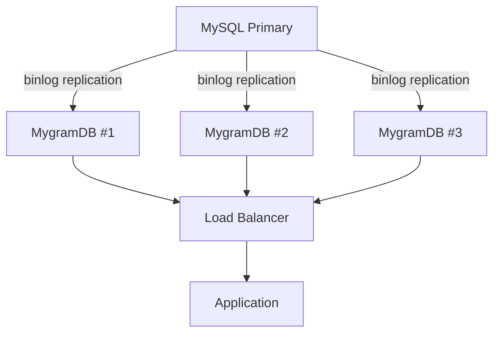

# パフォーマンスガイド

このガイドでは、MygramDBの詳細なパフォーマンスベンチマーク、最適化のヒント、ベストプラクティスを提供します。

## ベンチマーク環境

- **データセット**: 1,699,686行（実際の本番データ）
- **設定**: バイグラムインデックス（ngram_size=2）
- **ハードウェア**: 標準的なサーバー構成
- **MySQL バージョン**: 8.x、FULLTEXT ngram インデックス
- **テスト方法**: コールドキャッシュ（MySQL再起動後） vs ウォームキャッシュ vs MygramDB

## パフォーマンスベンチマーク

### 典型的なユースケース: ORDER BY id LIMIT 100

ページネーション付き検索結果を取得する、最も一般的な実際のクエリパターン：

| クエリタイプ | 結果セット | MySQL (コールド) | MySQL (ウォーム) | MygramDB | 高速化 |
|------------|------------|--------------|--------------|----------|---------|
| 中頻度語句 | 7.8万行 (4.6%) | 906ms | 592ms | 24ms | **38倍 / 25倍** |
| 高頻度語句 | 80.7万行 (47.5%) | 2,495ms | 2,017ms | 42ms | **59倍 / 48倍** |
| 超高頻度語句 | 127万行 (74.9%) | 3,753ms | 3,228ms | 56ms | **68倍 / 58倍** |
| 2語句 AND | 6,300行 | 1,189ms | - | 10ms | **115倍** |

**主な発見:**
- ORDER BY は MySQL のパフォーマンスに大きく影響（ORDER BY なしと比較して2-3倍遅い）
- MygramDB は 127万件マッチでも60ms以下のレスポンスタイムを維持
- 高頻度語句で最大のパフォーマンス差（68倍高速）

### COUNT クエリ

IDを取得せずにマッチ数をカウント：

| クエリタイプ | 結果セット | MySQL (コールド) | MySQL (ウォーム) | MygramDB | 高速化 |
|------------|------------|--------------|--------------|----------|---------|
| 中頻度語句 | 7.8万行 (4.6%) | 682ms | 432ms | 6.3ms | **108倍 / 68倍** |
| 高頻度語句 | 80.7万行 (47.5%) | 727ms | 588ms | 8.6ms | **84倍 / 68倍** |
| 超高頻度語句 | 127万行 (74.9%) | 1,072ms | 919ms | 5.3ms | **201倍 / 172倍** |
| 2語句 AND | 6,300行 | 1,191ms | - | 6.0ms | **197倍** |

**主な発見:**
- MygramDB は本番環境（コールドキャッシュ）で70-200倍高速なCOUNTクエリを実現
- ウォームキャッシュでも68-172倍高速
- 結果セットのサイズが大きいほどパフォーマンスの優位性が拡大

### SEARCH with LIMIT（ORDER BY なし、ウォームキャッシュ）

| クエリタイプ | 結果セット | MySQL | MygramDB | 勝者 |
|------------|------------|-------|----------|---------|
| 中頻度語句 | 7.8万行 (4.6%) | 19ms | 67ms | MySQL 3.6倍高速* |
| 高頻度語句 | 80.7万行 (47.5%) | 18ms | 7.2ms | **MygramDB 2.5倍高速** |
| 超高頻度語句 | 127万行 (74.9%) | 18ms | 4.9ms | **MygramDB 3.6倍高速** |
| 2語句 AND | 6,300行 | 18ms | 12.6ms | **MygramDB 1.4倍高速** |

\* MySQL は結果セットが小さい（<5%マッチ）場合、ソートが不要なら早期終了可能。

## パフォーマンス分析

### MySQL が遅い理由

1. **ディスクベースのB-tree**: FULLTEXT インデックスは各クエリでディスクI/Oが必要
2. **圧縮なし**: 転置インデックスが圧縮されておらず、より多くのディスク読み込みが必要
3. **キャッシュ依存**: コールドとウォームキャッシュで2-3倍のパフォーマンス差
4. **ORDER BY のオーバーヘッド**: ソートには追加の処理とI/Oが必要
5. **高頻度語句**: 短く一般的な語句は大きな転置リストのスキャンが必要
6. **並行性のボトルネック**: 高負荷な並行環境で、ディスクI/Oのシリアル化によりリクエストがキューイング

### 高負荷時のパフォーマンス

**MySQL FULLTEXT の負荷時:**
- 単一クエリ: 600-3,700ms
- 中程度の負荷: ディスクI/O競合によりクエリがキューイング開始
- 高負荷: レスポンスタイムがキューの増大により10秒以上に劣化
- 連鎖障害: 遅いクエリがコネクションプールをブロック、タイムアウト発生

**MygramDB の負荷時:**
- 単一クエリ: 24-56ms
- 中程度の負荷: 60ms以下のレイテンシを維持（インメモリ、I/O待機なし）
- 高負荷: スレッドプールアーキテクチャで依然として高速応答
- 予測可能: キューの蓄積なし、連鎖遅延なし

**実際のシナリオ:**
本番Webアプリケーションでは、ピーク時にバーストトラフィックが発生します。MySQL FULLTEXTは並行検索リクエストで苦戦しますが、MygramDBは同じ負荷を難なく処理します。

### MygramDB が速い理由

1. **インメモリインデックス**: ディスクI/Oがゼロ、すべてのデータがRAM上
2. **圧縮転置リスト**: ハイブリッド Delta エンコーディング + Roaring ビットマップ
3. **最適化された交差演算**: SIMD アクセラレーション付きビットマップ演算
4. **プライマリキーインデックス**: ORDER BY id はネイティブインデックス順を使用（外部ソート不要）
5. **キャッシュウォームアップ不要**: 常に準備完了、一貫したパフォーマンス

## パフォーマンス特性

### クエリ時間計算量

| 操作 | MySQL FULLTEXT | MygramDB |
|-----------|----------------|----------|
| 単一語句検索 | O(n log n) + ディスクI/O | O(n) インメモリ |
| AND 交差演算 | O(n * m) + ディスクI/O | O(n + m) SIMD付き |
| ORDER BY id | O(n log n) 外部ソート | O(1) インデックススキャン |
| COUNT | フルスキャン | ビットマップ基数 |

### スケーラビリティ

**MygramDB が線形にスケールするもの:**
- 検索語句の数（効率的なビットマップ交差演算）
- 結果セットのサイズ（圧縮ビットマップ）
- 同時クエリ数（スレッドプールアーキテクチャ）

**MygramDB がスケールしないもの:**
- 利用可能なRAMを超えるデータセットサイズ（インメモリのみ）

## 最適化のヒント

### 1. 適切な ngram_size を選択

```yaml
tables:
  - name: "articles"
    ngram_size: 2          # ASCII/英数字: バイグラム（推奨）
    kanji_ngram_size: 1    # CJK文字: ユニグラム（推奨）
```

**推奨事項:**
- **バイグラム (2)** ASCII/英語用: 精度とインデックスサイズのバランスが良い
- **ユニグラム (1)** CJK用: 各文字が意味を持つ
- **トライグラム (3)**: より精密だがインデックスが大きく、クエリが遅い

### 2. メモリ設定

```yaml
memory:
  hard_limit_mb: 16384      # 許可される最大メモリ
  soft_target_mb: 8192      # 目標メモリ使用量
  roaring_threshold: 0.18   # Delta→Roaring 変換閾値
```

**推奨事項:**
- `hard_limit_mb` を利用可能なRAMの60-70%に設定
- `soft_target_mb` を `hard_limit_mb` の50%に設定
- `roaring_threshold` はメモリが逼迫していない限りデフォルト（0.18）のまま

### 3. フィルターを使用して選択的クエリ

```yaml
tables:
  - name: "articles"
    filters:
      - column: "status"
        type: "int"
      - column: "category_id"
        type: "int"
```

早期にフィルタリングして結果セットを削減:
```
SEARCH articles tech FILTER status=1 AND category_id=5 LIMIT 100
```

### 4. クエリパターンの最適化

**高速なクエリ:**
- `SEARCH table term ORDER BY id LIMIT 100` - プライマリキーインデックスを使用
- `COUNT table term` - ビットマップ基数演算
- `SEARCH table term1 AND term2` - 効率的なビットマップ交差演算

**やや遅いクエリ:**
- `SEARCH table term LIMIT 100` ORDER BY なし - それでも高速だが、より多くスキャンする可能性
- 非常に大きな LIMIT 値（>1000） - 返すIDが多い

### 5. OPTIMIZE コマンドの使用

定期的に実行して転置リストのストレージを最適化:

```
OPTIMIZE
```

これにより、密度に基づいて Delta エンコーディングリストを Roaring ビットマップに変換し、メモリ使用量を10-30%削減します。

## 本番環境デプロイの推奨事項

### 1. メモリサイジング

**経験則:** 100万ドキュメントあたり1-2GB RAMを計画

**サイジング例:**
- 100万ドキュメント: 2GB RAM 最小、4GB 推奨
- 1000万ドキュメント: 16GB RAM 最小、32GB 推奨
- 1億ドキュメント: 複数インスタンスへのシャーディングを検討

### 2. 高可用性セットアップ

ロードバランサーの背後に複数の MygramDB インスタンスをデプロイ:



### 3. モニタリング

`INFO` コマンドでこれらのメトリクスを監視:

```
INFO
```

主要メトリクス:
- `doc_count`: インデックスされたドキュメント数
- `index_size`: インデックスが使用するメモリ
- `total_requests`: 処理された総クエリ数
- `connections`: 現在のアクティブ接続数
- `uptime`: サーバー稼働時間（秒）

### 4. バックアップ戦略

`DUMP SAVE` コマンドでスナップショットを作成:

```
DUMP SAVE /path/to/snapshot.dmp
```

定期的なスナップショットをスケジュール:
```bash
# 毎日のスナップショット
0 2 * * * echo "DUMP SAVE /backup/mygramdb-$(date +\%Y\%m\%d).dmp" | mygram-cli
```

## トラブルシューティング

### クエリが期待より遅い

1. **インデックスが最適化されているか確認:**
   ```
   OPTIMIZE
   ```

2. **メモリ使用量を確認:**
   ```
   INFO
   ```
   `index_size` を確認 - `hard_limit_mb` に近い場合、メモリを増やす。

3. **デバッグモードを有効化:**
   ```
   DEBUG ON
   SEARCH table term LIMIT 100
   ```
   `query_time`、`index_time`、`optimization` フィールドを確認。

### 高メモリ使用量

1. **OPTIMIZE を実行:**
   ```
   OPTIMIZE
   ```
   密な転置リストを Roaring ビットマップに変換（10-30%削減）。

2. **roaring_threshold を調整:**
   ```yaml
   memory:
     roaring_threshold: 0.15  # 低い = より積極的な圧縮
   ```

3. **シャーディングを検討:** データを複数の MygramDB インスタンスに分割。

## 代替手段との比較

### vs MySQL FULLTEXT

**MygramDB の利点:**
- 典型的なクエリで25-200倍高速
- 一貫したパフォーマンス（キャッシュウォームアップ不要）
- ORDER BY のパフォーマンスが優れている
- ディスクI/Oなし

**MySQL の利点:**
- 別インフラストラクチャが不要
- 既存の MySQL データで動作
- メモリ要件が低い

### vs Elasticsearch

**MygramDB の利点:**
- デプロイが簡単（単一バイナリ）
- 運用の複雑さが低い
- 直接 MySQL レプリケーション（ETL不要）
- シンプルなクエリでのレイテンシが低い

**Elasticsearch の利点:**
- ノード間の分散検索
- 高度な分析と集計
- 全文検索機能（ハイライト、ファジー検索）
- 単一ノードRAMに制限されない

## 独自データでのベンチマーク

独自データで MygramDB をベンチマーク:

```bash
# 1. MySQL で MygramDB を起動
./mygramdb -c config.yaml

# 2. 初期インデックス作成を待つ
# ログで "Indexed N rows" を確認

# 3. デバッグモードを有効化
echo "DEBUG ON" | mygram-cli

# 4. テストクエリを実行
echo "SEARCH table common_term LIMIT 100" | mygram-cli
echo "COUNT table common_term" | mygram-cli

# 5. MySQL と比較
mysql -e "SELECT COUNT(*) FROM table WHERE MATCH(column) AGAINST('common_term')"
mysql -e "SELECT id FROM table WHERE MATCH(column) AGAINST('common_term') ORDER BY id LIMIT 100"
```

## まとめ

MygramDB は、典型的な本番ワークロードにおいて MySQL FULLTEXT と比較して25-200倍高速な全文検索を提供します。パフォーマンスの優位性は以下で最も顕著です:

1. 高頻度検索語句（68-201倍高速）
2. ORDER BY を含むクエリ（25-115倍高速）
3. COUNT 操作（70-200倍高速）
4. コールドキャッシュシナリオ（本番環境で一般的）

数百万のドキュメントを持つ読み取り負荷の高いワークロードでは、MygramDB は最小限の運用の複雑さで劇的なパフォーマンス向上を提供します。
