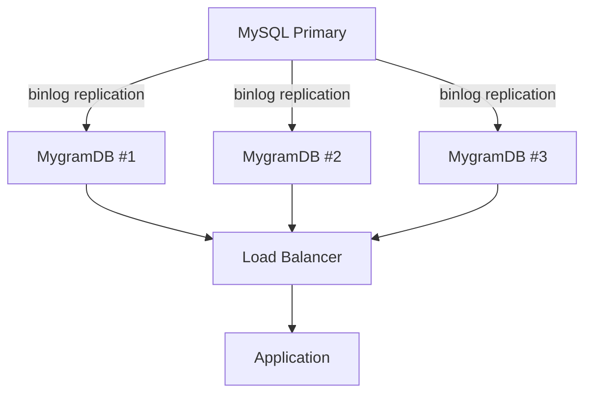

# パフォーマンスガイド

このガイドでは、MygramDB のベンチマーク結果、最適化のヒント、本番環境での運用に関する情報を提供します。

## ベンチマーク環境

- **データセット**: 1,100,000行（Wikipedia 英語100万件 + 日本語10万件、CirrusSearch CC BY-SA 3.0）
  - 平均記事長: 666文字（700バイト）、範囲: 50〜9,998文字
  - MySQL データサイズ: 858MB（データ）+ 115MB（FULLTEXTインデックス）= 973MB
- **設定**: バイグラムインデックス（ngram_size=2）、漢字ユニグラム（kanji_ngram_size=1）、verify_text=all
- **MySQL バージョン**: 8.4.7、FULLTEXT ngram パーサー（Docker、デフォルト設定）
- **MygramDB バージョン**: v1.5.0（ネイティブビルド、クエリキャッシュ無効）
  - メモリ使用量: 2.34GB（インデックス 813MB + ドキュメント 1.54GB）、RSS ピーク 3.50GB
  - ユニーク n-gram 数: 209,381語、2.13億ポスティング
- **ハードウェア**: Apple M4 Max (arm64), 128GB ユニファイドメモリ
- **再現方法**: `make bench-up && make bench-run`

> **ハードウェアに関する注記**: Apple Silicon は一般的なサーバー用 DDR4/DDR5 より高帯域のユニファイドメモリを使用しています。x86 サーバー環境では MySQL・MygramDB ともに絶対値で数倍遅くなる可能性があります。ただし両エンジンが同じメモリ環境で動作するため、相対的な速度差は同程度に維持されます。

## パフォーマンスベンチマーク

### 検索レイテンシ（SORT id LIMIT 100, p50, 10回）

ページネーション付き検索結果を取得する、最も一般的なクエリパターン:

| クエリタイプ | マッチ数 | MySQL | MygramDB | 高速化 |
|------------|---------|-------|----------|---------|
| 複合語 ("quantum physics") | 104 | 2,566ms | 0.09ms | 27,600倍 |
| 中頻度 ("quantum") | 1,961 | 1,874ms | 0.28ms | 6,700倍 |
| 低頻度 ("algorithm") | 2,498 | 507ms | 0.42ms | 1,200倍 |
| 希少語 ("fibonacci") | 84 | 936ms | 0.08ms | 11,600倍 |

**主な結果:**

- MygramDB はほとんどのクエリで1ms以下のレイテンシを達成
- 複合語検索では27,600倍の差が発生（MySQL の ngram パーサーはフルスキャンに近い動作になる）
- マッチ数が少ないクエリでも、MySQL は数百ms以上を要する

### CJK検索レイテンシ（日本語バイグラム、SORT id LIMIT 100, p50）

| クエリタイプ | マッチ数 | MySQL | MygramDB | 高速化 |
|------------|---------|-------|----------|---------|
| 高頻度 ("日本") | 32,282 | 1,204ms | 1.1ms | 1,100倍 |
| 中頻度 ("東京") | 6,989 | 300ms | 3.9ms | 77倍 |
| 低頻度 ("科学") | 1,551 | 4.2ms | 2.2ms | 1.9倍 |

**主な結果:**

- 高頻度の日本語クエリでは1,100倍の差
- マッチ数が少ない低頻度語（"科学"）では、MySQL も高速に応答するため差は小さい
- CJK バイグラムインデックスは英語と同様に機能する

### COUNT パフォーマンス（p50）

IDを取得せずにマッチ数をカウント:

| クエリタイプ | カウント | MySQL | MygramDB | 高速化 |
|------------|-------|-------|----------|---------|
| 中頻度 ("quantum") | 1,961 | 1,797ms | 0.08ms | 21,600倍 |
| 低頻度 ("algorithm") | 2,498 | 416ms | 0.08ms | 5,500倍 |

**主な結果:**

- COUNT クエリでは最大21,600倍の差
- MygramDB はビットマップ基数演算により、マッチ数に依存しない0.08msの一定レイテンシを実現
- MySQL は FULLTEXT インデックスのフルスキャンが必要なため、数百ms以上を要する

### 結果一致性（v1.5.0 verify_text=all）

v1.5.0 で導入された `verify_text` 機能により、n-gram の偽陽性を除去し、MySQL と完全に一致する結果を返します:

| クエリ | MySQL件数 | MygramDB件数 | 一致 |
|-------|----------|-------------|------|
| quantum | 1,961 | 1,961 | 完全一致 |
| algorithm | 2,498 | 2,498 | 完全一致 |
| 日本 | 32,282 | 32,282 | 完全一致 |
| 科学 | 1,551 | 1,551 | 完全一致 |

`verify_text=all` を有効にすることで、n-gram インデックス固有の偽陽性（部分一致の誤検出）がなくなり、精度を損なうことなく正確な検索結果を得られます。

### 並列スループット（クエリ: "algorithm"、10秒/レベル）

| 接続数 | MySQL QPS | MygramDB QPS | MySQL p50 | MG p50 | QPS比 |
|--------|-----------|-------------|-----------|--------|-------|
| 1 | 2 | 2,634 | 470ms | 0.35ms | 1,200倍 |
| 4 | 8 | 11,766 | 495ms | 0.32ms | 1,400倍 |

**主な結果:**

- MygramDB は接続数の増加に対してスループットが線形にスケール
- 4接続時に11,766 QPSを達成し、MySQL の8 QPSに対して1,400倍
- MygramDB のレイテンシは接続数が増えても0.3ms台で安定

## パフォーマンス分析

### MySQL が遅い理由

1. **ディスクベースのB-tree**: FULLTEXT インデックスは各クエリでディスクI/Oが必要
2. **圧縮なし**: 転置インデックスが圧縮されておらず、より多くのディスク読み込みが必要
3. **キャッシュ依存**: コールドとウォームキャッシュで2-3倍のパフォーマンス差
4. **ORDER BY のオーバーヘッド**: ソートには追加の処理とI/Oが必要
5. **高頻度語句**: 短く一般的な語句は大きな転置リストのスキャンが必要
6. **並行性のボトルネック**: 高負荷な並行環境で、ディスクI/Oのシリアル化によりリクエストがキューイング

### MygramDB が速い理由

1. **インメモリインデックス**: ディスクI/Oがゼロ、すべてのデータがRAM上
2. **圧縮転置リスト**: ハイブリッド Delta エンコーディング + Roaring ビットマップ
3. **最適化された交差演算**: SIMD アクセラレーション付きビットマップ演算
4. **プライマリキーインデックス**: ORDER BY id はネイティブインデックス順を使用（外部ソート不要）
5. **キャッシュウォームアップ不要**: 常に準備完了、一貫したパフォーマンス
6. **verify_text**: 偽陽性除去を含めてもサブミリ秒のレイテンシを維持

## パフォーマンス特性

### クエリ時間計算量

| 操作 | MySQL FULLTEXT | MygramDB |
|-----------|----------------|----------|
| 単一語句検索 | O(n log n) + ディスクI/O | O(n) インメモリ |
| AND 交差演算 | O(n * m) + ディスクI/O | O(n + m) SIMD付き |
| ORDER BY id | O(n log n) 外部ソート | O(1) インデックススキャン |
| COUNT | フルスキャン | ビットマップ基数 |

### スケーラビリティ

**MygramDB が線形にスケールするもの:**
- 検索語句の数（効率的なビットマップ交差演算）
- 結果セットのサイズ（圧縮ビットマップ）
- 同時クエリ数（スレッドプールアーキテクチャ）

**MygramDB がスケールしないもの:**
- 利用可能なRAMを超えるデータセットサイズ（インメモリのみ）

## 最適化のヒント

### 1. 適切な ngram_size を選択

```yaml
tables:
  - name: "articles"
    ngram_size: 2          # ASCII/英数字: バイグラム（推奨）
    kanji_ngram_size: 1    # CJK文字: ユニグラム（推奨）
```

**推奨事項:**
- **バイグラム (2)** ASCII/英語用: 精度とインデックスサイズのバランスが良い
- **ユニグラム (1)** CJK用: 各文字が意味を持つ
- **トライグラム (3)**: より精密だがインデックスが大きく、クエリが遅い

### 2. メモリ設定

```yaml
memory:
  hard_limit_mb: 16384      # 予約済み / 現在は未強制
  soft_target_mb: 8192      # 予約済み / 現在は未強制
  roaring_threshold: 0.18   # Delta→Roaring 変換閾値
```

**推奨事項:**
- `hard_limit_mb`と`soft_target_mb`は互換性のための予約フィールドとして
  扱ってください。現時点ではプロセスメモリ上限を強制しません
- `roaring_threshold` はメモリが逼迫していない限りデフォルト（0.18）のまま

### 3. フィルターを使用して選択的クエリ

```yaml
tables:
  - name: "articles"
    filters:
      - column: "status"
        type: "int"
      - column: "category_id"
        type: "int"
```

早期にフィルタリングして結果セットを削減:
```
SEARCH articles tech FILTER status=1 AND category_id=5 LIMIT 100
```

### 4. クエリパターンの最適化

**高速なクエリ:**
- `SEARCH table term ORDER BY id LIMIT 100` - プライマリキーインデックスを使用
- `COUNT table term` - ビットマップ基数演算
- `SEARCH table term1 AND term2` - 効率的なビットマップ交差演算

**やや遅いクエリ:**
- `SEARCH table term LIMIT 100` ORDER BY なし - それでも高速だが、より多くスキャンする可能性
- 非常に大きな LIMIT 値（>1000） - 返すIDが多い

### 5. OPTIMIZE コマンドの使用

定期的に実行して転置リストのストレージを最適化:

```
OPTIMIZE
```

これにより、密度に基づいて Delta エンコーディングリストを Roaring ビットマップに変換し、メモリ使用量を10-30%削減します。

## 本番環境デプロイの推奨事項

### 1. メモリサイジング

**経験則:** 100万ドキュメントあたり1-2GB RAMを計画

**サイジング例:**
- 100万ドキュメント: 2GB RAM 最小、4GB 推奨
- 1000万ドキュメント: 16GB RAM 最小、32GB 推奨
- 1億ドキュメント: 複数インスタンスへのシャーディングを検討

### 2. 高可用性セットアップ

ロードバランサーの背後に複数の MygramDB インスタンスをデプロイ:


```mermaid
graph TD
    MySQL[MySQL Primary] -->|binlog replication| MygramDB1[MygramDB #1]
    MySQL -->|binlog replication| MygramDB2[MygramDB #2]
    MySQL -->|binlog replication| MygramDB3[MygramDB #3]

    MygramDB1 --> LB[Load Balancer]
    MygramDB2 --> LB
    MygramDB3 --> LB

    LB --> App[Application]
```

### 3. モニタリング

`INFO` コマンドでこれらのメトリクスを監視:

```
INFO
```

主要メトリクス:
- `doc_count`: インデックスされたドキュメント数
- `index_size`: インデックスが使用するメモリ
- `total_requests`: 処理された総クエリ数
- `connections`: 現在のアクティブ接続数
- `uptime`: サーバー稼働時間（秒）

### 4. バックアップ戦略

`DUMP SAVE` コマンドでスナップショットを作成:

```
DUMP SAVE /path/to/snapshot.dmp
```

定期的なスナップショットをスケジュール:
```bash
# 毎日のスナップショット
0 2 * * * echo "DUMP SAVE /backup/mygramdb-$(date +\%Y\%m\%d).dmp" | mygram-cli
```

## トラブルシューティング

### クエリが期待より遅い

1. **インデックスが最適化されているか確認:**
   ```
   OPTIMIZE
   ```

2. **メモリ使用量を確認:**
   ```
   INFO
   ```
   `index_size`とプロセスRSSを確認してください。`hard_limit_mb`は予約済みで、
   現時点ではプロセスメモリ上限を強制しません。

3. **デバッグモードを有効化:**
   ```
   DEBUG ON
   SEARCH table term LIMIT 100
   ```
   `query_time`、`index_time`、`optimization` フィールドを確認。

### 高メモリ使用量

1. **OPTIMIZE を実行:**
   ```
   OPTIMIZE
   ```
   密な転置リストを Roaring ビットマップに変換（10-30%削減）。

2. **roaring_threshold を調整:**
   ```yaml
   memory:
     roaring_threshold: 0.15  # 低い = より積極的な圧縮
   ```

3. **シャーディングを検討:** データを複数の MygramDB インスタンスに分割。

## 代替手段との比較

### vs MySQL FULLTEXT

**MygramDB の利点:**

- 検索クエリで1,200-27,600倍のレイテンシ改善（クエリ種別による）
- 一貫したサブミリ秒のレイテンシ（キャッシュウォームアップ不要）
- COUNT クエリで5,500-21,600倍高速
- verify_text により MySQL と完全に一致する検索結果
- 並列負荷下でスループットが線形にスケール

**MySQL の利点:**

- 別インフラストラクチャが不要
- 既存の MySQL データで動作
- メモリ要件が低い
- マッチ数が少ない単純なクエリでは十分な速度

### vs Elasticsearch

**MygramDB の利点:**
- デプロイが簡単（単一バイナリ）
- 運用の複雑さが低い
- 直接 MySQL レプリケーション（ETL不要）
- シンプルなクエリでのレイテンシが低い

**Elasticsearch の利点:**
- ノード間の分散検索
- 高度な分析と集計
- 全文検索機能（ハイライト、ファジー検索）
- 単一ノードRAMに制限されない

## ベンチマークの再現

付属のベンチマークスクリプトで結果を再現できます:

```bash
# ベンチマーク環境の起動（MySQL + MygramDB + データ投入）
make bench-up

# ベンチマーク実行
make bench-run
```

独自データでベンチマークする場合:

```bash
# 1. MySQL で MygramDB を起動
./mygramdb -c config.yaml

# 2. 初期インデックス作成を待つ
# ログで "Indexed N rows" を確認

# 3. デバッグモードを有効化
echo "DEBUG ON" | mygram-cli

# 4. テストクエリを実行
echo "SEARCH table common_term LIMIT 100" | mygram-cli
echo "COUNT table common_term" | mygram-cli

# 5. MySQL と比較
mysql -e "SELECT COUNT(*) FROM table WHERE MATCH(column) AGAINST('common_term')"
mysql -e "SELECT id FROM table WHERE MATCH(column) AGAINST('common_term') ORDER BY id LIMIT 100"
```

## まとめ

MygramDB v1.5.0 は、MySQL FULLTEXT（ngram パーサー）と比較して、検索クエリで1,200-27,600倍、COUNT クエリで5,500-21,600倍のレイテンシ改善を達成しました。主な特徴は以下の通りです:

1. **サブミリ秒のレイテンシ**: ほとんどのクエリで0.1-1ms以下の応答時間
2. **完全な結果一致**: verify_text により n-gram の偽陽性を除去し、MySQL と同一の結果を返す
3. **線形スケーリング**: 4接続で11,766 QPS を達成（MySQL は 8 QPS）
4. **COUNT の高速化**: ビットマップ基数演算により0.08msの一定レイテンシ
5. **CJK 対応**: 日本語バイグラムで高頻度語句1,100倍の改善

なお、CJK の低頻度語など MySQL 側のレイテンシが十分に小さいケースでは、差は小さくなります。MygramDB は、大量のドキュメントに対する読み取り負荷の高いワークロードで、最も効果を発揮します。
